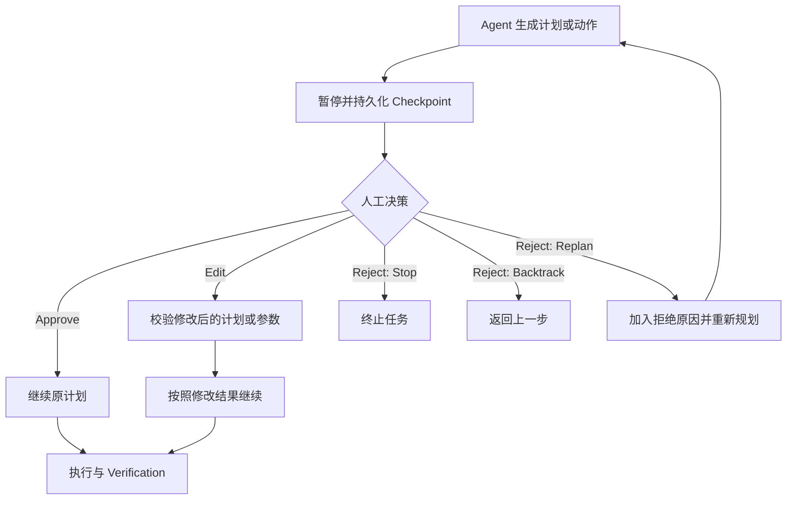
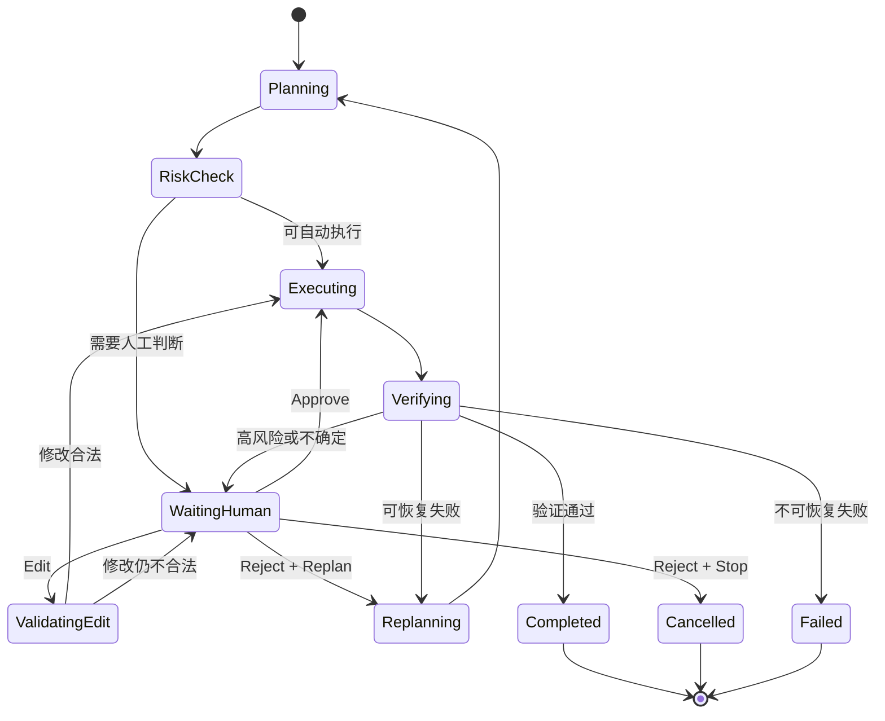
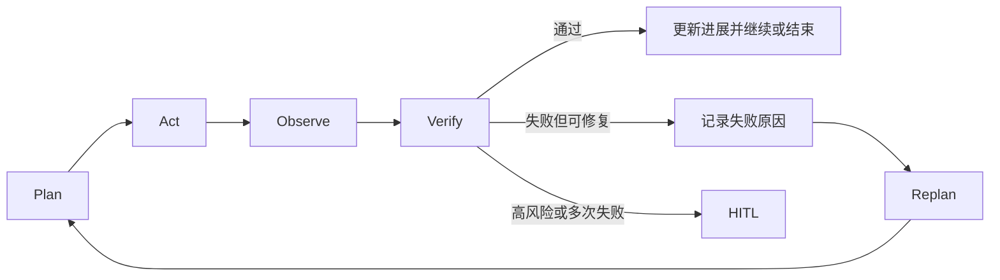
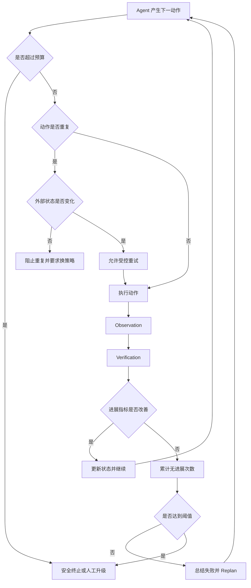
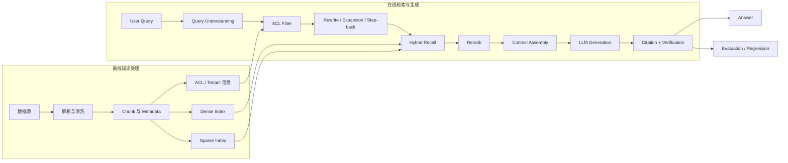
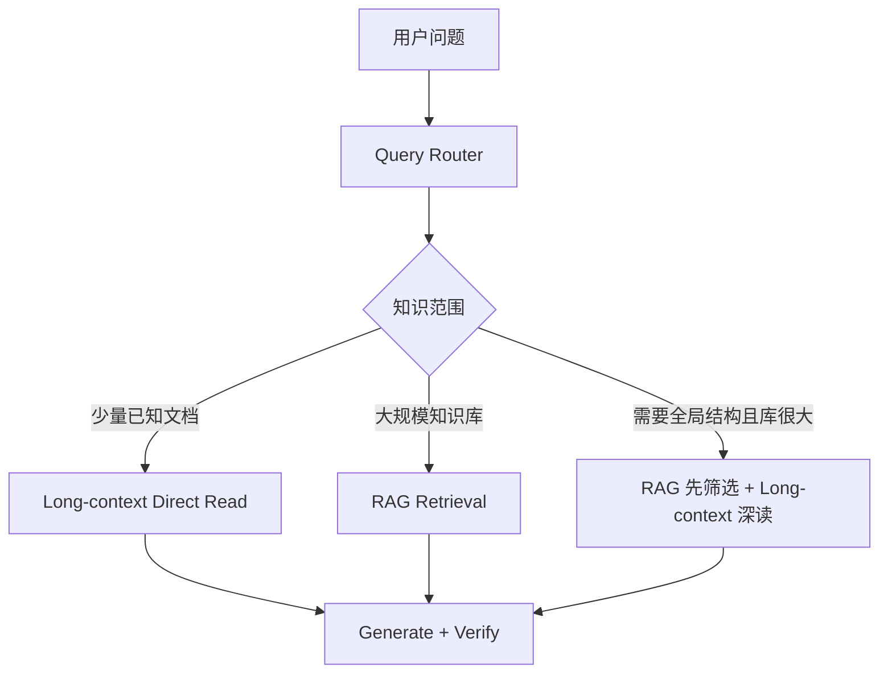
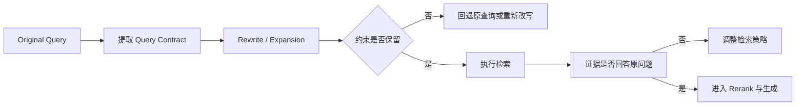
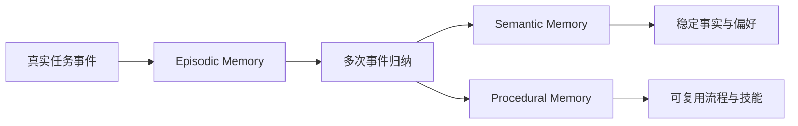
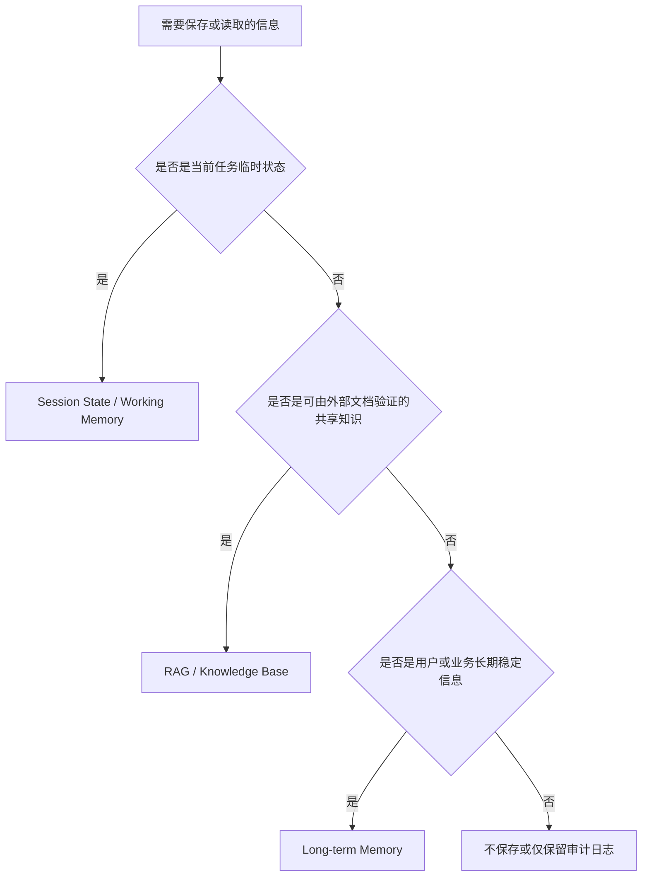
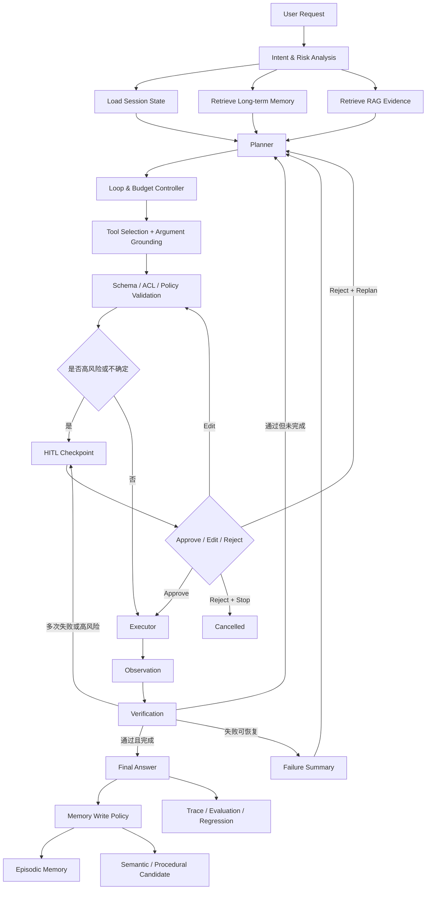

> 本笔记围绕四个 Agent 工程化问题展开：
>
> 1. 如何把人的判断力嵌入 Agent Runtime；
> 2. 如何防止 Agent 陷入无效循环；
> 3. 如何构建完整的生产级 RAG；
> 4. 如何区分 RAG、长期记忆与会话状态。
>
> 核心思想：**模型负责提出计划与候选动作，Runtime 负责状态、约束、执行、恢复与验证；人类在关键节点负责审批、修正或否决。**

---

## 目录

- [一、术语纠正与核心结论](#一术语纠正与核心结论)
- [二、HITL：把人类判断力嵌入 Agent Runtime](#二hitl把人类判断力嵌入-agent-runtime)
- [三、如何避免 Agent 死循环](#三如何避免-agent-死循环)
- [四、RAG：不只是向量数据库](#四rag不只是向量数据库)
- [五、Chunk、Metadata 与检索策略](#五chunkmetadata-与检索策略)
- [六、Query Rewrite 与查询漂移](#六query-rewrite-与查询漂移)
- [七、ACL：让检索结果真正满足权限要求](#七acl让检索结果真正满足权限要求)
- [八、RAG、Memory 与 Session State 的边界](#八ragmemory-与-session-state-的边界)
- [九、完整 Agent 生产架构](#九完整-agent-生产架构)
- [十、面试高频问题速答](#十面试高频问题速答)
- [十一、复习检查表](#十一复习检查表)

---

# 一、术语纠正与核心结论

## 1. HILT 应写作 HITL

正确术语是：

> **HITL：Human-in-the-Loop，人类在环。**

HITL 指的是：在 Agent 的规划、工具调用、内容生成或高风险动作执行过程中，设置人工决策节点，把人类的判断力嵌入 Agent Runtime。

HITL 不是简单地“让人最后看一眼”，而是 Runtime 中一个正式的状态与控制机制。

---

## 2. Approve、Edit、Reject 的准确含义

| 决策 | 含义 | Runtime 后续动作 |
|---|---|---|
| Approve | 接受当前计划、参数或输出，不再修改 | 继续执行下一节点 |
| Edit | 人类修改计划、参数或输出 | 使用修改后的内容继续执行 |
| Reject | 当前方案不可接受 | 停止、回退或触发重新规划 |

需要注意：

- **Approve 不等于“低风险”**。低风险动作可能自动通过，高风险动作也可能经过审批后被 Approve。
- **Edit 不只是修改文字**。它可以修改计划、工具参数、目标对象、执行范围、时间窗口和输出结果。
- **Reject 不应只是返回一句失败信息**。它应映射到明确的 Runtime 分支，例如终止、回到上一步或触发 Replan。

---

## 3. 其他术语修正

| 原始表达 | 建议表达 |
|---|---|
| hilt | HITL |
| 觉得检索性 | 决定检索性 |
| 文档解析和勤洗 | 文档解析与清洗 |
| 通信陈本 | 通信成本 |
| 长期记忆等于对话历史 | 长期记忆不等于完整对话历史 |
| dense 保语义 | Dense Retrieval 更擅长语义相似性 |
| sparse 保词面 | Sparse Retrieval 更擅长精确词面匹配 |
| rerank 只看 precision | Rerank 更关注候选排序质量与前排精度 |
| APADRE | 未识别为通用 RAG 术语，本文按“应用与服务/API 层”理解 |

---

# 二、HITL：把人类判断力嵌入 Agent Runtime

## 1. HITL 的本质

HITL 是一种将人类判断嵌入 Agent 执行流程的机制。

一个没有 HITL 的 Agent 流程通常是：

```text
用户请求
  → 模型规划
  → 工具执行
  → 返回结果
```

加入 HITL 后，流程变为：

```text
用户请求
  → 模型规划
  → 风险判断
  → 人工审批
  → Approve / Edit / Reject
  → 执行、修改后执行或重新规划
  → Verification
```

HITL 主要解决以下问题：

1. 模型无法稳定判断高风险动作；
2. 用户要求具有隐含业务规则；
3. 工具调用具有不可逆副作用；
4. 参数虽然合法，但可能不符合真实业务意图；
5. 模型输出需要专业人员承担最终责任；
6. 系统需要保留可审计的人类决策证据。

> 核心结论：**HITL 不是对模型能力不足的临时补丁，而是高风险 Agent 的正式治理机制。**

---

## 2. 什么情况下需要 HITL

并非所有动作都要人工审批，否则系统会失去自动化价值。

适合引入 HITL 的情况包括：

### 高风险操作

- 删除数据；
- 修改生产配置；
- 发起支付；
- 批量发送消息；
- 对外发布内容；
- 重启线上服务；
- 修改权限；
- 提交合同或正式报告。

### 高不确定性任务

- 用户意图存在歧义；
- 模型置信度较低；
- 检索证据互相冲突；
- 工具参数无法完整 Grounding；
- 关键字段由模型推断而非真实查询获得。

### 强责任任务

- 法律、医疗、金融等专业判断；
- 审批结果需要具体人员签字；
- 输出会直接影响客户权益；
- 操作需要满足内部合规制度。

### 异常升级

- 连续多次工具失败；
- Verification 不通过；
- Agent 出现循环；
- 成本或延迟超过预算；
- 当前状态无法自动恢复。

---

## 3. Approve、Edit、Reject 三种分支

### 3.1 Approve

Approve 表示：

> 人类接受当前计划、参数、动作或输出，Runtime 可以继续执行。

Approve 的结果应至少记录：

- 审批人；
- 审批时间；
- 审批对象；
- 审批时的完整快照；
- 风险级别；
- 使用的策略版本；
- 后续执行节点。

Approve 可以用于：

- 接受 Agent 生成的执行计划；
- 确认邮件收件人和正文；
- 确认数据库修改范围；
- 确认故障处置动作；
- 确认最终报告内容。

### 3.2 Edit

Edit 表示：

> 人类不完全接受当前结果，但可以通过修改，使其成为 Runtime 后续可执行的输入。

Edit 可能修改：

- 任务计划；
- 工具名称；
- 工具参数；
- 目标对象；
- 执行范围；
- 执行顺序；
- 输出内容；
- 风险等级；
- 验证条件。

例如，Agent 提议：

```json
{
  "action": "restart_service",
  "service": "payment-service",
  "scope": "all_instances"
}
```

人工修改为：

```json
{
  "action": "restart_service",
  "service": "payment-service",
  "scope": "single_canary_instance",
  "verify_before_expansion": true
}
```

这里，人的经验没有停留在自然语言反馈中，而是被转换成了机器可以继续执行的结构化参数。

> Edit 的核心价值：**把人类经验转化为可执行、可记录、可复用的输入。**

### 3.3 Reject

Reject 表示：

> 当前计划或动作不可接受，Runtime 不得按照原路径继续执行。

Reject 之后可以有三种处理方式：

1. **Stop**：直接终止任务；
2. **Rollback / Backtrack**：返回上一步；
3. **Replan**：把拒绝原因加入上下文，重新生成计划。

Reject 时应记录明确理由，例如：

```json
{
  "decision": "reject",
  "reason_code": "blast_radius_too_large",
  "comment": "禁止重启全部实例，应先检查数据库连接池和单实例状态。",
  "next_action": "replan"
}
```

模糊的“不同意”难以帮助 Agent 改进；结构化拒绝原因才能支持后续规划、评测与训练。

---

## 4. HITL 对 Runtime 的四项核心要求

### 4.1 Interrupt：可中断

Agent 必须能够在指定节点暂停，而不是从开始一路执行到结束。

中断点可能位于：

- 规划完成后；
- 高风险工具执行前；
- 参数生成后；
- 批量操作前；
- 最终结果发布前；
- Verification 失败后。

中断时，Runtime 应明确返回：

- 当前停在哪个节点；
- 为什么中断；
- 等待人类决定什么；
- 人类可以执行哪些动作；
- 超时后如何处理。

### 4.2 State Persistence：状态持久化

Agent 暂停后，所有必要状态都必须保存，否则无法安全恢复。

建议持久化：

```text
Run ID
Thread / Session ID
当前节点
执行计划
输入与中间结果
工具调用历史
当前工具参数
风险判断
检索证据
等待审批的对象
已完成步骤
未完成步骤
预算消耗
错误与失败摘要
策略版本
Checkpoint 时间
```

状态持久化不应只保存一段聊天文本，而应保存可恢复的结构化状态。

### 4.3 Resume：可恢复

人类做出决定后，Runtime 应从中断点继续，而不是从头重新运行。

恢复时需要确认：

1. Checkpoint 是否仍然有效；
2. 外部资源状态是否已变化；
3. 审批对象是否与当前版本一致；
4. 工具参数是否被人工修改；
5. 操作是否已经被其他请求执行；
6. 是否需要重新进行权限和风险校验。

> 恢复不是简单地“继续调用下一行代码”，而是基于最新外部状态重新确认前置条件。

### 4.4 Branching：可分叉处理

Runtime 必须能根据人工决策进入不同分支：



---

## 5. HITL 的推荐状态机



---

## 6. HITL Checkpoint 的数据结构

一个可用于生产环境的审批记录可以包含：

```json
{
  "run_id": "run_20260806_001",
  "checkpoint_id": "cp_004",
  "thread_id": "incident_9527",
  "node": "before_restart_service",
  "status": "waiting_human",
  "proposed_action": {
    "tool": "restart_service",
    "arguments": {
      "service": "payment-service",
      "scope": "all_instances"
    }
  },
  "risk_level": "high",
  "evidence_refs": [
    "log://trace-1024",
    "metric://payment-error-rate"
  ],
  "allowed_decisions": [
    "approve",
    "edit",
    "reject_stop",
    "reject_replan"
  ],
  "policy_version": "ops-policy-v3",
  "created_at": "2026-08-06T17:20:00+08:00"
}
```

人工处理后追加：

```json
{
  "decision": "edit",
  "reviewer": "oncall_engineer_01",
  "edited_action": {
    "tool": "restart_service",
    "arguments": {
      "service": "payment-service",
      "scope": "single_canary_instance",
      "verify_before_expansion": true
    }
  },
  "reason_code": "reduce_blast_radius",
  "comment": "先重启一台实例并观察五分钟。",
  "reviewed_at": "2026-08-06T17:23:00+08:00"
}
```

---

## 7. 真实业务场景：运维故障处置 Agent

### 场景背景

线上支付服务错误率升高。Agent 已完成：

1. 查询告警；
2. 检索历史故障案例；
3. 分析日志和指标；
4. 生成处置计划；
5. 准备调用服务重启工具。

Agent 原计划：

```text
重启 payment-service 全部实例
```

由于该动作影响范围较大，Runtime 在执行前触发 HITL。

### Approve

值班工程师确认：

- 当前存在完整回滚方案；
- 流量已经切换；
- 全量重启符合故障手册；
- 审批人具备操作权限。

工程师选择 Approve，Runtime 继续执行。

### Edit

值班工程师认为直接全量重启风险过大，将计划修改为：

```text
先重启 1 个金丝雀实例
→ 等待 5 分钟
→ 检查错误率、P95 延迟和健康检查
→ 通过后再逐批重启
```

Runtime 校验修改后的参数，生成新的执行分支。

### Reject

工程师发现根因更可能是数据库连接池耗尽，不同意重启服务。

Reject 原因：

```text
当前动作与根因假设不一致，请先检查连接池指标，
再对数据库依赖和线程池状态进行重新规划。
```

Runtime 返回诊断节点，并触发 Replan。

---

## 8. HITL 数据的额外价值

人工产生的 Approve、Edit、Reject 数据具有较高价值，因为它们来自真实任务、真实约束和真实责任场景。

可以用于：

- 构建偏好数据；
- 生成行为克隆或监督微调样本；
- 优化风险分类器；
- 优化工具参数生成；
- 构建高风险回归测试集；
- 发现 Prompt、Tool Schema 和 Workflow 缺陷；
- 总结领域专家的稳定规则；
- 训练 Replan 策略。

但这些记录不能未经处理就直接作为训练数据。

### 需要注意的偏差

- Approve 不一定代表最优，只代表当时可接受；
- Reject 可能来自流程限制，而非技术错误；
- 不同审批人的标准可能不一致；
- 高风险 Case 会被过度采样；
- 人工 Edit 可能只解决当前问题，不具备普适性；
- 审批结果可能包含敏感信息和权限信息。

因此需要进行：

```text
脱敏
→ 去重
→ 决策原因标准化
→ 审批人一致性分析
→ 质量抽检
→ 任务与风险分层
→ 训练集 / 评测集隔离
```

> 核心结论：**HITL 日志既是运行时审计数据，也是潜在的高价值监督数据，但必须经过治理后才能复用。**

---

# 三、如何避免 Agent 死循环

## 1. 什么是 Agent 死循环

Agent 死循环不一定表现为程序层面的无限循环，也可能表现为：

- 重复调用同一个工具；
- 使用相同参数反复失败；
- 在多个工具之间来回切换；
- 不断 Replan，但计划没有本质变化；
- 持续增加内容，却没有接近任务目标；
- 反复检索相同证据；
- Verification 失败后重复原动作；
- 因上下文丢失而再次执行已完成步骤。

---

## 2. 最大步数、时间和费用预算只是底线

常见限制包括：

- 最大 Step 数；
- 最大工具调用次数；
- 最大 Token 数；
- 最大执行时长；
- 最大模型费用；
- 单工具超时；
- 全局 Deadline。

这些措施只能保证循环最终被强制终止，但不能判断 Agent 是否正在有效推进。

例如，一个 Agent 在 20 步预算内重复调用同一工具 19 次，虽然没有无限运行，但仍然是失败的。

> Budget 解决的是“最多浪费多少资源”，而不是“Agent 是否在正确前进”。

---

## 3. 检测重复动作

可以为每次动作生成 Action Signature：

```text
Action Signature =
工具名称
+ 规范化参数
+ 关键上下文状态
+ 目标对象
```

例如：

```json
{
  "tool": "search_logs",
  "normalized_args": {
    "service": "payment-service",
    "time_range": "last_30_minutes",
    "level": "ERROR"
  },
  "state_version": 7
}
```

若短时间内出现相同 Signature，且外部状态没有变化，则说明可能正在重复。

重复检测可以分为：

- 完全相同动作；
- 参数仅有无意义变化；
- 语义等价动作；
- A → B → A 的周期循环；
- 多次得到相同 Observation。

### 不应机械阻止所有重复

以下重复可能是合理的：

- 等待异步任务完成后轮询；
- 重试暂时性网络错误；
- 等待外部状态变化；
- 分页获取不同结果；
- 按计划分批执行相同操作。

因此，重复检测还需要结合：

- 重试次数；
- Backoff；
- 外部状态变化；
- Observation 是否改变；
- 当前任务是否允许轮询；
- 是否存在明确的退出条件。

---

## 4. 跟踪进展指标

Agent 每一步都应回答：

> 当前状态是否比上一步更接近任务完成？

可以为任务定义 Progress Signals。

### 信息检索任务

- 未解决子问题数量；
- 证据覆盖率；
- 有效来源数量；
- 冲突证据数量；
- 尚未验证的结论数量。

### 工具执行任务

- 已完成步骤数；
- 未完成步骤数；
- 已满足后置条件数量；
- 剩余阻塞项；
- 外部状态变化量。

### 故障诊断任务

- 候选根因数量是否缩小；
- 是否新增区分性证据；
- 已排除假设数量；
- 关键指标是否恢复；
- 是否形成可执行处置方案。

如果连续若干步没有任何 Progress Signal 改善，应触发：

```text
总结失败
→ 改变策略
→ Replan
→ 人工升级
→ 或安全终止
```

---

## 5. 摘要失败历史

失败历史不能以完整日志形式无限塞入上下文，否则会造成：

- 上下文膨胀；
- 关键信息被淹没；
- 模型重复关注旧细节；
- Token 成本增加；
- 进一步诱发循环。

推荐维护结构化 Failure Summary：

```json
{
  "failed_attempts": [
    {
      "strategy": "restart_all_instances",
      "result": "rejected",
      "reason": "blast_radius_too_large"
    },
    {
      "strategy": "query_application_logs",
      "result": "no_new_evidence",
      "reason": "same_time_range_and_filter"
    }
  ],
  "do_not_repeat": [
    "restart_all_instances",
    "query_same_logs_without_changing_filter"
  ],
  "remaining_options": [
    "inspect_database_pool",
    "inspect_thread_pool",
    "compare_healthy_instance"
  ]
}
```

这样能够告诉模型：

- 哪些方法已经试过；
- 为什么失败；
- 哪些动作不得重复；
- 还剩哪些候选策略。

---

## 6. 引入 Verification

Agent 不应仅根据“工具返回成功”判断任务完成。

Verification 可以检查：

- 后置条件是否满足；
- 目标对象是否正确；
- 外部状态是否真实改变；
- 输出是否有证据支持；
- 结果是否符合用户要求；
- 是否出现新的副作用；
- 当前动作是否真正减少了未完成项。

一个典型闭环：



---

## 7. 对高风险动作引入审批或 Dry-Run

### Dry-Run

Dry-Run 表示：

> 只模拟动作及其影响，不真正产生副作用。

例如：

- 展示即将删除的文件；
- 展示即将修改的数据库行；
- 展示邮件收件人和正文；
- 展示重启服务的影响范围；
- 展示权限变更差异；
- 展示 Terraform 或配置变更计划。

Dry-Run 可以让 Agent 在执行前获得额外 Observation，并支持人工判断。

### HITL

当动作风险高、不可逆或影响范围较大时，在 Dry-Run 后进入人工审批。

推荐流程：

```text
生成动作
→ 参数与权限校验
→ Dry-Run
→ 影响范围分析
→ HITL
→ 执行
→ Verification
→ 审计记录
```

---

## 8. 防循环控制器



---

## 9. 一个实用的循环终止策略

可以综合以下信号：

```text
Hard Stop:
- max_steps
- max_duration
- max_cost
- global_deadline

Loop Detection:
- repeated_action_signature
- repeated_observation
- cyclic_state_pattern
- unchanged_plan

Progress Check:
- unresolved_items_delta
- evidence_coverage_delta
- state_change_delta
- verification_score_delta

Escalation:
- repeated_failure_count
- high_risk_action
- low_confidence
- conflicting_evidence
```

示例逻辑：

```python
if budget_exceeded:
    stop("budget_exceeded")

elif repeated_action and not external_state_changed:
    block_action()
    require_replan("repeated_action_without_new_information")

elif no_progress_count >= 3:
    escalate_to_human("no_measurable_progress")

elif high_risk_action:
    request_human_approval()

else:
    execute_and_verify()
```

---

# 四、RAG：不只是向量数据库

## 1. RAG 的本质

RAG，即 Retrieval-Augmented Generation，检索增强生成。

其核心过程是：

```text
根据当前问题检索外部知识
→ 将相关证据加入模型上下文
→ 基于证据生成回答
```

RAG 的主要价值：

- 补充模型未见过的知识；
- 使用最新信息；
- 访问企业私有知识；
- 提供可引用证据；
- 降低仅依赖参数记忆造成的幻觉；
- 在不重新训练模型的情况下更新知识。

---

## 2. RAG 与微调的区别

一句话理解：

> **RAG 主要补充知识，微调主要改变行为。**

| 维度 | RAG | Fine-tuning |
|---|---|---|
| 核心目标 | 给模型提供外部知识 | 改变模型行为、风格或能力 |
| 知识更新 | 更新知识库即可 | 通常需要重新训练 |
| 私有数据 | 适合动态访问 | 可能固化到参数中 |
| 可引用性 | 可以返回来源 | 参数知识通常难以直接溯源 |
| 时效性 | 较强 | 取决于训练数据时间 |
| 适合内容 | 文档、制度、产品资料、案例 | 输出格式、任务风格、领域行为 |
| 主要风险 | 检索失败、上下文噪声 | 灾难性遗忘、训练偏差、成本 |

两者可以组合：

```text
Fine-tuning：
让模型学会如何回答、如何调用工具、如何遵守格式

RAG：
让模型在回答时获得最新且可验证的知识
```

---

## 3. RAG 的完整工程链路

生产级 RAG 至少包含三个阶段。

### 3.1 离线知识处理

```text
数据源接入
→ 文档解析
→ 清洗与规范化
→ 结构识别
→ Chunk 切分
→ Metadata 生成
→ Embedding / Sparse Index
→ 权限信息绑定
→ 索引构建
→ 版本管理
```

### 3.2 在线检索

```text
用户查询
→ 查询理解
→ 权限与租户过滤
→ Query Rewrite / Expansion / Step-back
→ Dense / Sparse / Hybrid Recall
→ 去重与融合
→ Rerank
→ Context Assembly
```

### 3.3 生成、验证与评测

```text
Prompt 组装
→ LLM 生成
→ 引用绑定
→ Grounding / Faithfulness 检查
→ 安全与权限检查
→ 返回答案
→ Trace 与反馈
→ 离线评测和回归
```



> 核心结论：**向量数据库只是 RAG 中的一个索引组件，不等于完整 RAG 系统。**

---

## 4. 长上下文模型与 RAG 的组合

长上下文模型并不会自动取代 RAG。

长上下文的优势：

- 可以一次读取较完整的文档；
- 减少过度切分造成的信息丢失；
- 适合单文档深度分析；
- 可以保留更完整的结构关系。

RAG 的优势：

- 可以从超大知识库中筛选候选内容；
- 可以做 ACL 与租户过滤；
- 可以使用最新数据；
- 可以提供稳定引用；
- 可以控制输入成本；
- 可以通过检索指标进行独立评测。

推荐使用路由器决定处理路径：



### 路由参考

| 场景 | 建议 |
|---|---|
| 单份较短合同总结 | 直接长上下文 |
| 数万份企业文档问答 | RAG |
| 从大量论文中筛选后做比较 | RAG + 长上下文 |
| 需要最新政策与内部制度 | 多源 RAG |
| 已知文件、已知页码、深度解释 | 直接读取对应内容 |

---

# 五、Chunk、Metadata 与检索策略

## 1. Chunk Size 的权衡

Chunk 太小：

- 上下文不完整；
- 代词与指代丢失；
- 流程被切断；
- 表格与条款失去结构；
- 检索结果碎片化。

Chunk 太大：

- 一个 Chunk 混入多个主题；
- 相似度被无关内容稀释；
- Token 成本增加；
- Rerank 难度增大；
- 召回后上下文噪声较多。

### 不同内容的建议

| 内容类型 | Chunk 倾向 | 原因 |
|---|---|---|
| FAQ、短答案 | 较细粒度 | 一个问题对应一个独立答案 |
| 制度文档 | 保留标题和章节边界 | 条款依赖上级标题和适用范围 |
| 长流程说明 | 按步骤组或流程段切分 | 保留前后依赖 |
| 表格 | 行列结构化解析 | 纯文本切分容易丢失关系 |
| 代码 | 按函数、类、模块切分 | 需要保留语法与引用关系 |
| 合同条款 | 按条款与子条款切分 | 需要精确引用和法律结构 |
| 学术论文 | 按章节、段落和图表说明切分 | 便于区分方法、实验和结论 |

推荐起步策略：

> **先采用中等长度 Chunk，加适度 Overlap，再根据真实评测结果调整。**

不要只凭经验选择 Chunk Size，应对以下组合进行实验：

```text
Chunk Size
× Overlap
× Embedding Model
× Retrieval Top-K
× Reranker
× Context Budget
```

---

## 2. Structure-aware Chunking

比固定 Token 切分更可靠的方式是结构感知切分。

优先保留：

- 文档标题；
- 章节层级；
- 列表结构；
- 表格标题与表头；
- 代码函数边界；
- 合同条款编号；
- 问题与答案配对；
- 图片说明与正文引用；
- 页面或段落来源位置。

一个 Chunk 可以包含：

```json
{
  "chunk_id": "policy_2026_03_section_4_2",
  "text": "……",
  "title": "数据访问控制",
  "section_path": [
    "信息安全制度",
    "第四章 权限管理",
    "4.2 数据访问控制"
  ],
  "page": 18,
  "document_version": "2026-03",
  "effective_date": "2026-03-01"
}
```

---

## 3. Metadata 的三项价值

Metadata 决定：

1. **检索性**；
2. **可治理性**；
3. **可引用性**。

### 检索性

支持：

- 按文档类型过滤；
- 按时间过滤；
- 按产品、部门、地区过滤；
- 按章节和主题检索；
- 按语言或版本检索。

### 可治理性

支持：

- 文档版本管理；
- 过期信息下线；
- 租户隔离；
- 权限过滤；
- 数据来源审计；
- 生命周期管理；
- 删除与更新传播。

### 可引用性

支持：

- 返回文档名称；
- 返回页码；
- 返回章节；
- 返回原文位置；
- 绑定证据 ID；
- 对结论进行溯源。

### 常见 Metadata 字段

| 类型 | 字段示例 |
|---|---|
| 标识 | document_id、chunk_id、source_id |
| 结构 | title、section、heading_path、page |
| 业务 | product、department、region、customer |
| 时间 | created_at、updated_at、effective_date、expire_at |
| 权限 | tenant_id、owner、acl、security_level |
| 版本 | version、checksum、is_latest |
| 引用 | source_url、page、span_start、span_end |
| 质量 | parser_version、ocr_confidence、review_status |

---

## 4. Dense、Sparse 与 Hybrid Retrieval

### Dense Retrieval

Dense Retrieval 使用 Embedding 表示语义。

优势：

- 擅长语义相似；
- 用户表达和文档措辞不一致时仍可能召回；
- 适合自然语言问题；
- 适合概念和意图匹配。

局限：

- 可能忽略精确关键词；
- 对编号、专有名词和代码值不稳定；
- 相似语义不一定等于正确事实；
- Embedding 模型存在领域偏差。

### Sparse Retrieval

常见方法包括 BM25。

优势：

- 擅长精确词面匹配；
- 对产品型号、错误码、姓名、法条编号有效；
- 可解释性较强；
- 不需要 Embedding 推理。

局限：

- 对同义词和改写较弱；
- 用户问题与原文措辞差异大时可能漏召回；
- 长查询可能受到词频噪声影响。

### Hybrid Retrieval

Hybrid Retrieval 结合 Dense 和 Sparse：

```text
Dense：补语义召回
Sparse：保精确词面
Fusion：合并两路候选
Rerank：重新判断与当前查询的相关性
```

常见融合方式：

- 加权分数；
- Reciprocal Rank Fusion；
- 分路 Top-K 后去重；
- 学习型融合。

> 一句话记忆：**Dense 保语义，Sparse 保词面，Hybrid 提高整体稳定性。**

---

## 5. Recall 与 Rerank 的评价重点

### 第一阶段召回

目标是：

> 尽可能不要漏掉真正相关的证据。

常见指标：

- Recall@K；
- Hit Rate@K；
- Evidence Coverage；
- Oracle Recall；
- 不同查询类型的分层召回率。

### Rerank

目标是：

> 把真正相关的候选排到前面，并减少进入上下文的噪声。

常见指标：

- Precision@K；
- MRR；
- NDCG@K；
- MAP；
- Top-1 / Top-3 命中率。

需要避免过度简化：

- Recall 阶段也不能无限扩大 K，否则成本和噪声会急剧增加；
- Rerank 不只看 Precision，还要关注排序质量；
- 最终需要看端到端回答正确率、引用正确率和 Faithfulness。

---

# 六、Query Rewrite 与查询漂移

## 1. Query Rewrite 的目的

Query Rewrite 是对原查询进行重述，使其更适合检索。

核心要求：

> **保留原始意图，不得擅自改变约束。**

例如：

原查询：

```text
为什么支付服务昨晚一直超时？
```

Rewrite：

```text
检索昨晚支付服务请求超时、依赖调用延迟、
线程池耗尽和数据库连接池异常的日志与故障记录。
```

Rewrite 不是自由发挥，而是面向检索的语义重构。

---

## 2. Query Expansion

Expansion 通过加入相关词、别名、缩写或业务术语扩大召回面。

例如：

```text
原查询：支付接口超时

Expansion：
支付 API 超时
payment timeout
gateway timeout
HTTP 504
下游依赖延迟
请求耗时异常
```

Expansion 的风险是引入无关概念，因此最好限制在：

- 领域词典；
- 实体别名；
- 已知缩写；
- 产品映射；
- 错误码映射；
- 经过验证的同义表达。

---

## 3. Step-back Query

Step-back 的思路是：

> 先退到更抽象的原理层，再从原理回到具体问题。

例如：

具体问题：

```text
为什么 payment-service 的 P95 延迟升高？
```

Step-back：

```text
微服务接口延迟升高通常由哪些组件造成？
```

得到通用维度后，再回到具体检索：

```text
检索 payment-service 的数据库、缓存、线程池、
下游服务、网络和 GC 指标。
```

Step-back 适合：

- 原问题过窄；
- 用户缺少专业术语；
- 需要先构造排查框架；
- 需要多跳检索；
- 需要跨文档组合证据。

---

## 4. 什么是查询漂移

查询漂移是指：

> Rewrite、Expansion 或多轮检索后，查询逐渐偏离用户原始意图。

例如，用户问：

```text
公司差旅报销是否包含机场停车费？
```

错误 Rewrite：

```text
公司交通补贴政策有哪些？
```

原始约束中的：

- 差旅；
- 报销；
- 机场；
- 停车费；

被抽象成了过宽的“交通补贴”，造成检索方向变化。

---

## 5. 如何控制查询漂移

建议保存 Query Contract：

```json
{
  "original_query": "公司差旅报销是否包含机场停车费？",
  "must_preserve": [
    "差旅",
    "报销",
    "机场停车费"
  ],
  "optional_expansion": [
    "停车费用",
    "机场停车",
    "交通费用"
  ],
  "must_not_infer": [
    "固定交通补贴",
    "通勤补贴"
  ]
}
```

每次 Rewrite 后检查：

1. 核心实体是否保留；
2. 时间、地区、对象等约束是否保留；
3. 是否新增了原问题没有的假设；
4. 查询范围是否过度扩大；
5. 返回证据是否仍能直接回答原问题。



---

# 七、ACL：让检索结果真正满足权限要求

## 1. ACL 是什么

ACL，即 Access Control List，访问控制列表。

其含义是：

> 将一组访问控制规则绑定到具体资源上，规定哪些主体可以对该资源执行哪些操作。

ACL 中通常包含：

- 主体：用户、角色、用户组、服务账号；
- 资源：文档、文件夹、数据库记录、Chunk；
- 权限：读、写、修改、删除、审批；
- 条件：租户、部门、时间、网络区域、安全级别。

---

## 2. RAG 中为什么需要 ACL

RAG 可能从企业知识库中检索：

- 人事资料；
- 财务数据；
- 客户合同；
- 内部故障记录；
- 研发文档；
- 管理制度；
- 不同租户的数据。

如果只在生成答案后检查权限，会出现严重风险：

- 未授权内容已经进入模型上下文；
- 敏感信息可能影响生成结果；
- 日志或 Trace 中可能留下敏感片段；
- 模型可能间接泄露检索到的内容。

因此，权限过滤应尽量发生在检索前或检索过程中。

推荐顺序：

```text
身份认证
→ 获取用户 / 租户 / 角色
→ 构造 ACL Filter
→ 在候选召回时过滤
→ Rerank
→ Context Assembly
→ 生成
→ 输出前再次检查
```

---

## 3. ACL 与 Metadata 的绑定

示例：

```json
{
  "chunk_id": "contract_2026_001_p12",
  "tenant_id": "tenant_a",
  "owner_department": "legal",
  "security_level": "confidential",
  "acl": {
    "allow_users": ["user_001"],
    "allow_roles": ["legal_reviewer", "finance_director"],
    "deny_roles": ["external_contractor"]
  }
}
```

检索时：

```text
Query
+ tenant_id = tenant_a
+ role in allowed_roles
+ security_level <= user_clearance
```

---

## 4. ACL 的常见陷阱

- 文档有权限，但 Chunk 索引没有同步权限；
- 文档权限已修改，旧索引仍可检索；
- 多租户过滤只依赖 Prompt；
- 先检索敏感内容，再在生成阶段过滤；
- 缓存没有包含用户或租户维度；
- Rerank 服务收到未授权原文；
- Trace 和评测数据保存了敏感内容；
- 管理员权限被误用为普通服务权限。

> 核心结论：**ACL 不是回答生成后的文本过滤，而是贯穿数据接入、索引、召回、缓存、生成和日志的端到端控制。**

---

# 八、RAG、Memory 与 Session State 的边界

## 1. 长期记忆不等于完整对话历史

长期记忆通常是经过以下过程后保留的信息：

```text
原始交互
→ 筛选
→ 去噪
→ 压缩
→ 摘要
→ 验证
→ 分类
→ 设置作用域与有效期
→ 写入长期存储
```

完整对话历史包含大量：

- 临时信息；
- 已过期偏好；
- 试探性表达；
- 错误信息；
- 重复内容；
- 不适合长期保存的敏感数据。

因此不能把所有历史消息直接当作长期记忆。

---

## 2. 三类信息应该放在哪里

| 信息 | 推荐位置 | 示例 |
|---|---|---|
| 可外部验证的共享知识 | RAG | 公司制度、产品手册、论文、法律条款 |
| 某个用户或业务的长期稳定信息 | Memory | 用户长期偏好、历史决策、稳定约束 |
| 当前任务执行到哪一步 | Session State / Working Memory | 当前审批节点、已调用工具、剩余步骤 |

### RAG

适合：

- 共享知识；
- 客观资料；
- 可以从外部文档验证的证据；
- 需要版本管理和引用的信息。

例如：

```text
公司的差旅报销制度是什么？
```

应检索公司制度文档，而不是依赖某个用户的 Memory。

### Long-term Memory

适合：

- 某个用户长期稳定的偏好；
- 某个业务对象持续存在的信息；
- 多次交互中验证过的稳定事实；
- 可在未来任务中复用的经验。

例如：

```text
这个用户习惯先看风险摘要，再看完整技术细节。
```

### Session State / Working Memory

适合：

- 当前任务执行阶段；
- 临时中间结果；
- 当前计划；
- 等待审批的动作；
- 当前预算；
- 这次任务已尝试的方法。

例如：

```text
这次审批走到哪一步了？
```

答案应来自当前 Run 的 Session State 或 Checkpoint，而不是长期记忆或 RAG。

---

## 3. Memory 的主要类型

### Working Memory

当前任务需要的短期状态。

包括：

- 当前目标；
- 当前计划；
- 中间结果；
- 工具调用结果；
- 当前未解决问题；
- 临时约束；
- 当前 Checkpoint。

Working Memory 随任务结束而清理，或仅保留摘要。

### Episodic Memory

记录具体事件经历。

特点：

- 有时间；
- 有场景；
- 有参与对象；
- 有具体经过；
- 有结果和反馈。

示例：

```text
2026-08-06 的支付服务故障中，
全量重启方案被拒绝，最终采用单实例金丝雀重启，
验证通过后再逐批扩容。
```

### Semantic Memory

从多次经历中抽象出的稳定知识或偏好。

示例：

```text
该团队处理生产故障时，默认先使用金丝雀方式控制影响范围。
```

### Procedural Memory

描述“怎么做”的程序性经验或技能模板。

示例：

```text
支付服务异常处置流程：
检查告警 → 对比健康实例 → 检查连接池 →
生成低风险处置计划 → Dry-Run → HITL → Verification。
```

---

## 4. Episodic、Semantic 与 Procedural 的转化



不能把一次事件直接当作稳定规则。

例如，一次审批人要求“先重启一台实例”，不代表所有服务都必须这样处理。只有经过多次验证、政策确认或专家审核后，才能提升为 Semantic 或 Procedural Memory。

---

## 5. Memory 写入前的判断

写入长期记忆前应检查：

1. 是否对未来任务有复用价值；
2. 是否是稳定事实，而非临时表达；
3. 是否经过用户或外部证据确认；
4. 是否包含敏感信息；
5. 作用域属于用户、团队、项目还是全局；
6. 是否需要设置 TTL；
7. 是否可以被后续更新或撤销；
8. 是否与现有记忆冲突；
9. 是否应写入 RAG 而不是 Memory；
10. 是否只是当前 Session State。

---

## 6. Memory 的治理字段

```json
{
  "memory_id": "mem_1024",
  "type": "procedural",
  "scope": {
    "tenant_id": "tenant_a",
    "team": "payment_ops"
  },
  "content": "高风险服务重启默认先执行金丝雀验证。",
  "source_episode_ids": [
    "episode_081",
    "episode_093",
    "episode_104"
  ],
  "confidence": 0.92,
  "verified_by": "ops_lead",
  "created_at": "2026-08-06T18:00:00+08:00",
  "expires_at": null,
  "policy_version": "ops-policy-v3",
  "sensitivity": "internal",
  "status": "active"
}
```

---

## 7. RAG、Memory、State 的选择流程



---

# 九、完整 Agent 生产架构



这个架构中：

- **RAG** 提供可验证的外部知识；
- **Memory** 提供用户和业务的长期信息；
- **Session State** 保存当前任务状态；
- **Planner** 负责生成执行方案；
- **Loop Controller** 防止无效循环；
- **Validator** 负责 Schema、权限和策略校验；
- **HITL** 处理高风险与不确定情况；
- **Executor** 可靠执行真实动作；
- **Verification** 判断业务目标是否完成；
- **Trace 与评测** 负责持续改进。

---

# 十、面试高频问题速答

## 1. 什么是 HITL？

HITL 是 Human-in-the-Loop，即把人类判断嵌入 Agent Runtime。在计划、参数、高风险工具调用或最终发布等关键节点，Runtime 暂停并持久化状态，由人类 Approve、Edit 或 Reject，之后从 Checkpoint 恢复或进入新的执行分支。

---

## 2. HITL 对 Runtime 有什么要求？

四个核心要求：

1. 可中断；
2. 状态持久化；
3. 可从 Checkpoint 恢复；
4. 支持 Approve、Edit、Reject 等分叉执行。

生产环境还需要权限校验、审计、幂等、超时和外部状态重新确认。

---

## 3. Approve、Edit、Reject 分别是什么？

- Approve：接受当前计划或动作，继续执行；
- Edit：人类修改计划、参数或输出，校验后继续；
- Reject：拒绝当前方案，并选择停止、回退或 Replan。

---

## 4. 为什么 HITL 数据有训练价值？

因为它来自真实任务中的人类决策，包含可接受方案、专家修改和拒绝原因，可以用于风险分类、参数生成、偏好优化、Replan 训练和回归评测。但必须先脱敏、去偏、标准化和质量审核。

---

## 5. 如何避免 Agent 死循环？

不能只设置最大步数。还应：

- 检测重复 Action Signature；
- 检测重复 Observation；
- 跟踪可量化进展；
- 摘要失败历史；
- 禁止重复无效策略；
- 引入 Verification；
- 对高风险动作使用 Dry-Run 和 HITL；
- 多次无进展时 Replan、升级人工或安全终止。

---

## 6. 为什么最大步数不能真正解决循环？

最大步数只能限制资源损失，无法判断每一步是否有效。Agent 可能在预算内重复无效动作，因此还需要重复检测、状态变化检测和 Progress Signals。

---

## 7. RAG 和微调有什么区别？

RAG 主要在推理时补充外部知识，适合最新、私有、可引用的信息；微调主要改变模型的行为、风格和任务能力。两者可以组合使用。

---

## 8. 为什么 RAG 不等于向量数据库？

因为完整 RAG 还包括数据接入、解析清洗、Chunk、Metadata、Dense/Sparse/Hybrid 检索、Rerank、上下文组装、ACL、生成、引用、评测和回归。向量数据库只是索引组件之一。

---

## 9. Dense、Sparse 和 Hybrid 分别有什么特点？

- Dense 擅长语义匹配；
- Sparse 擅长精确关键词、编号和专有名词；
- Hybrid 结合两者，提高不同查询类型下的稳定性。

---

## 10. 召回和 Rerank 分别关注什么？

第一阶段召回更关注 Recall@K 和证据覆盖，避免漏掉相关文档；Rerank 更关注前排精度和排序质量，例如 Precision@K、MRR、NDCG。最终还要评估回答正确率、引用正确率和 Faithfulness。

---

## 11. Query Rewrite、Expansion、Step-back 有什么区别？

- Rewrite：保留原始意图，对查询进行更适合检索的重述；
- Expansion：加入别名、同义词和相关术语，扩大召回面；
- Step-back：先抽象到上位原理，再回到具体问题组织检索。

---

## 12. 如何避免 Query Drift？

保存原查询和必须保留的实体、时间、对象、限制条件；改写后进行约束校验；禁止加入未经用户表达的新假设；最终检查证据是否仍直接回答原问题。

---

## 13. Metadata 有什么价值？

Metadata 决定检索性、可治理性和可引用性。它支持过滤、版本管理、ACL、生命周期、租户隔离、页码与章节引用。

---

## 14. ACL 在 RAG 中应该放在哪里？

ACL 应尽量在检索前或检索过程中生效，而不是只在生成后过滤。权限还应贯穿索引、缓存、Rerank、上下文、日志和评测数据。

---

## 15. 长上下文模型会取代 RAG 吗？

不会完全取代。长上下文适合已知的少量文档深度阅读；RAG 适合从大型、动态、受权限控制的知识库中筛选证据。常见方案是路由或“RAG 先筛选、长上下文再深读”。

---

## 16. 长期记忆为什么不等于对话历史？

完整对话历史包含临时、重复、错误、过期和敏感信息。长期记忆应经过筛选、压缩、验证、分类、权限控制和有效期管理，只保存对未来任务有复用价值的信息。

---

## 17. RAG、Memory 和 Session State 如何区分？

- RAG：共享、客观、可外部验证的知识；
- Memory：用户或业务长期稳定的信息；
- Session State：当前任务走到哪一步以及临时中间状态。

---

## 18. “这次审批走到哪一步了”应该从哪里获取？

应从当前 Run 的 Session State 或 Checkpoint 获取，而不是长期 Memory，也不是 RAG。

---

# 十一、复习检查表

## HITL

- [ ] 能解释 HITL 的定义；
- [ ] 能说明为什么 HITL 是 Runtime 机制；
- [ ] 能区分 Approve、Edit、Reject；
- [ ] 能解释 Interrupt、Persistence、Resume、Branching；
- [ ] 能设计一个审批 Checkpoint；
- [ ] 能说明恢复前为什么要重新检查外部状态；
- [ ] 能说明 HITL 数据的训练价值与偏差；
- [ ] 能举出一个真实业务案例。

## Agent 防循环

- [ ] 能区分无限循环和无效循环；
- [ ] 知道最大步数只是资源底线；
- [ ] 能设计 Action Signature；
- [ ] 能解释重复动作何时合理；
- [ ] 能定义 Progress Signals；
- [ ] 能维护 Failure Summary；
- [ ] 能说明 Verification 的作用；
- [ ] 能解释 Dry-Run 与 HITL 的配合。

## RAG

- [ ] 能说明 RAG 与微调的区别；
- [ ] 能画出完整 RAG Pipeline；
- [ ] 知道 RAG 不等于向量数据库；
- [ ] 能解释 Chunk Size Trade-off；
- [ ] 能说明结构感知切分；
- [ ] 能解释 Metadata 的三项价值；
- [ ] 能区分 Dense、Sparse 和 Hybrid；
- [ ] 能说明 Recall 与 Rerank 的指标差异；
- [ ] 能区分 Rewrite、Expansion 和 Step-back；
- [ ] 能解释 Query Drift；
- [ ] 能说明 ACL 为什么必须前置；
- [ ] 能说明长上下文与 RAG 如何组合。

## Memory

- [ ] 能说明长期记忆不等于对话历史；
- [ ] 能区分 Working、Episodic、Semantic、Procedural Memory；
- [ ] 能解释 Episode 如何沉淀为 Semantic 或 Procedural Memory；
- [ ] 能区分 RAG、Memory 与 Session State；
- [ ] 能设计 Memory 写入策略；
- [ ] 能说明 Scope、TTL、Verification 和 Permission；
- [ ] 能判断一条信息应该存在哪里。

---

# 总结

一个可靠的 Agent 系统不能只依赖模型“自己想明白”。

它需要：

```text
RAG 提供可验证知识
+ Memory 提供长期个性化与业务经验
+ Session State 保存当前任务进度
+ Loop Controller 防止无效循环
+ HITL 处理高风险与不确定决策
+ Executor 可靠执行
+ Verification 检查真实业务结果
+ Trace / Evaluation / Regression 持续改进
```

最终目标不是让 Agent 永远不失败，而是让系统做到：

> **失败可发现、过程可中断、状态可恢复、动作可审批、结果可验证、经验可沉淀、行为可审计。**
