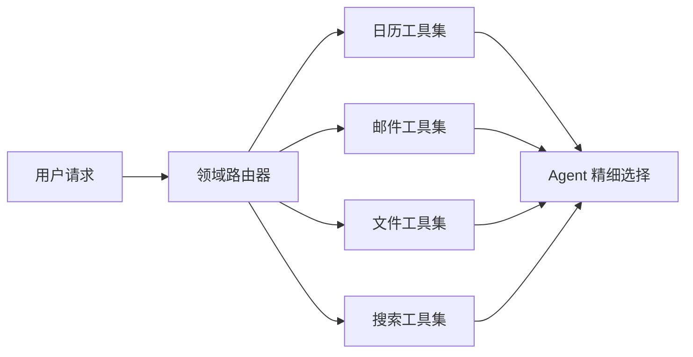
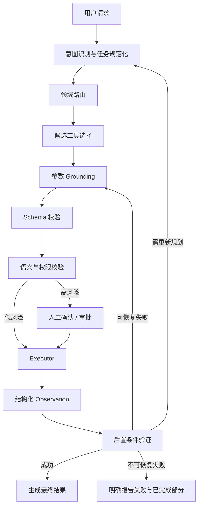
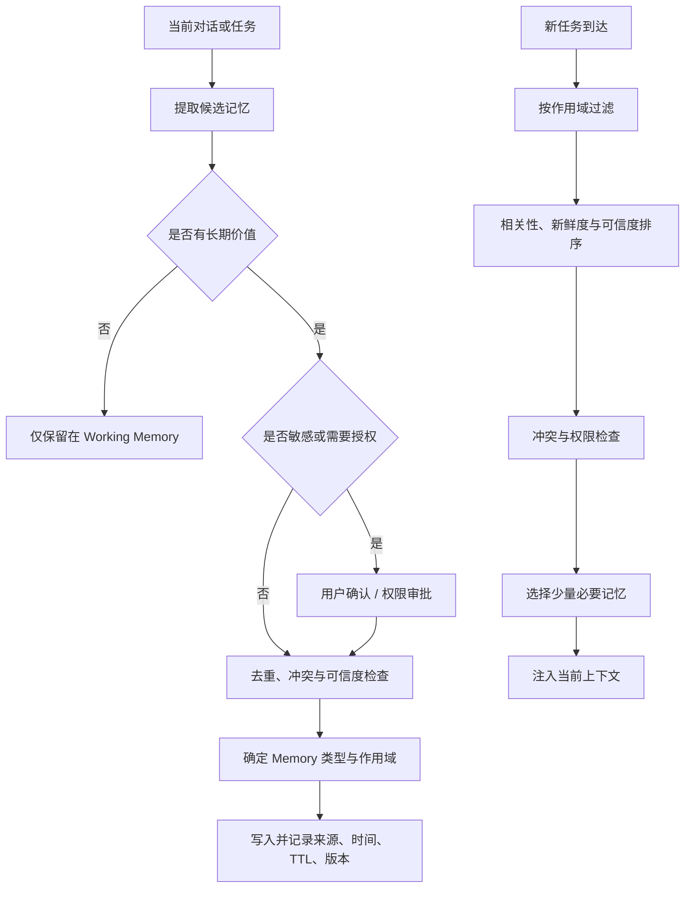
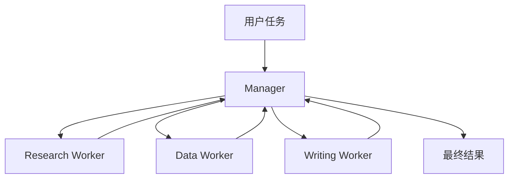
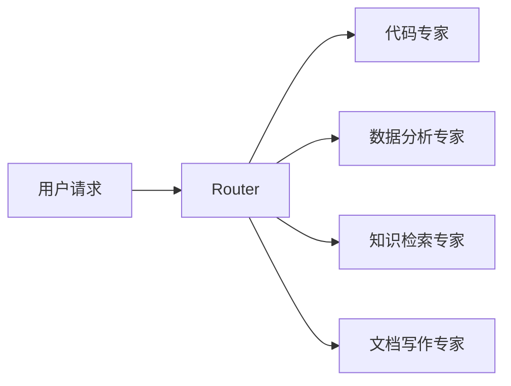
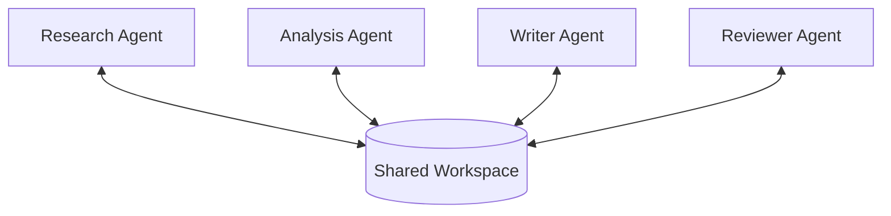
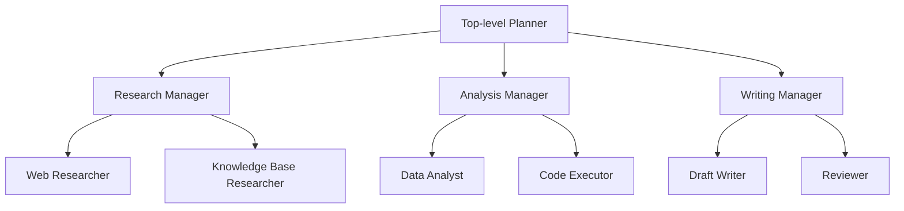
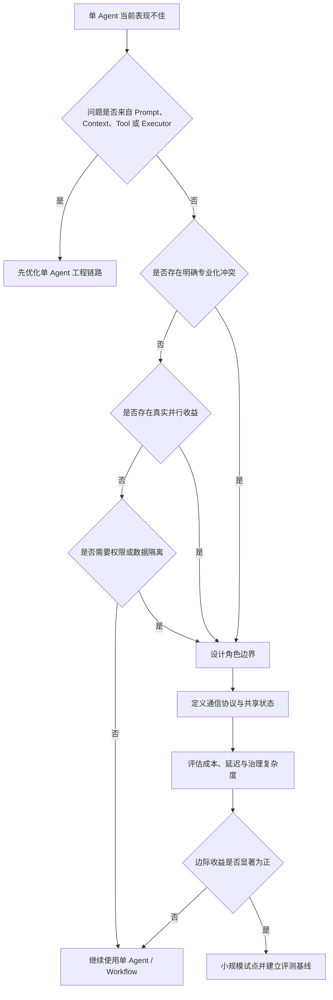
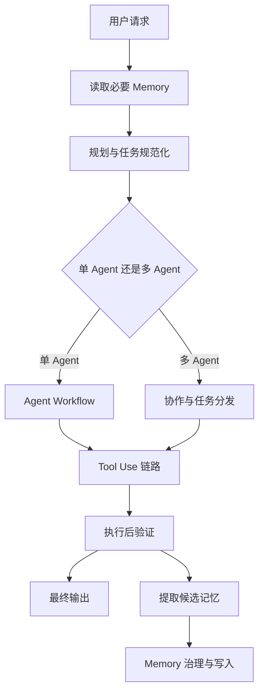

> 本笔记围绕三个 Agent 工程化核心问题展开：**如何让 Agent 正确调用工具、如何设计可靠的长期记忆、什么时候值得引入多 Agent。**
>
> 核心思想：**Agent 的可靠性不只取决于模型能力，还取决于 Prompt、Context、Schema、Executor、Verification、Memory Governance 与 Workflow Design 是否形成完整闭环。**

## 目录

- [一、Tool Use：如何让 Agent 正确调用工具](#一tool-use如何让-agent-正确调用工具)
- [二、Memory：如何设计可靠的长期记忆](#二memory如何设计可靠的长期记忆)
- [三、Multi-Agent：什么时候应该引入多智能体](#三multi-agent什么时候应该引入多智能体)
- [四、三个模块如何形成完整 Agent 系统](#四三个模块如何形成完整-agent-系统)
- [五、面试高频问题速答](#五面试高频问题速答)
- [六、复习检查表](#六复习检查表)

---

# 一、Tool Use：如何让 Agent 正确调用工具

## 1. Tool Use 的本质

Tool Use 不是“让模型输出一个函数名”这么简单，而是一条完整的决策与执行链路：

```text
理解用户意图
    ↓
判断是否需要调用工具
    ↓
选择正确工具
    ↓
生成并补全参数
    ↓
校验参数、权限与风险
    ↓
执行真实动作
    ↓
读取执行结果
    ↓
验证任务是否真正成功
    ↓
决定继续调用、修正还是结束
```

一个稳定的 Tool Use 系统至少要解决五个问题：

1. **Prompt**：模型什么时候应该调用工具；
2. **Context**：模型能否拿到完成决策所需的信息；
3. **Schema**：模型输出的工具调用是否结构化、稳定且可校验；
4. **Executor**：工具调用能否被可靠、安全地执行；
5. **Verification**：系统能否确认当前操作是否真正成功。

| 层级 | 解决的问题 | 常见失败 |
|---|---|---|
| Prompt | 什么时候调用、何时不调用 | 不该调用时乱调用，该调用时直接回答 |
| Context | 是否掌握用户目标、约束和环境状态 | 因信息不足选错工具或填错参数 |
| Schema | 调用格式是否稳定、字段是否合法 | 字段缺失、类型错误、枚举值错误 |
| Executor | 动作是否可靠执行 | 超时、重复执行、部分成功、资源泄漏 |
| Verification | 任务是否真正完成 | 接口返回 200，但业务目标并未达成 |

> 关键结论：**模型负责决策，系统负责约束、执行与验证。不能把全部可靠性责任都交给模型。**

---

## 2. Tool Use 的完整链路

原始链路可以整理为：

```text
Tool Selection
    → Argument Grounding
    → Schema / Policy Validation
    → Action Execution
    → Observation
    → Post-condition Verification
```

### 2.1 Tool Selection：工具选择

模型需要判断：

- 当前任务是否需要工具；
- 应该调用哪一个工具；
- 是否需要连续调用多个工具；
- 多个工具之间是否存在先后依赖；
- 当前操作是否具有真实副作用。

工具选择错误通常不是单纯的“模型太弱”，还可能是工具设计问题。

### 2.2 Argument Grounding：参数落地

参数落地是指把用户的自然语言要求转换为工具所需的具体字段。

例如，用户说：

> 帮我把明天下午的项目会推迟一小时。

系统需要完成：

1. 确定“明天”的绝对日期；
2. 找到“项目会”对应的真实事件；
3. 获取原始开始时间和结束时间；
4. 将两个时间同时顺延一小时；
5. 保留原有参会人、会议地点和描述；
6. 在执行前判断是否需要用户确认。

因此，参数生成不能只依赖模型猜测，还需要通过检索、查询或上下文补全获得真实值。

### 2.3 Validation：参数、权限与策略校验

在真正执行前，至少进行三类校验：

#### 结构校验

- 必填字段是否齐全；
- 字段类型是否正确；
- 字符串格式是否符合要求；
- 枚举值是否在允许范围内；
- 时间、金额、数量是否符合边界条件。

#### 语义校验

- 文件是否真实存在；
- 收件人是否为目标联系人；
- 日期与用户表达是否一致；
- 删除对象是否正确；
- 参数组合是否存在逻辑冲突。

#### 安全校验

- 当前用户是否有权限执行；
- 是否属于高风险操作；
- 是否需要二次确认或人工审批；
- 是否触发敏感数据、越权或合规策略；
- 是否可能造成不可逆副作用。

### 2.4 Action Execution：动作执行

Executor 不能只是简单地调用一个 API，还要处理真实生产环境中的异常。

执行层重点包括：

1. 幂等；
2. 重试；
3. 超时与取消；
4. 事务与回滚；
5. 沙箱与资源隔离；
6. 错误分类；
7. 调用审计与可观测性。

### 2.5 Observation：观察结果

执行后要将结果转换为模型能够理解的 Observation，例如：

```json
{
  "status": "success",
  "event_id": "evt_1024",
  "old_start_time": "2026-08-06T14:00:00+08:00",
  "new_start_time": "2026-08-06T15:00:00+08:00",
  "updated_fields": ["start_time", "end_time"]
}
```

好的 Observation 应该：

- 信息明确；
- 字段稳定；
- 能区分成功、失败与部分成功；
- 包含下一步决策需要的信息；
- 避免将大量无关日志直接塞回上下文。

### 2.6 Post-condition Verification：后置验证

工具返回成功，不代表用户目标已经实现。

例如：

- 邮件接口返回成功，但邮件进入草稿箱而非已发送；
- 文件上传成功，但上传的是错误版本；
- 数据库更新成功，但更新了错误记录；
- 日历事件修改成功，但只修改了开始时间，没有修改结束时间；
- 检索接口有返回，但证据并不支持最终结论。

因此执行后需要检查业务后置条件：

```text
接口调用成功了吗？
    ↓
目标对象正确吗？
    ↓
关键字段真的变化了吗？
    ↓
变化后的状态满足用户目标吗？
    ↓
是否产生了额外副作用？
```

> 关键结论：**Tool Result 是接口结果，Task Success 才是业务结果。二者不能画等号。**

---

## 3. 为什么 Agent 总是选错工具

常见原因可以归纳为五类。

### 3.1 工具集过大

当一个 Agent 同时看到几十甚至上百个工具时，容易出现：

- 相似工具混淆；
- 工具描述互相重叠；
- 选择概率被无关工具稀释；
- Prompt 与 Schema 占用大量上下文；
- 模型难以理解复杂依赖关系。

#### 优化方法：缩小候选工具集

不要让模型每次都从完整工具库中直接选择，而应先进行粗粒度路由：



这相当于把：

```text
从 100 个工具中选择 1 个
```

变成：

```text
先选择 1 个领域，再从该领域的 3～8 个工具中选择
```

### 3.2 工具描述不清晰

差的工具描述只说明“它能做什么”，却没有说明：

- 什么时候应该使用；
- 什么时候不应该使用；
- 和相似工具有什么区别；
- 调用前需要哪些前置条件；
- 是否会产生真实副作用；
- 成功结果和失败结果分别是什么。

#### 差的描述

```text
search_file：搜索文件。
```

#### 更好的描述

```text
search_file：
当用户不知道文件准确位置，或需要根据主题、内容进行语义查找时使用。
如果已经知道文件 ID 或准确路径，不要调用本工具，应直接读取目标文件。
本工具只返回候选文件，不修改任何文件。
```

工具描述推荐包含：

```text
功能 + 使用条件 + 禁止条件 + 输入约束 + 副作用 + 返回结果
```

### 3.3 缺少上层路由与中间规范层

复杂系统中，用户语言通常不能直接映射到底层 API。

可以增加一个中间规范层，将自然语言先转为统一任务表示：

```json
{
  "intent": "update_calendar_event",
  "target": "项目会",
  "time_scope": "tomorrow_afternoon",
  "operation": "shift",
  "offset_minutes": 60,
  "risk_level": "medium",
  "requires_confirmation": true
}
```

然后再由领域 Agent 或执行器将规范化任务转换为具体工具参数。


规范层的价值：

- 降低自然语言歧义；
- 统一不同工具的输入表达；
- 方便权限、风险与审批判断；
- 便于记录 Trace 和构建评测集；
- 减少每个工具重复理解用户意图的成本。

### 3.4 上下文不足

模型没有足够信息时，只能猜测。

常见缺失信息包括：

- 用户当前身份与权限；
- 当前环境状态；
- 已存在的文件、事件或任务；
- 历史操作结果；
- 时间、地点、对象的精确值；
- 业务规则和风险要求。

优化方法：

1. 先查询，再执行；
2. 将关键状态以结构化方式写入上下文；
3. 只提供当前决策需要的信息；
4. 明确区分“已验证事实”和“模型推测”；
5. 对缺失的高风险参数禁止自动猜测。

### 3.5 缺少反馈机制

如果 Agent 调用错工具后没有收到明确反馈，它可能继续沿着错误路径执行。

高质量反馈应该告诉模型：

- 错误发生在哪个步骤；
- 是工具错误、参数错误还是权限错误；
- 哪些字段需要修正；
- 是否允许重试；
- 重试前需要补充什么信息；
- 是否应该切换到其他工具。

#### 模糊反馈

```text
调用失败。
```

#### 结构化反馈

```json
{
  "status": "failed",
  "error_type": "invalid_argument",
  "field": "start_time",
  "reason": "time must include timezone",
  "retryable": true,
  "suggested_action": "convert the time to ISO 8601 with timezone"
}
```

---

## 4. Action Executor 的工程注意点

### 4.1 幂等性

幂等是指同一个请求被重复执行多次，最终结果与执行一次相同。

它主要解决：

- 网络超时后无法确认请求是否成功；
- Agent 重试导致重复创建；
- 消息队列重复投递；
- 用户重复点击或重复发送请求。

常见做法：

- 为请求生成 `idempotency_key`；
- 对创建类操作检查业务唯一键；
- 保存请求状态和执行结果；
- 重复请求直接返回第一次执行结果。

### 4.2 重试机制

只有可恢复错误才适合自动重试。

| 错误类型 | 是否重试 | 示例 |
|---|---|---|
| 临时网络错误 | 可以 | Connection Reset |
| 服务限流 | 可以，但需要退避 | HTTP 429 |
| 服务端临时故障 | 可以 | HTTP 502 / 503 |
| 参数错误 | 不应直接重试 | 缺少必填字段 |
| 权限错误 | 不应直接重试 | HTTP 403 |
| 业务冲突 | 需要重新规划 | 目标事件已被删除 |

推荐使用：

- 指数退避；
- 随机抖动；
- 最大重试次数；
- 总时间预算；
- 幂等键；
- 熔断与降级。

### 4.3 超时与取消

每次工具调用都应该具有明确的：

- 单次调用超时；
- 整体任务超时；
- 最大 Step 数；
- 最大 Token 或成本预算；
- 取消信号；
- 资源清理逻辑。

否则 Agent 可能陷入：

- 无限等待；
- 无限循环调用；
- 不断增加成本；
- 用户已经取消但后台仍继续执行；
- 连接、线程或 GPU 资源无法释放。

### 4.4 事务与回滚

一个复杂任务可能包含多个真实动作：

```text
创建订单
    → 扣减库存
    → 扣款
    → 发送通知
```

如果中间某一步失败，需要考虑：

- 数据库事务；
- 补偿事务；
- Saga；
- 状态机；
- 人工介入；
- 部分成功结果的明确暴露。

> 不要向用户报告“全部完成”，除非所有关键步骤都完成并通过验证。

### 4.5 沙箱与资源隔离

对于代码执行、文件操作、系统命令或第三方插件，应限制：

- 文件系统访问范围；
- 网络访问范围；
- CPU、内存和执行时间；
- 可调用命令；
- 凭证暴露；
- 进程与容器权限；
- 输出大小。

沙箱的目的不是保证绝对安全，而是缩小错误或攻击发生后的影响范围。

### 4.6 审计与可观测性

每次真实工具调用至少记录：

- 请求 ID 与 Trace ID；
- 用户意图；
- 选择的工具；
- 参数摘要；
- 权限与审批结果；
- 开始与结束时间；
- 执行状态；
- 重试次数；
- 错误类型；
- 最终业务验证结果。

---

## 5. Tool Use 的推荐可靠性架构



---

# 二、Memory：如何设计可靠的长期记忆

## 1. 为什么 Agent 需要 Memory

单次上下文只能保存当前对话窗口中的信息。Memory 的作用是让 Agent 在跨轮次、跨任务甚至跨会话时保持连续性。

Memory 可以用于保存：

- 当前任务进度；
- 过去发生的事件；
- 用户长期偏好；
- 多次任务中抽象出的稳定知识；
- 可复用的操作流程；
- 历史失败经验与纠错结论。

但 Memory 不是“把所有对话永久存起来”。

> Memory 的核心不是存得多，而是**在正确的作用域中写入正确的信息，并在正确的时间读取出来。**

---

## 2. Memory 的五层结构

一个较完整的 Agent Memory 可以设计为：

```text
Working Memory
+ Episodic Memory
+ Semantic Memory
+ Procedural Memory
+ User Memory
```

### 2.1 Working Memory：工作记忆

保存当前任务正在使用的短期状态。

例如：

- 当前目标；
- 已完成步骤；
- 下一步计划；
- 临时变量；
- 工具调用结果；
- 当前任务中的关键约束。

特点：

- 生命周期短；
- 与当前任务强相关；
- 任务结束后可以压缩、归档或删除；
- 通常位于 Agent State、Checkpoint 或当前上下文中。

### 2.2 Episodic Memory：情景记忆

记录一次具体事件或经历，包含时间、场景、参与对象、过程与结果。

例如：

```text
2026-08-05，用户准备 AI Agent 面试。
用户要求每天至少学习 6 小时，算法基础较弱。
最终生成了分阶段复习计划，并将算法训练放入每日固定时段。
```

Episodic Memory 重点回答：

- 什么时候发生；
- 在什么场景发生；
- 当时做了什么；
- 结果如何；
- 后续有什么影响。

### 2.3 Semantic Memory：语义记忆

从多次经历中抽象出的稳定知识、事实或偏好。

例如：

- 用户长期目标是 AI Agent 应用开发岗位；
- 用户偏好结构清晰、可打印的学习计划；
- 某类工具在生产环境下必须配置超时与重试；
- 某业务规则在多个任务中长期成立。

它与 Episodic Memory 的区别是：

| 类型 | 保存内容 | 示例 |
|---|---|---|
| Episodic Memory | 一次具体经历 | 某天用户要求把学习时间改成 6 小时 |
| Semantic Memory | 多次经历形成的稳定结论 | 用户通常每天可以安排至少 6 小时学习 |

### 2.4 Procedural Memory：程序性记忆

保存“怎么做”的经验、步骤和技能模板。

例如：

- 如何生成一份面试复习计划；
- 如何排查工具调用失败；
- 如何完成 RAG 评测；
- 如何发布项目；
- 如何执行数据库迁移；
- 如何根据历史 Bad Case 做回归测试。

Procedural Memory 通常可以表现为：

- Skill；
- Workflow；
- SOP；
- Prompt Template；
- Tool Chain；
- 可执行脚本。

### 2.5 User Memory：用户记忆

保存与特定用户相关、长期有价值且允许存储的信息。

例如：

- 长期目标；
- 稳定偏好；
- 常用格式；
- 长期项目背景；
- 用户明确要求记住的信息。

User Memory 必须受到更严格的：

- 权限控制；
- 隐私保护；
- 可见性管理；
- 删除机制；
- 数据最小化；
- 敏感信息限制。

> User Memory 不是独立于其他记忆类型的“第六种知识”，而是强调记忆的归属对象和权限边界。

---

## 3. Memory 的六个治理维度

设计 Memory 时，至少回答以下问题：

### 3.1 作用域 Scope

这条记忆属于谁、适用于哪里？

常见作用域：

- 当前步骤；
- 当前任务；
- 当前会话；
- 当前项目；
- 当前团队；
- 当前用户；
- 全局系统。

作用域越大，错误记忆造成的影响越大。

### 3.2 写入策略 Write Policy

不应该把所有对话自动写入长期记忆。

写入前应判断：

- 是否具有长期价值；
- 是否经过用户确认；
- 是否属于稳定事实或偏好；
- 是否包含敏感信息；
- 是否与已有记忆冲突；
- 是否只是一次性临时信息；
- 是否有足够证据支持。

可以将写入流程设计为：

```text
候选记忆提取
    → 价值判断
    → 敏感性检查
    → 去重与冲突检测
    → 用户授权或策略审批
    → 写入
```

### 3.3 读取策略 Read Policy

读取 Memory 时不能只做简单 Top-K 相似度搜索。

还应综合考虑：

- 当前任务相关性；
- 记忆作用域；
- 时间新鲜度；
- 来源可信度；
- 用户身份和权限；
- 是否存在冲突；
- 是否已经失效；
- 注入上下文后的 Token 成本。

推荐排序思路：

```text
最终分数 = 相关性 + 重要性 + 新鲜度 + 可信度 - 冲突惩罚 - 上下文成本
```

这不是固定公式，而是一种设计思想。

### 3.4 有效期 TTL

不同记忆应设置不同生命周期：

| 记忆 | 建议生命周期 |
|---|---|
| 当前工具临时结果 | 当前 Step 或任务 |
| 当前任务计划 | 任务结束前 |
| 一次事件记录 | 可长期保留，但随时间降低权重 |
| 用户临时偏好 | 设置明确过期时间 |
| 用户长期偏好 | 定期验证，而非永久默认有效 |
| 稳定流程或技能 | 版本化维护，直到被替换 |

### 3.5 验证机制 Validation

记忆写入后也可能过时或错误，因此需要：

- 来源记录；
- 时间戳；
- 置信度；
- 版本号；
- 最近验证时间；
- 冲突标记；
- 用户纠正记录；
- 自动或人工复核机制。

对于关键记忆，读取后应先验证再使用，而不是直接把它当作绝对事实。

### 3.6 权限隔离 Permission Isolation

必须防止：

- A 用户读取 B 用户记忆；
- 项目级记忆泄漏到其他项目；
- 普通 Agent 读取高权限记忆；
- 调试日志暴露敏感数据；
- 共享 Memory 被恶意内容污染。

常见控制方法：

- Tenant ID；
- User ID；
- Project ID；
- Role-Based Access Control；
- Attribute-Based Access Control；
- 字段级脱敏；
- 加密存储；
- 访问审计。

---

## 4. Memory 用错会导致什么

### 4.1 错误经验固化

一次错误回答被写入长期记忆，后续任务不断复用，导致错误被放大。

### 4.2 用户偏好过时

用户过去喜欢某种格式，不代表现在仍然喜欢。如果系统永远不验证，就会持续输出不合适的结果。

### 4.3 权限与隐私泄露

如果作用域或权限设计错误，可能把一个用户或项目的信息带到另一个上下文中。

### 4.4 上下文噪声过大

读取太多历史记忆会：

- 占用上下文；
- 干扰当前任务；
- 增加延迟和成本；
- 提高模型注意力分散风险；
- 让模型更难判断哪些信息最重要。

### 4.5 冲突记忆未被处理

同一事实存在多个版本时，如果系统没有时间、来源或优先级机制，模型可能随机选择其中一个。

### 4.6 系统行为越来越偏

错误写入、错误读取和错误强化形成正反馈后，Agent 会逐渐偏离真实用户需求和业务规则。


---

## 5. Memory 的推荐写入与读取流程



---

## 6. Memory 设计原则

1. **最小写入**：没有长期价值的信息不进入长期记忆；
2. **最小读取**：只读取当前任务真正需要的记忆；
3. **来源可追踪**：每条记忆都应能追溯来源；
4. **时间可感知**：旧记忆不能与新事实等价处理；
5. **冲突可管理**：允许更新、覆盖、降权和删除；
6. **权限可隔离**：不同用户、项目和 Agent 严格分区；
7. **用户可控制**：允许查看、纠正和删除用户记忆；
8. **流程可评测**：分别评测记忆写入准确率、读取召回率和最终任务收益。

---

# 三、Multi-Agent：什么时候应该引入多智能体

## 1. 不要为了“看起来高级”而使用 Multi-Agent

多 Agent 会带来新的成本：

- 多次模型调用；
- 更高 Token 消耗；
- 更长端到端延迟；
- Agent 之间的信息损失；
- 任务重复；
- 责任边界不清；
- 状态同步困难；
- 错误传播；
- 调试与评测复杂度上升。

因此，多 Agent 的引入必须证明其边际收益。

> 只有当**分工收益明显大于通信成本和治理成本**时，多 Agent 才值得使用。

可以用下面的思路判断：

```text
Multi-Agent 净收益
= 专业化收益
+ 并行收益
+ 上下文隔离收益
+ 可维护性收益
- 通信成本
- 延迟成本
- 状态同步成本
- 治理与评测成本
```

这不是严格数学公式，而是架构决策框架。

---

## 2. 什么时候适合使用 Multi-Agent

### 2.1 单 Agent 出现上下文过载

一个 Agent 同时处理大量文档、长流程和多个目标时，可能出现：

- 注意力分散；
- 关键约束丢失；
- 不同阶段信息相互干扰；
- Prompt 过长；
- 难以维护统一状态。

可以将不同阶段拆给不同 Agent，并只传递必要的结构化结果。

### 2.2 存在明显的专业化冲突

例如，一个 Deep Research 系统可能需要：

- Research Agent：追求高召回率；
- Data Agent：负责统计与代码分析；
- Writer Agent：强调表达和结构；
- Reviewer Agent：寻找证据缺口与逻辑问题。

这些角色的目标、工具和 Prompt 差异较大，硬塞进单一 Agent 容易产生冲突。

### 2.3 可以获得真实并行收益

多个相互独立的子任务可以同时执行，例如：

- 并行搜索多个信息源；
- 同时分析多个数据分片；
- 多个专家分别评估不同风险维度；
- 多个候选方案独立生成后再比较。

只有不存在强依赖关系的任务才适合并行。

### 2.4 需要独立审查与制衡

对于高质量或高风险任务，可以让执行者和审查者分离：

```text
Generator Agent 生成方案
    ↓
Reviewer Agent 独立检查
    ↓
Judge / Manager 决定通过、修改或重做
```

注意：如果 Reviewer 与 Generator 使用完全相同的信息、模型和思路，审查收益可能有限。

### 2.5 需要隔离工具、权限或数据

不同 Agent 可以拥有不同工具和权限：

- Search Agent 只能读取公共信息；
- Database Agent 只能访问特定数据表；
- Execution Agent 才能执行真实写操作；
- Reviewer Agent 只能读取 Trace，不能修改系统。

这有助于降低越权与误操作风险。

---

## 3. 什么时候不应该使用 Multi-Agent

以下情况优先使用单 Agent 或普通 Workflow：

- 任务步骤较少；
- 所有步骤高度依赖同一上下文；
- 不同角色之间没有明显专业化差异；
- 子任务无法并行；
- 通信内容比实际工作还多；
- 主要问题是工具描述差、上下文不足或执行器不稳定；
- 单 Agent 通过更好的 Prompt、State、Skill 和 Tool Routing 就能解决；
- 没有足够的评测和可观测能力支撑多 Agent 调试。

> 很多所谓 Multi-Agent 问题，本质上是单 Agent 的 Prompt、Context、Tool Schema 或 Workflow 没有设计好。

---

## 4. Multi-Agent 的五种典型架构

### 4.1 Manager–Worker

Manager 负责：

- 理解目标；
- 拆解任务；
- 分配子任务；
- 汇总结果；
- 判断是否需要重试或补充任务。

Worker 负责执行具体子任务。



适合：

- 任务可拆解；
- 子任务边界清晰；
- 需要统一调度和汇总。

风险：

- Manager 成为性能瓶颈；
- Manager 拆解错误会影响所有 Worker；
- Worker 结果汇总时可能丢失细节。

### 4.2 Handoff

当前 Agent 根据任务状态，将控制权转交给另一个 Agent。

```text
客服 Agent
    → 技术支持 Agent
    → 退款 Agent
    → 人工客服
```

适合：

- 会话型任务；
- 不同阶段角色边界清晰；
- 每次通常只有一个 Agent 主导。

风险：

- Handoff 条件不清导致来回转交；
- 上下文在转交时丢失；
- 用户不知道当前由谁负责。

### 4.3 Router + Specialist

Router 只做分类和分发，Specialist 负责专业任务。



适合：

- 请求类型差异明显；
- 每类任务有独立 Prompt、工具或知识库；
- 通常一次只需要一个 Specialist。

风险：

- Router 分类错误；
- 跨领域任务无法由单个 Specialist 完成；
- 类别数量过多后路由边界模糊。

### 4.4 Blackboard / Shared Workspace

多个 Agent 通过共享工作区读取和写入中间结果。

共享内容可以包括：

- 任务列表；
- 已知事实；
- 证据；
- 中间结论；
- 待解决问题；
- 当前版本草稿。



适合：

- 多个 Agent 需要异步协作；
- 任务状态复杂；
- 中间成果需要持续积累。

风险：

- 并发写入冲突；
- 共享空间被无关信息污染；
- 不清楚谁拥有最终事实解释权；
- 权限隔离困难。

### 4.5 Hierarchical Planning + Subagents

顶层 Agent 负责全局规划，中层 Agent 管理领域任务，底层 Agent 执行具体动作。



适合：

- 超长、复杂、多阶段任务；
- 子任务数量较多；
- 每个领域内部还需要继续拆解。

风险：

- 层级过深导致延迟和成本迅速增加；
- 信息经过多层压缩后失真；
- 很难定位责任与错误来源；
- 调度逻辑本身成为复杂系统。

---

## 5. 如何选择 Multi-Agent 架构

| 场景 | 推荐架构 |
|---|---|
| 请求类型明确、一次只进入一个领域 | Router + Specialist |
| 一个复杂目标需要拆成多个子任务 | Manager–Worker |
| 会话在不同业务角色间转交 | Handoff |
| 多个 Agent 需要共享中间成果 | Blackboard / Shared Workspace |
| 超长任务需要多级分解 | Hierarchical Planning + Subagents |
| 只需要固定顺序执行多个步骤 | 普通 Workflow，未必需要 Multi-Agent |

---

## 6. 引入 Multi-Agent 前的决策流程



---

## 7. Multi-Agent 的工程治理重点

### 7.1 明确角色边界

每个 Agent 应清楚定义：

- 输入；
- 输出；
- 目标；
- 工具；
- 权限；
- 不负责什么；
- 失败时如何处理。

### 7.2 使用结构化通信协议

Agent 之间不要只传递长篇自然语言。

推荐格式：

```json
{
  "task_id": "task_001",
  "agent": "research_agent",
  "status": "completed",
  "claims": [
    {
      "claim": "...",
      "evidence_ids": ["source_12", "source_18"],
      "confidence": 0.86
    }
  ],
  "open_questions": ["..."],
  "recommended_next_action": "run_data_analysis"
}
```

### 7.3 控制共享上下文

只传递：

- 结论；
- 证据引用；
- 必要状态；
- 未解决问题；
- 下一步约束。

避免把所有 Agent 的完整思考、日志和历史内容全部广播。

### 7.4 设定预算

至少限制：

- 最大 Agent 数；
- 最大调用轮数；
- 最大审核轮数；
- 最大 Token；
- 最大成本；
- 最大执行时间；
- 最大并发数。

### 7.5 处理失败与重复工作

需要明确：

- Worker 失败由谁重试；
- 是否切换其他 Agent；
- 如何避免多个 Agent 重复搜索；
- 如何合并冲突结论；
- 何时升级人工处理；
- 何时终止任务并报告部分结果。

### 7.6 建立分层评测

不仅评测最终答案，还要评测：

- Router 准确率；
- 任务拆解质量；
- Worker 完成率；
- Handoff 准确率；
- 通信 Schema 合规率；
- 证据保真率；
- 重复任务比例；
- Agent 间冲突率；
- 每成功任务成本；
- 端到端 P95 延迟。

---

# 四、三个模块如何形成完整 Agent 系统

Tool Use、Memory 和 Multi-Agent 不是三个孤立模块。



三者关系可以概括为：

- **Tool Use**：解决 Agent 如何对外部世界采取可靠行动；
- **Memory**：解决 Agent 如何跨时间保存和复用必要信息；
- **Multi-Agent**：解决复杂任务如何进行角色分工与协作；
- **Workflow / Harness**：将三者放进有约束、有反馈、可观测、可回滚的运行环境中。

> Agent 工程化的本质，是把不稳定的模型能力放进稳定的系统约束中。

---

# 五、面试高频问题速答

## 1. 如何解决 Agent 总是选错工具？

可以从四个层面解决：

1. **缩小候选工具集**：先用 Router 做领域分类，再让模型在少量相关工具中选择；
2. **重写工具描述**：明确使用条件、禁止条件、前置要求、副作用和返回结果；
3. **增加中间规范层**：先把自然语言转换成统一任务表示，再映射到底层工具；
4. **补全反馈闭环**：对参数错误、权限错误和执行失败返回结构化反馈，让 Agent 能修正或重新规划。

此外，还应分别评测 Tool Selection、Argument Grounding、Schema 合规率和任务最终成功率，不能只看最终回答。

## 2. Tool Use 链路包括哪些步骤？

完整链路是：

```text
工具选择
→ 参数落地
→ Schema、语义和权限校验
→ 动作执行
→ 结构化 Observation
→ 后置条件验证
```

其中，执行成功不等于任务成功，必须验证业务目标是否真正完成。

## 3. Executor 为什么要考虑幂等？

因为 Agent 在网络超时或状态不确定时可能自动重试。如果没有幂等机制，同一个操作可能被重复执行，例如重复发邮件、重复创建订单或重复扣款。常见做法是使用幂等键、业务唯一键和请求状态表。

## 4. Episodic、Semantic 和 Procedural Memory 有什么区别？

- **Episodic Memory**：记录一次具体事件，包含时间、场景、过程和结果；
- **Semantic Memory**：从多次经历中抽象出的稳定事实、知识或偏好；
- **Procedural Memory**：保存“怎么做”的流程、技能、SOP 或 Workflow。

## 5. Memory 设计的关键是什么？

关键不是存储更多内容，而是设计好：

```text
作用域、写入策略、读取策略、有效期、验证机制和权限隔离
```

同时要避免错误经验固化、偏好过时、隐私泄露、冲突记忆和上下文噪声。

## 6. 什么时候应该使用 Multi-Agent？

当单 Agent 已经出现上下文过载、专业化目标冲突，或者任务存在真实并行收益、独立审查需求、权限隔离需求时，可以考虑 Multi-Agent。

但必须比较专业化和并行带来的收益，是否明显大于通信、延迟、状态同步和治理成本。

## 7. Multi-Agent 有哪些典型架构？

常见架构包括：

- Manager–Worker；
- Handoff；
- Router + Specialist；
- Blackboard / Shared Workspace；
- Hierarchical Planning + Subagents。

架构选择取决于任务是分类分发、任务拆解、会话转交、共享协作还是多级规划。

## 8. Multi-Agent 和普通 Workflow 有什么区别？

普通 Workflow 通常是预定义的固定步骤，每一步可以由同一模型或普通函数完成；Multi-Agent 则强调不同角色拥有不同目标、上下文、工具或权限，并通过通信协议协作。

如果任务只是固定顺序执行，不存在角色专业化，就没有必要强行使用 Multi-Agent。

---

# 六、复习检查表

## Tool Use

- [ ] 能解释 Prompt、Context、Schema、Executor、Verification 的职责
- [ ] 能写出完整 Tool Use 链路
- [ ] 能解释为什么工具返回成功不等于任务成功
- [ ] 能说出工具选错的五类原因
- [ ] 能说明如何缩小候选工具集
- [ ] 能写出高质量 Tool Description 的组成
- [ ] 能解释 Argument Grounding
- [ ] 能区分结构、语义、权限三类校验
- [ ] 能解释幂等、重试、超时、取消、事务和回滚
- [ ] 能说明为什么需要沙箱和资源隔离

## Memory

- [ ] 能区分 Working、Episodic、Semantic、Procedural、User Memory
- [ ] 能解释 Memory 的作用域
- [ ] 能设计写入策略与读取策略
- [ ] 能说明 TTL 和版本化的作用
- [ ] 能解释记忆冲突如何处理
- [ ] 能说明 Memory 权限隔离方法
- [ ] 能列出错误经验固化、偏好过时和上下文噪声等风险
- [ ] 能设计候选记忆提取到最终写入的流程

## Multi-Agent

- [ ] 能解释为什么 Multi-Agent 不一定比单 Agent 好
- [ ] 能判断上下文过载和专业化冲突
- [ ] 能识别真实并行任务
- [ ] 能区分五种典型架构
- [ ] 能说明 Manager–Worker 与 Router + Specialist 的区别
- [ ] 能解释 Shared Workspace 的优点与风险
- [ ] 能设计 Agent 间结构化通信协议
- [ ] 能设置 Agent、轮数、Token、成本和时间预算
- [ ] 能设计 Router、Worker、Handoff 与端到端评测指标

---

# 总结

本章可以浓缩为三句话：

1. **Tool Use 的可靠性来自“选择—参数—校验—执行—观察—验证”的完整闭环。**
2. **Memory 的价值不在于保存全部历史，而在于正确写入、精准读取、定期验证和严格隔离。**
3. **Multi-Agent 只有在专业化、并行或隔离收益明显大于通信与治理成本时才值得引入。**

最终，一个可生产落地的 Agent 不应只是“模型 + 工具”，而应该是：

```text
Model
+ Prompt
+ Context
+ Tool Schema
+ Reliable Executor
+ Verification
+ Memory Governance
+ Workflow / Multi-Agent Orchestration
+ Evaluation & Observability
```
