> 适用：AI Agent / MCP / Tool Calling / Context Engineering / Agent Runtime 面试复习  
> 来源：根据《每日学习8-11.md》去重、纠错、结构化整理。
>
> **Mermaid 超大图规范**
>
> - 默认节点字号：**48px**
> - 边标签字号：**40px**
> - 节点间距：**150px**
> - 层级间距：**190px**
> - 图内边距：**70px**
> - 优先使用纵向 `flowchart TD`
> - 一张图只表达一个核心问题
> - 避免超宽图被网页自动缩小

---

# 目录

- [一、先抓住整篇主线](#一先抓住整篇主线)
- [二、Custom Tools / Free-form Tools](#二custom-tools--free-form-tools)
- [三、模型连续选错工具怎么排查](#三模型连续选错工具怎么排查)
- [四、Tool Schema 应该写业务边界](#四tool-schema-应该写业务边界)
- [五、为什么 Tool Result 也应该结构化](#五为什么-tool-result-也应该结构化)
- [六、MCP Sampling](#六mcp-sampling)
- [七、MCP Gateway](#七mcp-gateway)
- [八、项目为什么可以不用 MCP](#八项目为什么可以不用-mcp)
- [九、MCP 和 A2A 的职责边界](#九mcp-和-a2a-的职责边界)
- [十、正文与 Metadata 的分工](#十正文与-metadata-的分工)
- [十一、Context Engineering 的核心思想](#十一context-engineering-的核心思想)
- [十二、Prompt Caching 与稳定前缀](#十二prompt-caching-与稳定前缀)
- [十三、安全规则为什么要强调“先读后改”](#十三安全规则为什么要强调先读后改)
- [十四、可逆性与影响范围](#十四可逆性与影响范围)
- [十五、Memory 类型与写入规则](#十五memory-类型与写入规则)
- [十六、Memory 为什么要索引化按需加载](#十六memory-为什么要索引化按需加载)
- [十七、Context Compression 五层策略](#十七context-compression-五层策略)
- [十八、Context Engineering > Prompt Engineering > Model Selection](#十八context-engineering--prompt-engineering--model-selection)
- [十九、面试高频速答](#十九面试高频速答)
- [二十、一页速记](#二十一页速记)

---

# 一、先抓住整篇主线

这份笔记看起来内容很多，其实可以归纳成三条主线：

```text
Tool Engineering
→ 工具怎么描述、选择、执行、返回

Protocol & Integration
→ MCP / Gateway / Sampling / A2A

Context Engineering
→ 上下文怎么选择、缓存、压缩、召回
```

## 超大总览图

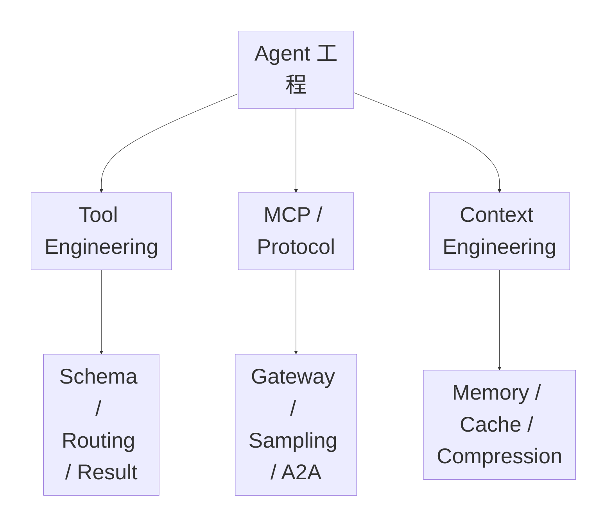

---

# 二、Custom Tools / Free-form Tools

结构化 Function Calling 通常要求模型输出明确字段；但有些输入天然更适合一整段文本，例如：

- Code Patch
- Shell Command
- Regex
- SQL / DSL
- 配置片段
- 长表达式

这时可以使用 **Custom Tool / Free-form Tool**。

核心权衡：

> 自由度越高，表达能力越强；但静态校验能力越弱，安全边界和错误恢复也越难。

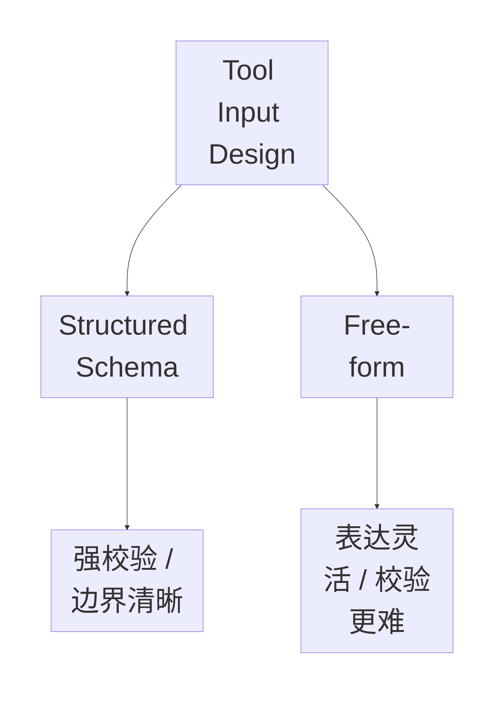

---

# 三、模型连续选错工具怎么排查

模型连续选错工具，不一定是模型能力问题。不要第一反应就换更强模型。

推荐排查：

1. **Schema / Description**：名称是否相似、描述是否歧义、允许/禁止条件是否缺失。
2. **Context / Runtime Noise**：是否暴露太多工具、旧错误是否污染当前决策、工具返回是否过长。
3. **Routing / Tool Choice**：必要时增加 Tool Router、Namespace、Tool Group、场景过滤或 tool choice 约束。

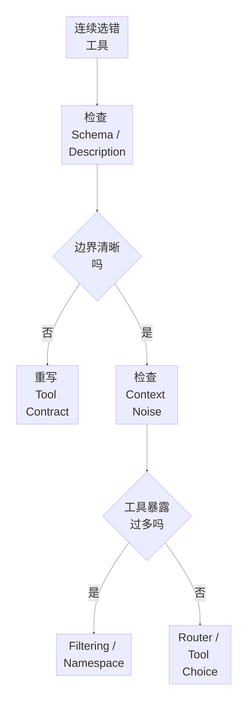

---

# 四、Tool Schema 应该写业务边界

Schema 不能只写字段类型，还应该写清：

- 用途
- 允许调用
- 禁止调用
- 前置条件
- 资格不确定时怎么做
- 参数 Schema

例如退款工具：

```text
refund_order

用途：
对符合退款条件的已支付订单发起退款。

允许调用：
- 当前用户本人订单
- 订单状态为 PAID
- 未超过退款期限
- refund_amount <= 实际支付金额

禁止调用：
- 不得退款他人订单
- 不得对已退款订单再次退款
- 不得超过实际支付金额
- 用户只是咨询退款政策时不得调用

资格无法确认：
先调用 get_order_status，
不要直接调用 refund_order。
```

参数：

```json
{
  "order_id": "string",
  "refund_amount": "number",
  "reason": "string"
}
```

核心：

> **把业务边界写进 Tool Contract，而不是只写字段。**

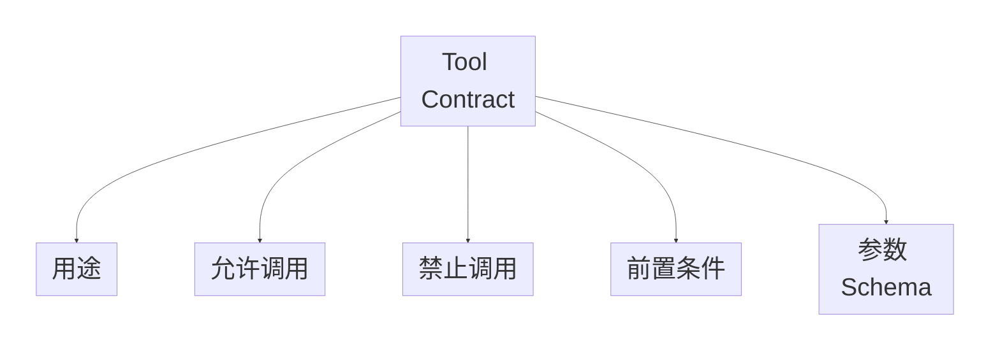

---

# 五、为什么 Tool Result 也应该结构化

工具结果通常是下一步 Agent 决策依据，而不是给人看的说明文。

自然语言返回：

```text
订单看起来已经支付，但之前似乎没有退款……
```

结构化返回：

```json
{
  "order_status": "PAID",
  "refund_status": "NONE",
  "refundable": true,
  "max_refund_amount": 199.0
}
```

结构化结果更容易判断：

- 是否继续
- 是否重试
- 是否追问
- 是否进入其他分支

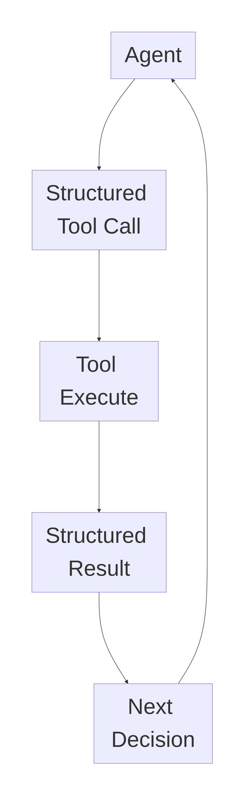

---

# 六、MCP Sampling

原笔记中的直觉：

> MCP Server 像专业员工，Client / Host 像老板。Server 做到一半需要模型判断时，可以请求 Host 使用宿主自己的 LLM 帮助推理。

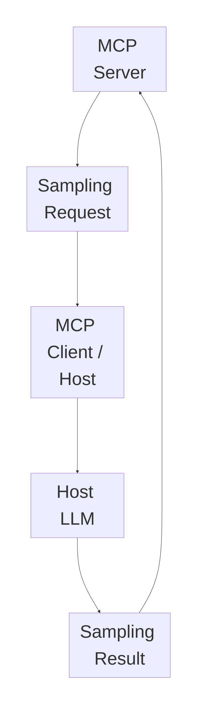

价值：

- Server 不必绑定固定模型供应商
- Server 不必自己持有模型 API Key
- 模型选择和权限仍由 Host 控制

---

# 七、MCP Gateway

企业里 MCP Server、Agent、用户和权限数量上升后，需要统一治理层。

Gateway 可负责：

- Authentication
- Authorization
- Policy
- Audit
- Rate Limit / Quota
- Routing
- Registry / Discovery

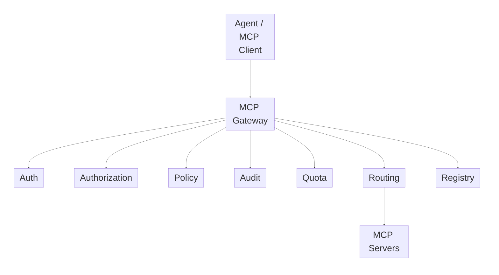

---

# 八、项目为什么可以不用 MCP

面试不要回答：

> 我们不会 MCP。

更成熟的口径：

> 当前项目规模和工具边界下，Function Calling + 统一 Tool Registry 已经能满足能力注册和工具调用需求。MCP 的主要收益在跨应用、跨 Agent、跨团队复用标准能力；当前项目里这部分复用收益还没有覆盖协议接入和治理复杂度。但 Tool Schema、Registry 和能力边界保持标准化，为后续迁移 MCP 留接口。

核心：

> **不用 MCP ≠ 不懂 MCP，而是当前收益没有覆盖复杂度。**

---

# 九、MCP 和 A2A 的职责边界

```text
MCP
= Agent 怎么接工具 / 数据 / 外部能力

A2A
= Agent 和 Agent 怎么协作
```

二者可以同时存在。

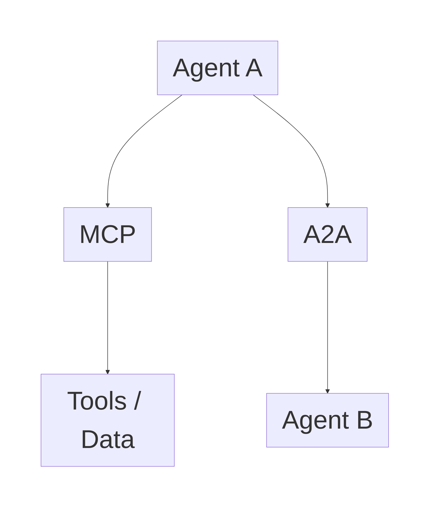

---

# 十、正文与 Metadata 的分工

一句话：

> **正文决定语义，Metadata 决定可检索性、可治理性和可引用性。**

正文承载业务内容；Metadata 可以包含：

```text
title
source
tenant_id
department
version
date
page
security_level
acl
```

同一句“住宿上限 800 元”，没有 Metadata 时无法判断：

- 是哪年制度
- 哪家公司
- 是否最新版
- 用户是否有权限
- 原文页码在哪里

---

# 十一、Context Engineering 的核心思想

Context Engineering 关注：

> **当前这一轮模型到底能看到哪些信息。**

可能包括：

- System Prompt
- Project Instruction
- Memory
- Tool Description
- Tool Result
- Current State
- Conversation History
- RAG Evidence
- Current File
- Failure Summary

目标：

> **在有限 Token Budget 里装下最有价值的信息。**

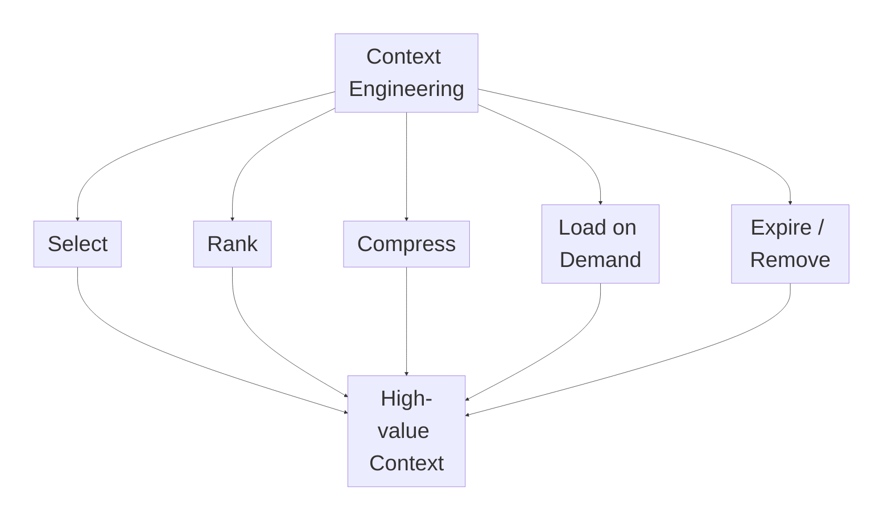

---

# 十二、Prompt Caching 与稳定前缀

原笔记记录了一个重要设计原则：

> **变化少的内容放前面，变化频繁的内容放后面。**

抽象成：

```text
Stable Prefix
→ System Rules
→ Project Rules
→ Tool Contracts

Dynamic Suffix
→ Environment
→ Current State
→ User Query
→ Recent Tool Result
```

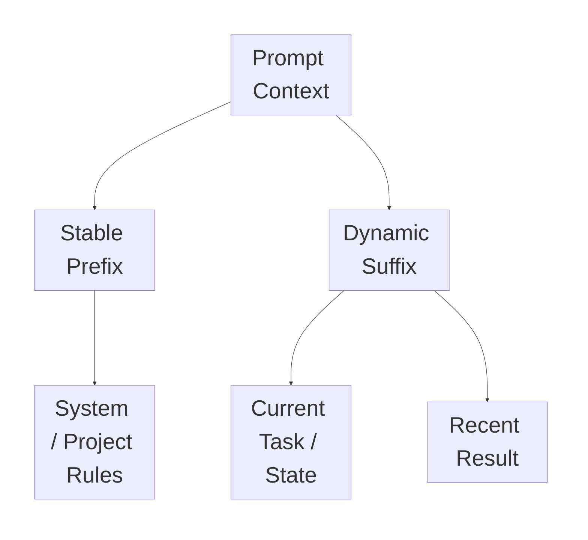

> **证据边界：**原笔记中关于 Claude Code “三级缓存”和具体节省比例的描述属于原笔记实现观察。本优化版不把未独立核验的内部实现和具体百分比当作确定事实；面试中优先讲“稳定前缀有利于缓存命中”的通用工程原则。

---

# 十三、安全规则为什么要强调“先读后改”

重要原则：

> **不要对没有读过的代码提修改建议。**

否则模型可能只根据文件名、函数名或用户描述猜内部逻辑，产生“幻觉修改”。

可靠 Coding Agent 流程：

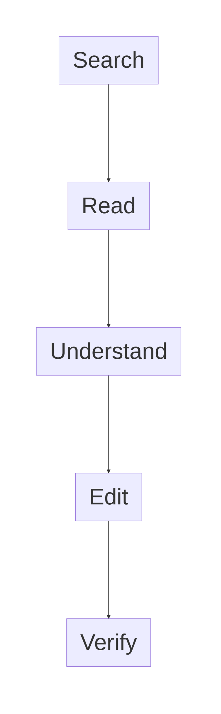

同时不要顺手加入用户没有要求的：

- 重构
- 新功能
- 方法签名变化
- 大规模格式修改

原则：

> **最小必要修改降低副作用。**

---

# 十四、可逆性与影响范围

操作风险不应该只粗暴分成“安全 / 危险”。

至少考虑：

1. **Reversibility**：能不能撤销
2. **Blast Radius**：影响范围多大

| 可逆性 | 影响范围 | 风险 |
|---|---|---|
| 高 | 小 | 低 |
| 高 | 大 | 中 |
| 低 | 小 | 中 |
| 低 | 大 | 高 |

例如：

```text
改一个可 Git 回滚的配置
```

和：

```text
删除整个数据目录
```

即使都叫“工具调用”，风险完全不同。

---

# 十五、Memory 类型与写入规则

原笔记记录四类 Memory：

| 类型 | 内容 |
|---|---|
| User | 用户长期偏好与习惯 |
| Feedback | 用户对 Agent 行为的纠正 |
| Project | 项目长期决策与状态 |
| Reference | 外部参考信息指针 |

## Feedback Memory

不要只记：

> 用户不喜欢跑完整测试。

更完整：

```text
What：
用户不希望每次小改动都跑全量测试

Why：
全量测试耗时长

How to Apply：
普通小改动优先相关模块测试，
高风险改动或发布前再跑全量
```

核心：

> **Memory 不只是记事实，还要记未来如何应用。**

## Project Memory

避免相对时间：

```text
昨天把认证改成 OAuth2
```

改成：

```text
2026-08-10：认证模块迁移到 OAuth2
```

长期记忆尽量时间绝对化。

## 不值得重复存入 Memory 的内容

如果能从权威 Source of Truth 重新查询：

- Git History
- 代码结构
- 文件树
- 已存在的项目规范
- 可直接从源码推导的信息

就要谨慎重复存入 Memory，避免 Memory 过期后和真实状态冲突。

---

# 十六、Memory 为什么要索引化按需加载

不要每轮把所有 Memory 全部放进 Context。

更合理：

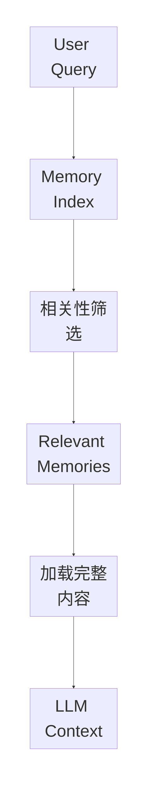

核心：

> **先检索 Memory，再消费 Memory。**

> 原笔记中关于具体模型角色、Top-5、frontmatter 行数等 Claude Code 细节，在需要对外陈述前应独立核验；这里保留“两阶段召回”这一工程思想。

---

# 十七、Context Compression 五层策略

最重要的思想：

> **不要一上来就全量 Summary。能轻量解决，就不要使用更重的压缩。**

## 第 1 层：大结果外置

巨大 Tool Result：

```text
5000 行日志
巨大 JSON
完整编译输出
```

可以：

```text
完整内容存外部文件
+
Context 留 Preview
+
按需重新读取
```

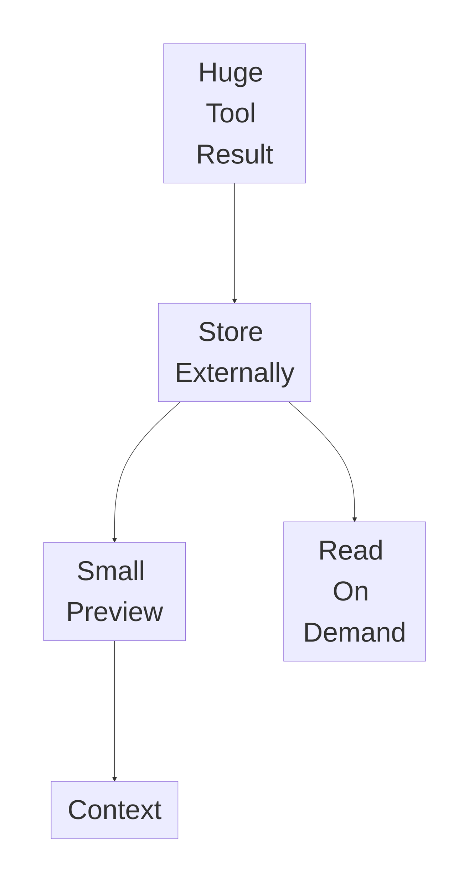

## 第 2 层：删除远古低价值消息

几十轮以前的：

```text
帮我看看 bug
好的
这个文件呢
可以
```

如果已经不影响当前决策，可以移除。

## 第 3 层：裁剪旧 Tool Result

不一定删除整条消息，只把老工具输出替换为：

```text
[Old tool result cleared]
```

保留最近和当前任务强相关的结果。

## 第 4 层：Read-time Projection

不修改完整本地历史，只在调用模型时生成压缩视图：

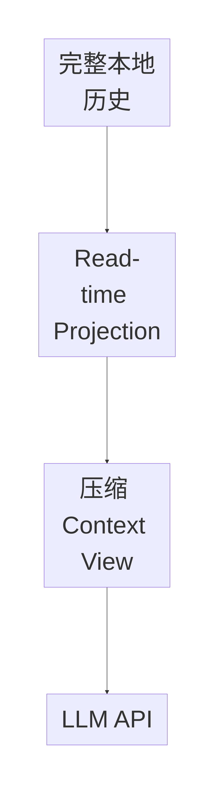

核心：

> **Compression 可以是视图，而不是源数据修改。**

## 第 5 层：全量结构化摘要

前面仍不够时，再总结整个历史，至少保留：

- 用户核心需求
- 已完成事项
- 关键结果
- 关键决策及原因
- 未完成待办
- 当前阻塞
- 最近操作对象

## 五层总图

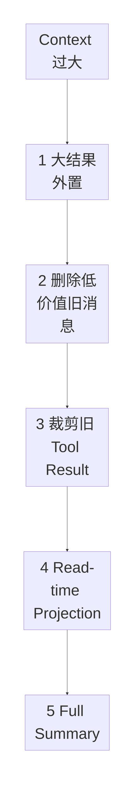

越往后：

```text
处理成本 ↑
信息损失风险 ↑
```

因此应渐进式加码。

---

# 十八、Context Engineering > Prompt Engineering > Model Selection

原笔记最后给出的学习优先级可以保留为一种工程排查原则：

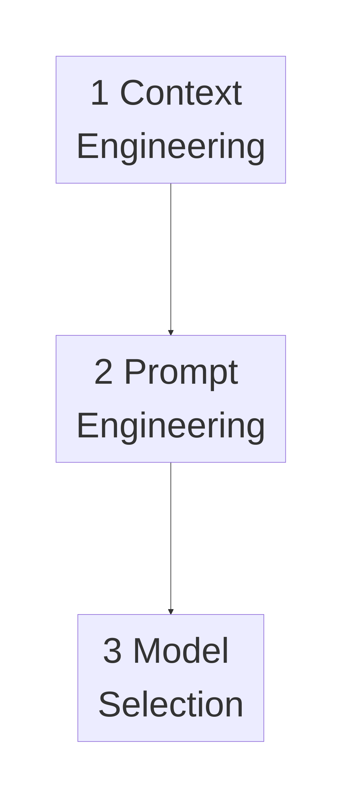

它不是说模型不重要，而是提醒：

很多“模型不够聪明”的问题其实来自：

- Context 给错
- Context 太多
- Evidence 被噪声淹没
- 旧信息没有清理
- Tool Description 冲突

所以排查时先问：

> **模型是不是拿到了正确的信息？**

---

# 十九、面试高频速答

## 1. 什么情况下适合 Free-form Tool？

> 当输入天然是一段完整 Patch、Shell、Regex、DSL 或代码，拆成很多字段反而明显增加复杂度时适合 Free-form。但自由度越高越难做静态校验，高风险场景仍需要 Validator、Sandbox 和权限控制。

## 2. 模型连续选错工具怎么办？

> 先排 Tool Description 和 Schema 边界，再检查 Context 是否暴露过多工具或错误历史，最后才考虑 Router、Namespace、Tool Filtering 或强制 tool choice。不要第一反应换模型。

## 3. Tool Description 最重要的是什么？

> 不只是这个工具“干什么”，还要明确什么时候允许调用、什么时候禁止调用、资格无法确认时先调用什么。

## 4. 为什么 Tool Result 也需要 Schema？

> 因为结果是下一步 Agent 决策输入。结构化状态比自然语言更容易判断成功、失败、重试、追问和分支。

## 5. MCP Sampling 是什么？

> MCP Server 在执行过程中需要模型推理时，可以请求 Host / Client 使用宿主控制的 LLM 完成推理，再把结果返回 Server。

## 6. MCP Gateway 解决什么问题？

> 当 MCP Server 和 Client 数量变多时，统一处理认证、授权、策略、审计、限流、路由和服务发现。

## 7. 为什么项目不用 MCP？

> 当前 Tool 数量和复用边界下，Function Calling + Tool Registry 已够用。MCP 的跨应用标准化收益还没有覆盖接入复杂度，但能力注册和 Schema 保持标准化，方便后续迁移。

## 8. MCP 和 A2A 区别？

> MCP 解决 Agent 如何接 Tool / Data；A2A 解决 Agent 与 Agent 如何协作。

## 9. Metadata 有什么价值？

> 正文承载语义，Metadata 支持过滤、版本、权限、来源和 Citation，所以决定可检索性、可治理性和可引用性。

## 10. Context Engineering 是什么？

> 运行时决定模型这一轮到底看到什么，以及这些信息如何选择、排序、压缩、淘汰和按需加载。

## 11. 为什么先读后改？

> 防止模型根据文件名、方法名猜内部实现，减少幻觉修改和无关改动。

## 12. 如何判断工具操作风险？

> 至少看可逆性和 Blast Radius。不可逆且影响范围大的操作需要更强保护。

## 13. Memory 为什么不能什么都存？

> 能从代码、Git 或权威 Source of Truth 重新查到的信息，重复写入长期 Memory 容易过期并产生冲突。

## 14. Memory 怎么降低 Context 成本？

> 先通过 Index / Metadata 筛选相关 Memory，再只加载少量完整内容，而不是每轮塞入全部记忆。

## 15. Context 太长怎么压缩？

> 先大结果外置，再删除低价值旧消息、裁剪旧 Tool Result、使用 Read-time Projection，最后才做全量结构化摘要。

## 16. 为什么不直接 Full Summary？

> Summary 有额外计算成本和信息损失。很多 Context 膨胀可以通过外置、删除和投影解决，不需要立刻让模型重新总结整个历史。

---

# 二十、一页速记

```text
Free-form Tool
= Patch / Shell / Regex / DSL
= 灵活但难校验

选错 Tool
= Schema
→ Context
→ Routing

Tool Contract
= 用途
+ 允许
+ 禁止
+ 前置条件
+ 参数

Tool Result
= 最好结构化

MCP Sampling
= Server 请求 Host LLM 推理

MCP Gateway
= Auth
+ Authorization
+ Policy
+ Audit
+ Quota
+ Routing
+ Registry

MCP
= Agent ↔ Tool / Data

A2A
= Agent ↔ Agent

正文
= Semantic Content

Metadata
= Retrieval + Governance + Citation

Context Engineering
= Select
+ Rank
+ Compress
+ Load on Demand
+ Expire

Coding Agent
= Search
→ Read
→ Understand
→ Edit
→ Verify

Risk
= Reversibility × Blast Radius

Memory
= User
+ Feedback
+ Project
+ Reference

Memory Recall
= Index
→ Filter
→ Relevant
→ Full Load

Context Compression
1. Large Result Offload
2. Remove Old Low-value Messages
3. Prune Old Tool Results
4. Read-time Projection
5. Full Structured Summary

优化优先级
= Context Engineering
→ Prompt Engineering
→ Model Selection
```

---

# 最终核心结论

这份学习笔记最值得形成的工程认知不是：

> Agent 要接很多 Tool、很多 MCP Server、很多 Memory。

而是：

> **Agent Runtime 要控制模型能看到什么、能调用什么、工具边界是什么、结果如何结构化、历史如何压缩。**

一个可靠 Agent 可以抽象为：

```text
Clear Tool Contract
+
Controlled Tool Space
+
Structured Observation
+
Protocol Governance
+
High-value Context
+
Progressive Compression
+
Verification
```

最终目标是：

> **在有限模型能力、Token 和成本预算下，让模型始终拿到最有价值的信息，并只执行边界清晰、可验证的动作。**
