> 适用场景：AI Agent 应用开发 / Agent Runtime / MCP / A2A / Tool Calling / Workflow Reliability / Agent Eval  
> 来源：根据《每日学习8-12.md》原始学习笔记去重、纠错与结构化整理。
>
> 本文统一采用：
>
> **专有名词 / 系统级方法 → 记忆路线 → 工程理解 → 面试速答**
>
> 原稿没有给出实现代码或实验数据的地方，不额外编造。

---

# 目录

- [一、先抓住整篇主线](#一先抓住整篇主线)
- [二、Tool：模型负责选，Runtime 负责执行治理](#二tool模型负责选runtime-负责执行治理)
- [三、Schema：结构合法不等于业务合法](#三schema结构合法不等于业务合法)
- [四、工具选错与工具过多怎么治理](#四工具选错与工具过多怎么治理)
- [五、Skill 与 DSL](#五skill-与-dsl)
- [六、MCP：AI 应用能力接入协议](#六mcpai-应用能力接入协议)
- [七、Function Calling / MCP / A2A](#七function-calling--mcp--a2a)
- [八、Artifact 为什么重要](#八artifact-为什么重要)
- [九、Saga：跨系统长事务补偿](#九saga跨系统长事务补偿)
- [十、可靠性不是几个 Retry](#十可靠性不是几个-retry)
- [十一、Cancel：取消是一种状态转移](#十一cancel取消是一种状态转移)
- [十二、长任务：执行层与呈现层分离](#十二长任务执行层与呈现层分离)
- [十三、Polling / Streaming / Webhook](#十三polling--streaming--webhook)
- [十四、Agent Runtime 的核心定义](#十四agent-runtime-的核心定义)
- [十五、Runtime 的八大职责](#十五runtime-的八大职责)
- [十六、Control Plane / Data Plane / Runtime Core](#十六control-plane--data-plane--runtime-core)
- [十七、Capability Registry](#十七capability-registry)
- [十八、Model Router](#十八model-router)
- [十九、State Store / Artifact Store / Policy](#十九state-store--artifact-store--policy)
- [二十、Executor / Sandbox / Scheduler](#二十executor--sandbox--scheduler)
- [二十一、Tracing / Replay / Multi-tenancy](#二十一tracing--replay--multi-tenancy)
- [二十二、Runtime 的终止条件](#二十二runtime-的终止条件)
- [二十三、Agent Eval 七层框架](#二十三agent-eval-七层框架)
- [二十四、面试高频速答](#二十四面试高频速答)
- [二十五、一页速记](#二十五一页速记)

---

# 一、先抓住整篇主线

整篇可以压缩成：

```text
模型产生意图
↓
Tool / MCP / A2A 提供能力
↓
Runtime 做权限、策略和调度
↓
Retry / Idempotency / Saga / Cancel 保证可靠性
↓
State / Artifact / Trace 持久化
↓
Streaming / Webhook / Polling 对外呈现
↓
Eval 判断版本是否能上线
```

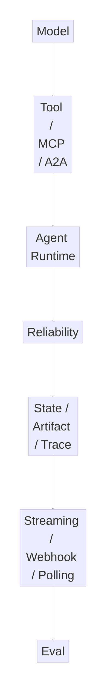

核心句：

> **模型负责提出动作意图，Runtime 负责把意图变成安全、可靠、可审计的系统行为。**

---

# 二、Tool：模型负责选，Runtime 负责执行治理

## 1. 专有名词

### Tool Selection
模型决定：
> 当前要调用哪个 Tool。

### Argument Grounding
模型决定：
> Tool 参数应该填什么。

### Runtime Governance
Runtime 决定：
> 这个动作能不能执行、什么时候执行、执行失败怎么办、执行以后如何处理。

---

## 2. 记忆路线

```text
Model
= What + Args

Runtime
= Can + When + After
```

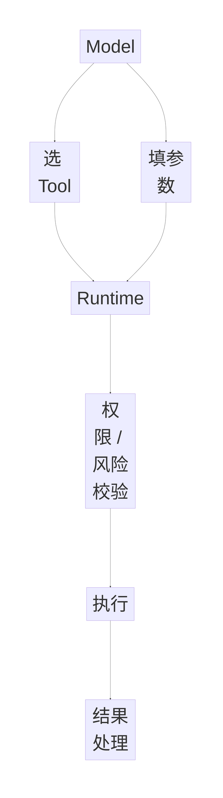

## 3. 工程理解

模型生成：

```json
{
  "tool": "refund_order",
  "amount": 999
}
```

并不意味着系统应该立刻执行。

Runtime 还要判断：

- 当前用户是否有权限；
- 订单是否允许退款；
- 退款金额是否合法；
- 是否已经退款；
- 是否需要审批；
- 是否存在幂等记录。

副作用 Tool 原稿强调：

> **默认串行、可审计，必要时走审批并默认考虑幂等。**

---

# 三、Schema：结构合法不等于业务合法

## 1. Schema Validation

回答：

> 参数结构对不对？

例如：

```json
{
  "order_id": "A1001",
  "refund_amount": 999
}
```

完全可以通过 JSON Schema。

---

## 2. Business Validation

回答：

> 当前业务状态下，这个动作合不合法？

例如：

```text
实际支付金额 = 199
refund_amount = 999
```

Schema 合法，但业务非法。

---

## 3. 最大风险

> **把“符合 Schema”误当成“业务合法”，进而触发高风险动作。**

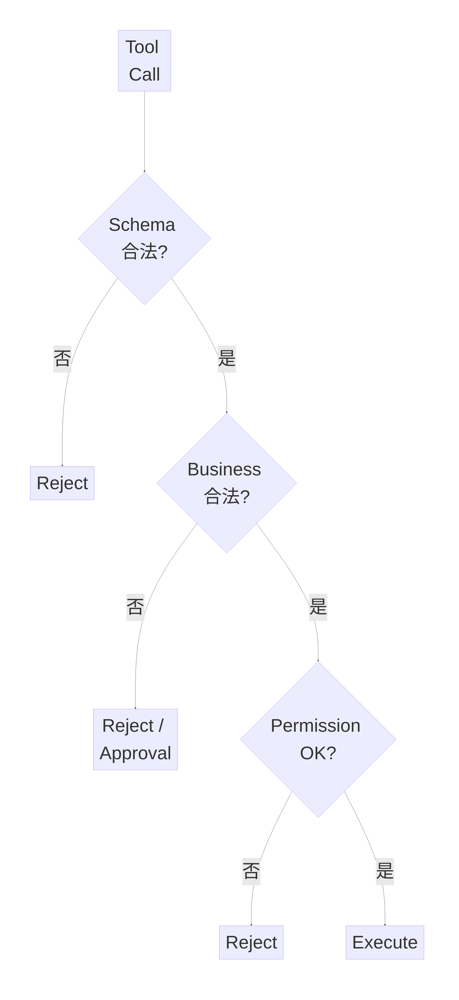

---

## 4. Tool Description 应该写边界

Tool Description 不应该只有：

> “这个工具用于退款。”

还应该写：

```text
能做什么
不能做什么
允许调用条件
禁止调用条件
前置条件
失败时如何处理
```

所以：

> **Tool Description 更接近 Tool Contract。**

---

## 5. Tool Result 也要尽量结构化

自由文本：

```text
订单好像已经支付，而且看起来应该可以退款……
```

结构化：

```json
{
  "status": "PAID",
  "refund_status": "NONE",
  "refundable": true,
  "max_refund_amount": 199
}
```

后者更适合作为下一步 Agent 决策输入。

---

# 四、工具选错与工具过多怎么治理

## 1. 连续两次选错 Tool

按原稿分三层排查：

```text
约束层
↓
Runtime 层
↓
上游 Routing 层
```

### 第一层：Schema / Description

检查：

- Tool 名称是否过于相似；
- Description 是否重叠；
- 调用边界是否模糊；
- 前置条件是否没写。

### 第二层：Runtime Tool Exposure

检查：

> 是否一次性给模型暴露了太多相似 Tool。

### 第三层：Routing / Tool Selection

必要时：

```text
先 Route 到 Namespace
↓
再加载少量候选 Tool
```

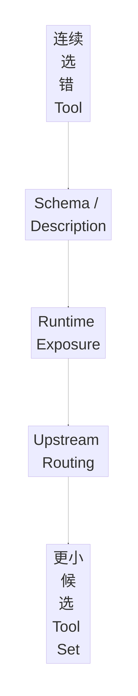

---

## 2. 工具过多怎么优化

原稿给出：

- Namespace；
- 超大 Tool 集动态加载；
- Tool Calling Cache；
- 减少近义 Tool。

可以记成：

```text
分组
→ 按需加载
→ 缓存
→ 去同义
```

---

# 五、Skill 与 DSL

## 1. Skill

Skill 不是：

> “一条超长 Prompt”。

而更像：

> **可复用能力资产。**

是否值得长期保留，看：

```text
任务效果是否稳定提升
成本是否下降
一致性是否提升
```

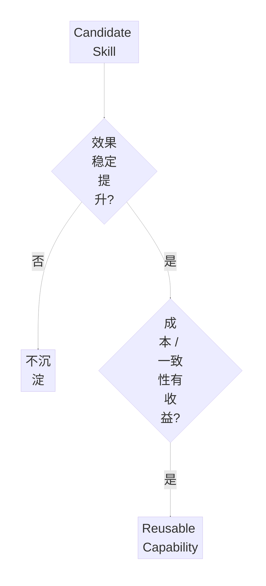

---

## 2. DSL

DSL：

> **Domain-Specific Language，领域特定语言。**

定义：

> 为某一个特定领域专门设计的一套表达规则 / 小语言。

例如：

```text
SEARCH source=web
FILTER score>0.8
SUMMARIZE style=brief
```

DSL 的意义是：

> 用更受控的方式表达某个领域里的动作，而不是追求通用编程能力。

---

# 六、MCP：AI 应用能力接入协议

## 1. 核心定义

原稿：

> **MCP 做的是外部能力如何被标准化暴露给 AI 应用。**

它不仅能连接函数，还可以涉及：

- Tools；
- Resources；
- Prompts；
- 文件 / 工作区上下文；
- Capability Discovery；
- Lifecycle；
- Authentication；
- Interoperability。

---

## 2. HTTP API 与 MCP

### HTTP API
更偏：

> 通用服务接口。

核心：

```text
Request
→ Response
```

### MCP
更偏：

> AI 应用能力接入标准协议。

还关注：

```text
能力发现
上下文资源
Prompt 模板
生命周期协商
认证
生态互操作
```

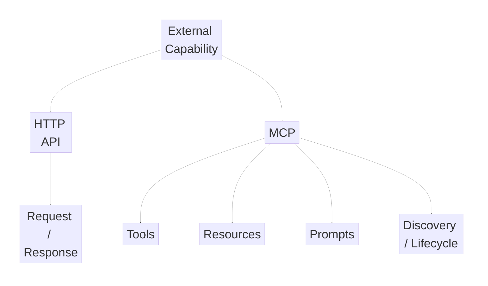

---

## 3. MCP Transport

原稿列出：

```text
stdio
Streamable HTTP
```

记忆：

```text
stdio
= 本地进程通信

Streamable HTTP
= 网络化 MCP 服务
```

---

# 七、Function Calling / MCP / A2A

## Function Calling

更偏：

> **模型接口。**

解决：

```text
模型怎么表达“我要调用某函数”
```

## MCP

更偏：

> **能力接入协议。**

解决：

```text
AI 应用如何发现、接入 Tool / Resource / Prompt
```

## A2A

更偏：

> **Agent 与 Agent 协作。**

解决：

```text
Agent A 如何把任务交给 Agent B
```

记忆：

```text
Function Calling = Model → Function
MCP              = AI App → Capability
A2A              = Agent → Agent
```

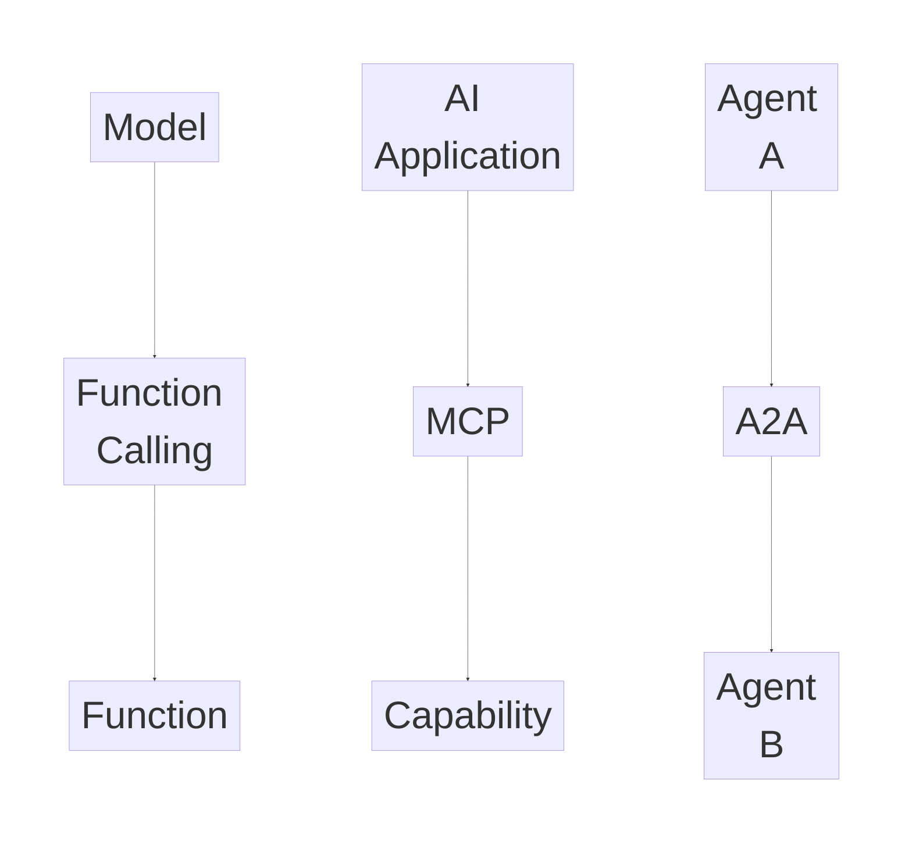

---

# 八、Artifact 为什么重要

A2A 强调 Artifact，是因为结果不一定是一句文本。

可能是：

```text
报告
文档
代码
表格
JSON
截图
```

Artifact：

> **Agent 执行后产生的可保存、可传递、可继续消费的成果物。**

所以：

```text
Message
= 沟通

Artifact
= 任务产物
```

---

# 九、Saga：跨系统长事务补偿

## 1. Saga 思想

Saga：

> **把长事务拆成多个独立步骤，每一步都设计一个补偿动作；后面失败时，按相反顺序撤销前面已完成的步骤。**

示例：

```text
创建日程
→ Compensation：删除日程

预订会议室
→ Compensation：释放会议室

发送邀请
→ Compensation：发送取消通知
```

---

## 2. 为什么 Agent 特别适合 Saga

因为 Agent Workflow 经常：

- 跨多个系统；
- 没有全局数据库事务；
- 混入模型推理；
- 混入人工审批；
- 副作用无法简单 Rollback；
- Failure Handling 不能只靠 try-catch。

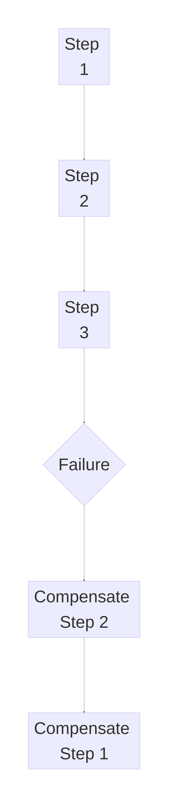

记忆：

> **Forward Action + Compensation。**

---

# 十、可靠性不是几个 Retry

原稿最重要的系统思想之一：

> **可靠性不是写几个 Retry，而是调度、状态、幂等、补偿的一整套设计。**

可以拆成四层。

---

## 1. Failure Classification

区分：

```text
Transient Failure
Permanent Failure
UNKNOWN
```

例如：

```text
网络瞬时超时
→ 可以 Retry

权限不足
→ Retry 无意义

请求超时但外部系统可能已经执行成功
→ UNKNOWN
```

---

## 2. Idempotency Key

同一业务动作分配唯一 Key，重复请求不会产生重复副作用。

---

## 3. UNKNOWN State

最危险的状态往往不是：

```text
SUCCESS
FAILED
```

而是：

> **不知道成功还是失败。**

例如：

```text
Payment API Timeout
```

此时正确处理：

```text
UNKNOWN
↓
查询外部真实状态
↓
确认成功 / 失败
↓
再决定是否 Retry
```

---

## 4. Saga + Workflow

Saga：

> 负责补偿。

Workflow：

> 负责调度、状态持久化、Retry、Timeout、恢复。

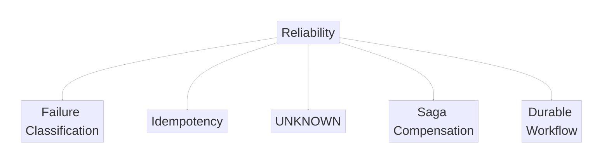

---

# 十一、Cancel：取消是一种状态转移

错误理解：

> Cancel = 强行 Kill Process。

更合理：

> **Cancel 是让任务进入受控终止状态，并处理已经发生的副作用。**

需要考虑四件事：

```text
取消是否向下游传播
正在执行的步骤怎么停
已完成副作用是否补偿
重复 Cancel 是否幂等
```

推荐语义：

```text
RUNNING
↓
CANCELING
↓
CANCELED
```

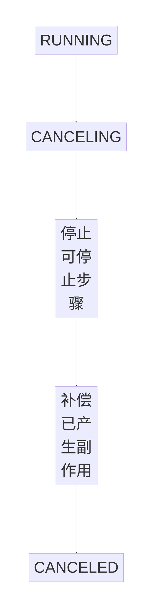

核心：

> **取消不一定能物理中止所有外部动作，但必须保证系统进入一致的 Cancel 语义。**

---

# 十二、长任务：执行层与呈现层分离

## 1. Execution Layer

负责：

```text
模型调用
Tool 执行
State
Checkpoint
Trace
Retry
Cancel
Timeout
Recovery
Artifact
```

## 2. Presentation Layer

负责：

```text
进度
阶段消息
Partial Result
Final Result
断线重连
Streaming / Webhook / Polling
取消 / 继续 / 补充输入入口
```

---

## 3. 为什么必须分离

长任务会遇到：

- 网页关闭；
- 网络抖动；
- 手机切后台；
- Streaming 断线。

所以：

> **连接可以断，任务不能丢。**

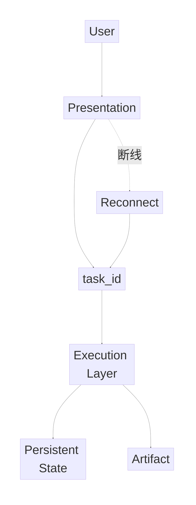

---

# 十三、Polling / Streaming / Webhook

三者都是：

> **任务结果怎么从服务端传给客户端。**

## Polling

客户端主动问：

> 好了吗？

类比：

> 每隔 5 分钟打电话问一次。

## Streaming

服务端持续推：

> 边做边告诉你。

类比：

> 一直保持通话。

## Webhook

客户端留地址：

> 做完以后服务端主动通知。

类比：

> 好了以后给我打电话。

---

## 最重要的组合

```text
Streaming = 实时体验
Webhook   = 异步通知
Polling   = 最终兜底
```

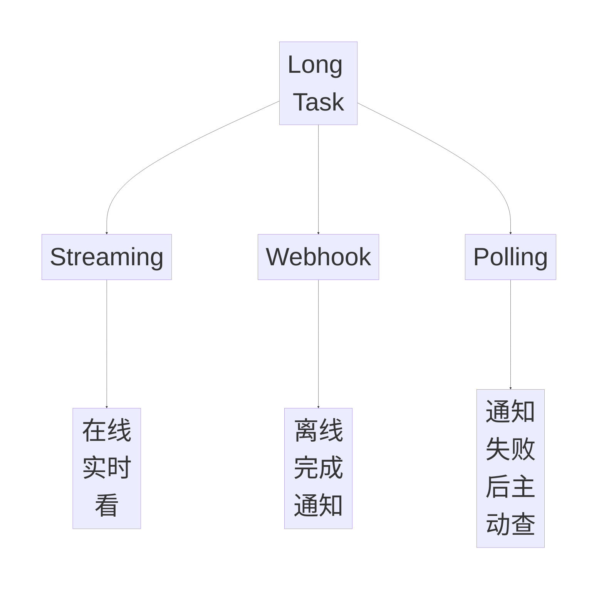

---

## Streaming 不等于 Chain-of-Thought

Agent 更适合流式输出：

- 阶段事件；
- Tool Event；
- Partial Result；
- 可理解的中间状态；
- 用户需要知道的下一步。

而不是：

> 完整内部推理过程。

---

# 十四、Agent Runtime 的核心定义

原稿定义：

> **Agent Runtime 是介于模型与外部世界之间的执行系统。**

它负责：

```text
把模型输出
↓
解释成受控动作
↓
组织 Tool / Protocol / State / Policy
↓
提供 Scheduling / Recovery / Safety / Observability / Governance
```

一句话：

> **Runtime 把“模型能想”变成“系统能做”。**

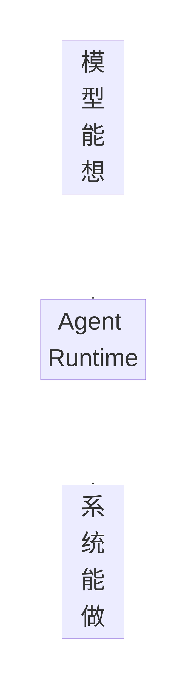

---

# 十五、Runtime 的八大职责

原稿八类职责：

```text
1. 输入规范化
2. 上下文装配
3. 模型调用与路由
4. 动作解释与执行
5. State / Artifact 管理
6. 调度与可靠性
7. 安全与策略
8. 可观测与回放
```

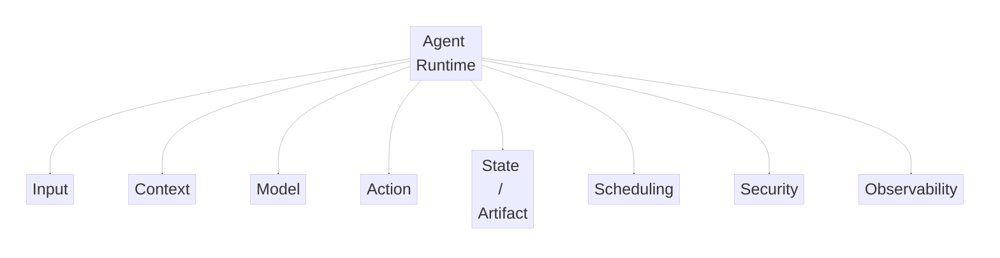

---

## 1. Input Normalization

统一来自：

```text
User
API
Upstream Workflow
Webhook
External Event
```

并处理：

```text
Identity
Session
Tenant
Validation
Rate Limit
Routing Preparation
```

---

## 2. Context Assembly

决定当前 Model Call 能看到：

- 哪些历史；
- 哪些 Memory；
- 哪些 RAG；
- 哪些 Tool / Namespace；
- Approval；
- Policy；
- Artifact Summary。

本质：

> **State → Model Context。**

---

## 3. Model Call & Routing

根据：

- Task Type；
- Cost；
- SLA；
- Tool Compatibility；
- Risk Level；

选择模型。

---

## 4. Action Interpretation & Execution

模型输出可能是：

```text
Final Answer
Function Call
Structured Output
Ask User
Handoff
MCP
A2A
Skill / Script
```

Runtime 要把它解释成：

> 可执行 Action。

---

## 5. State & Artifact

管理：

```text
Session / Conversation
Task State
Workflow Node
Tool History
Artifact
Approval
Cancel / Resume
Trace ID
```

---

## 6. Scheduling & Reliability

决定：

```text
同步 / 异步
串行 / 并行
Retry
Durable Workflow
Wait Event
Human Review
```

---

## 7. Security & Policy

Runtime 是：

> **模型与外部副作用之间的闸门。**

插入：

- Permission；
- Approval；
- Data Masking；
- Tenant Isolation；
- Quota；
- Tool Allow / Deny。

---

## 8. Observability & Replay

需要回答：

```text
模型当时看到什么？
选了哪个 Tool？
参数是什么？
哪一步失败？
State 怎么转移？
产生了什么副作用？
谁审批？
怎么 Replay？
```

---

# 十六、Control Plane / Data Plane / Runtime Core

## Control Plane

关注：

> **决定怎么跑。**

包括：

```text
Tool Registry
Skill Management
Model Routing Policy
Permission / Approval Policy
Tenant Config
Feature Flags
Version
Canary
Eval
Rollback
```

## Data Plane

关注：

> **当前实际在跑什么。**

包括：

```text
Request
Model Call
Tool Execute
Queue
State Write
Artifact
Trace
Event Stream
```

记忆：

> **Control Plane 定规则，Data Plane 真执行。**

---

## Runtime Core

原稿给出的核心循环：

```text
Read State
→ Assemble Context
→ Call Model
→ Interpret Output
→ Tool / MCP / A2A / Skill
→ Write State
→ Continue / Wait / Human / End
→ Event / Trace
```

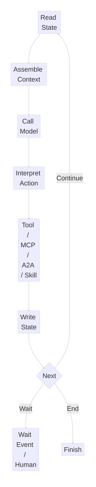

它需要：

- 显式 State；
- Failure Classification；
- Interrupt；
- Max Steps；
- Idempotency Boundary；
- Side-effect Control；
- Scheduling。

---

# 十七、Capability Registry

能力来源不再只是本地函数，还可能有：

```text
Function Tools
MCP Servers
A2A Remote Agents
Skills / Plugins
```

统一 Registry 后，Runtime 才能做：

```text
发现
授权
路由
版本
观测
```

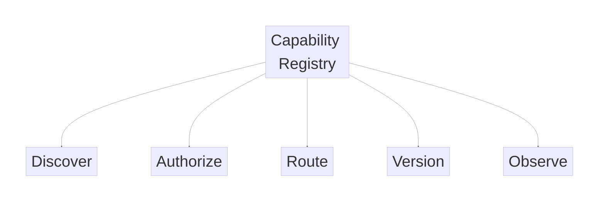

### Function Tool 注册

可以包含：

```text
name
schema
permission
executor
idempotency type
risk level
```

### MCP Server 注册

可以包含：

```text
server address
tools/resources/prompts
auth
tenant visibility
health
namespace
```

### A2A Agent 注册

可以包含：

```text
Agent Card
task type
streaming
push notification
trust/auth
quota
```

### Skill / Plugin 注册

可以包含：

```text
metadata
applicable scenario
invocation
version
runtime
evaluation result
```

---

# 十八、Model Router

原稿四个维度：

## 1. Task Type

```text
普通问答
复杂推理
代码
长上下文
Tool-intensive
多语言
```

## 2. Budget / SLA

```text
Cost Budget
Latency
Background Allowed?
Quality Requirement
```

## 3. Capability Compatibility

```text
Tool Calling
Strict Schema
Tool Search
MCP
Streaming
Background
Long Context
Multimodal
```

## 4. Risk Level

高风险：

> 更严格模型能力、Schema、Approval 和 Policy。

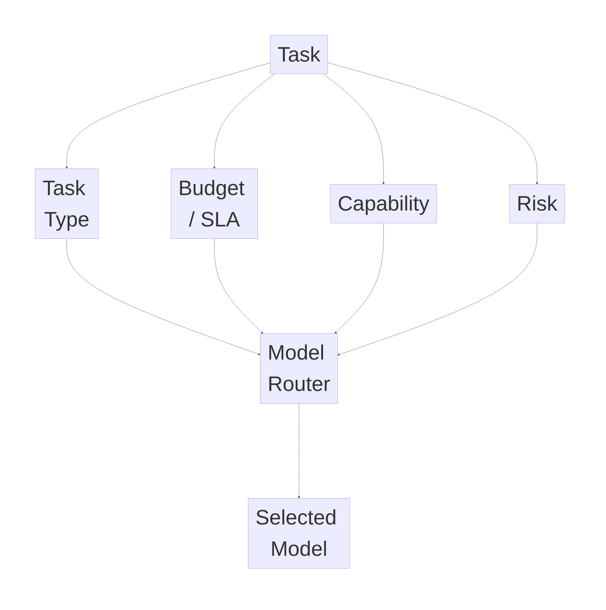

---

# 十九、State Store / Artifact Store / Policy

## 1. Session / State Store

至少支持：

```text
Session / Conversation History
Workflow / Task State
Checkpoint
Tool Call / Result Index
Artifact Reference
Approval / Interrupt
Resume Marker
Tenant / User Binding
TTL / Archive / Delete
```

---

## 2. Artifact Store

大对象：

```text
报告
表格
代码补丁
网页抓取结果
截图
大 JSON
```

不应该全部塞进 Context 或 State DB。

应该：

```text
Full Artifact
→ Artifact Store

Context
→ Summary + Reference + Key Fields
```

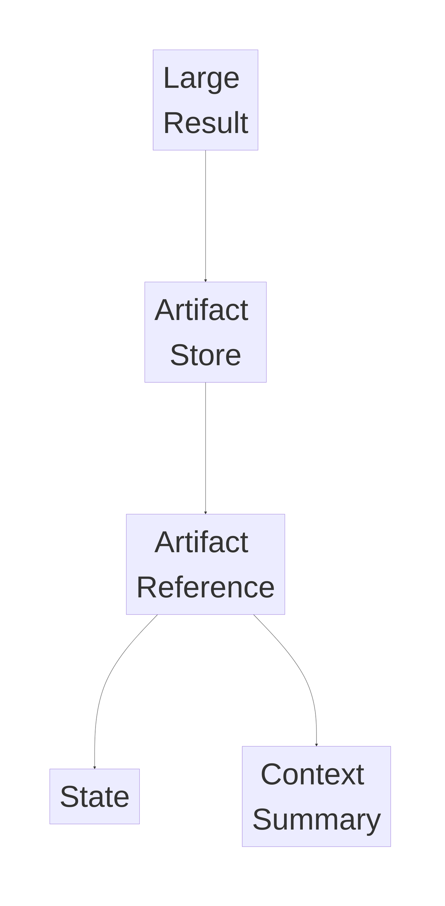

---

## 3. Policy / Approval / Permission

原稿四层：

```text
Tool Visibility
Execution Permission
Data Access Scope
Risk Action Approval
```

重点：

> **看得到不等于能执行。**

例如：

```text
可以查询
≠
可以删除
```

高风险动作：

- 发消息；
- 删除数据；
- 批量操作；
- 写生产；
- 高权限 API；
- 对外发布；

可进入 HITL。

---

# 二十、Executor / Sandbox / Scheduler

## Executor

推荐架构：

```text
Model Tool Call
↓
Runtime Core
↓
Action Interpretation
↓
Executor
↓
External System
```

模型不直接触达核心系统。

---

## Sandbox / Isolated Worker

高风险能力：

> 可以在 Container / Sandbox / Isolated Worker 中运行。

---

## Scheduler / Queue / Durable Workflow

长任务需要：

```text
Queue
Background Worker
Durable Workflow
Cron / Event Scheduler
```

Runtime Core：

> 负责业务编排逻辑。

Scheduler / Workflow Engine：

> 负责长期执行语义。

---

# 二十一、Tracing / Replay / Multi-tenancy

## Trace

串起：

```text
入口
→ 模型
→ Tool
→ Subtask
→ Remote Agent
```

## Structured Logs

记录：

```text
tenant_id
session_id
task_id
tool_name
tool_args summary
state transition
error_type
cost / latency
approval actor
```

## Replay

用于：

> 开发 / 调试环境复现一次执行链。

## Eval Hooks

将执行链导入：

- Benchmark；
- Regression；
- Online Sample Review；
- Trace Grading。

---

## 多租户隔离

原稿五个层面：

```text
Namespace Isolation
Quota / Rate Limit
Credential Isolation
Cache Isolation
Version / Canary
```

特别注意：

> Prompt Cache、Tool Metadata Cache、Retrieval Cache 都要 tenant-aware。

---

# 二十二、Runtime 的终止条件

常见终止原因：

```text
Final Answer
Goal State Reached
Final Artifact Completed
Wait User Input
Wait Approval
Canceled
Max Steps
Unrecoverable Error
Time Budget Exceeded
Cost Budget Exceeded
```

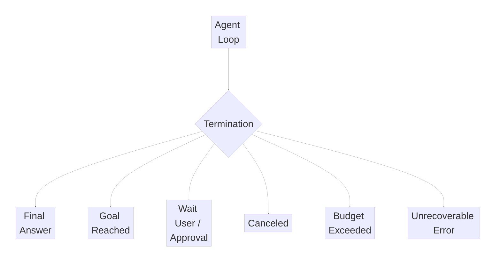

---

# 二十三、Agent Eval 七层框架

原稿最后一部分可以整理成：

```text
Task
↓
Success Criteria
↓
Dataset
↓
Environment
↓
Evaluator
↓
Report / Gate
↓
Feedback Loop
```

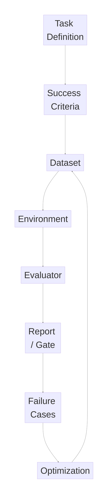

---

## 1. Task Definition

先定义：

> 评什么任务。

例如：

```text
企业知识问答
工单归类
代码修复
```

---

## 2. Success Criteria

定义：

```text
Success
Failure
Partial Success
```

例如：

```text
答案正确
AND Citation 充分
AND 5 步内完成
AND 不泄露敏感信息
```

---

## 3. Dataset / Scenario Set

原稿包括：

```text
Gold Set
Boundary Set
Failure Set
Adversarial Set
Online Replay Set
```

---

## 4. Environment / Executor

需要确定：

```text
Tool 真调用还是 Mock
Retrieval Corpus 是否固定
Browser Page 是否稳定
```

---

## 5. Evaluator / Scorer

原则：

> **能规则判断的优先规则判断。**

例如：

- Structured Output；
- Tool Args；
- Test Result；
- Schema；
- Forbidden Action。

开放式质量：

> LLM-as-a-Judge。

高风险：

> Human Review。

---

## 6. Report / Gate

评测最终不是只给一个分数，而是回答：

```text
能否上线？
哪些维度提升？
哪些退化？
退化能否接受？
```

---

## 7. Feedback Loop

失败 Case：

```text
进入 Dataset
↓
Prompt / Tool Schema / Retrieval / Workflow 优化
↓
再次 Eval
```

---

# 二十四、面试高频速答

## 1. 模型和 Runtime 的职责怎么分？

> 模型负责选 Tool、填参数和提出 Action Intent；Runtime 负责权限、业务合法性、执行时机、可靠性和状态更新。模型不应该直接拥有高风险副作用执行权。

## 2. 为什么 Schema 合法不等于能执行？

> Schema 只证明参数结构正确，不证明业务前置条件、权限、状态和风险满足要求。

## 3. Tool Description 最重要的是什么？

> 明确能力边界：能做什么、不能做什么、什么时候允许调用以及前置条件。

## 4. 连续两次选错 Tool 怎么排查？

> Schema/Description → Runtime 暴露工具数量 → 上游 Routing / Namespace。

## 5. Tool 太多怎么优化？

> Namespace、动态加载、Tool Metadata Cache、减少近义 Tool。

## 6. Skill 和 Prompt 的区别？

> Skill 更像可复用、可评测的能力资产，是否保留看任务效果、成本和一致性是否长期有收益。

## 7. MCP 是什么？

> MCP 解决外部 Tool、Resource、Prompt 等能力如何标准化暴露给 AI 应用。

## 8. Function Calling 和 MCP 区别？

> Function Calling 偏模型接口；MCP 偏能力接入协议。

## 9. A2A 和 MCP 区别？

> MCP 更偏 Agent 接 Tool / Resource，A2A 更偏 Agent 与 Agent 协作。

## 10. 为什么 A2A 强调 Artifact？

> 因为 Agent 任务结果往往是报告、表格、代码等可继续消费的成果，而不只是一段文本。

## 11. Saga 为什么适合 Agent Workflow？

> 因为 Agent Workflow 经常跨系统，没有全局事务，又混合模型推理和人工审批，需要通过 Compensation 恢复业务一致性。

## 12. UNKNOWN 状态是什么？

> 本地不知道外部 Action 到底成功还是失败。此时不能盲目 Retry，要先查询真实状态。

## 13. Cancel 为什么不是 Kill Process？

> Cancel 是状态转移，需要处理传播、当前步骤停止、已完成副作用补偿和重复 Cancel 幂等。

## 14. 为什么长任务必须执行与连接分离？

> 前端连接会断，但后台任务必须独立继续，所以需要 task_id、异步执行和持久化 State。

## 15. Streaming / Webhook / Polling 怎么选？

> Streaming 做在线实时体验，Webhook 做离线完成通知，Polling 做最终查询兜底。

## 16. Streaming 是否等于流式输出 Chain-of-Thought？

> 不等于。更适合输出阶段事件、Tool Event、Partial Result 和用户可理解的进度。

## 17. Agent Runtime 是什么？

> 模型与外部世界之间的受控执行系统，负责 Context、Tool、State、Policy、Scheduling、Recovery、Security 和 Observability。

## 18. Runtime 一句话怎么记？

> **把“模型能想”变成“系统能做”。**

## 19. Control Plane 和 Data Plane 区别？

> Control Plane 决定规则和策略；Data Plane 执行当前请求、模型调用、Tool 和 State。

## 20. Capability Registry 为什么需要？

> 因为能力来源不再只有 Function，还包括 MCP、A2A、Skill，需要统一发现、授权、路由、版本和观测。

## 21. Artifact Store 为什么独立？

> 大报告、表格、代码和抓取结果不适合全部塞进 Context 或 State DB，应该外置后只保留摘要和引用。

## 22. Agent Eval 为什么不能只看最终答案？

> Agent 是多步骤系统，还需要评任务、轨迹、Tool、环境交互、安全和业务效果。

---

# 二十五、一页速记

```text
Model
= 选 Tool + 填参数

Runtime
= 能不能执行 + 什么时候执行 + 执行后怎么办


Schema
= 结构合法
≠ Business Legal


Tool Contract
= 能做什么
+ 不能做什么
+ 调用条件
+ 前置条件


Tool Failure
= Schema
→ Runtime Exposure
→ Routing


Tool Explosion
= Namespace
+ Dynamic Loading
+ Cache
+ 去近义 Tool


Skill
= 可复用能力资产

DSL
= Domain-Specific Language


MCP
= AI 能力标准接入协议

stdio
= Local Process

Streamable HTTP
= Network Service


Function Calling
= Model → Function

MCP
= AI App → Capability

A2A
= Agent → Agent


Artifact
= 可保存 / 可传递 / 可继续消费的任务成果


Saga
= Forward Action + Compensation


Reliability
= Failure Classification
+ Idempotency
+ UNKNOWN
+ Saga
+ Durable Workflow


Cancel
= State Transition
≠ Kill Process


Long Task
= Execution
≠ Presentation


Streaming
= 在线实时看

Webhook
= 离线完成通知

Polling
= 最终兜底


Agent Runtime
= 模型与外部世界之间的执行系统
= 把“模型能想”变成“系统能做”


Runtime 8 职责
= Input
+ Context
+ Model
+ Action
+ State / Artifact
+ Scheduling
+ Security
+ Observability


Control Plane
= 决定怎么跑

Data Plane
= 实际在跑


Runtime Core
= State-driven Execution Loop


Capability Registry
= Function
+ MCP
+ A2A
+ Skill


Model Router
= Task
+ Budget / SLA
+ Capability
+ Risk


State Store
= Session
+ Workflow State
+ Checkpoint
+ Approval
+ Resume


Artifact Store
= 大对象外置


Policy
= Visibility
+ Execution Permission
+ Data Scope
+ HITL


Observability
= Trace
+ Logs
+ Replay
+ Eval


Multi-tenancy
= Namespace
+ Quota
+ Credential
+ Cache
+ Version


Agent Eval 7 层
= Task
→ Success Criteria
→ Dataset
→ Environment
→ Evaluator
→ Report / Gate
→ Feedback Loop
```

---

# 最终核心结论

这一天最重要的认知可以压缩成一句：

> **生产级 Agent 的核心不是“模型会不会调用工具”，而是 Runtime 能否把模型提出的动作变成安全、可靠、可恢复、可审计、可评测的系统行为。**

整个系统可以抽象成：

```text
Model
+
Capability Registry
+
Agent Runtime
+
Policy / Approval
+
State / Artifact
+
Scheduler / Durable Workflow
+
Idempotency / Saga
+
Observability
+
Evaluation
```

最终可以记成：

> **模型负责智能，Runtime 负责工程确定性。**
