> 适用场景：AI Agent 应用开发 / LangGraph / Temporal / Runtime / 状态管理 / 面试复习  
> 来源：根据《每日学习8.11.md》原始学习笔记进行去重、重组与工程化整理。  
> 说明：本文保留原笔记中的术语、组织逻辑与表达边界；其中 OpenAI、LangGraph、Temporal 等产品/框架相关描述均按原笔记口径整理，不额外扩展未在原文中出现的实现细节。

---

## 目录

- [一、先建立完整认知图](#一先建立完整认知图)
- [二、ACL 为什么要在 Ingest 阶段下沉](#二acl-为什么要在-ingest-阶段下沉)
- [三、Context Window、Session、Conversation、Thread、Memory、State](#三context-windowsessionconversationthreadmemorystate)
- [四、OpenAI 一侧值得知道的状态管理能力](#四openai-一侧值得知道的状态管理能力)
- [五、Context 生命周期](#五context-生命周期)
- [六、Context Assembly：上下文如何组装](#六context-assembly上下文如何组装)
- [七、LangGraph 的核心抽象](#七langgraph-的核心抽象)
- [八、Temporal 的核心抽象](#八temporal-的核心抽象)
- [九、LangGraph 与 Temporal 怎么选](#九langgraph-与-temporal-怎么选)
- [十、Retry 与 Durable Execution 的区别](#十retry-与-durable-execution-的区别)
- [十一、什么是 Agent Loop](#十一什么是-agent-loop)
- [十二、为什么“可能已经成功”时不能盲目重试](#十二为什么可能已经成功时不能盲目重试)
- [十三、五类幂等与防重复机制](#十三五类幂等与防重复机制)
- [十四、把这些概念串成一个生产级 Agent Runtime](#十四把这些概念串成一个生产级-agent-runtime)
- [十五、面试高频速答](#十五面试高频速答)
- [十六、一页速记](#十六一页速记)

---

# 一、先建立完整认知图

这份笔记围绕一个核心问题：

> **Agent 在多轮、多步骤、长时间运行的情况下，如何知道“自己现在在哪、之前发生过什么、接下来还能安全做什么”。**

可以分成四层：

```text
Knowledge & Permission
→ ACL / Metadata

Context & State
→ Context Window / Session / Conversation / Thread / Memory / State

Runtime & Workflow
→ LangGraph / Temporal / Agent Loop

Reliability
→ Retry / Durable Execution / Idempotency
```

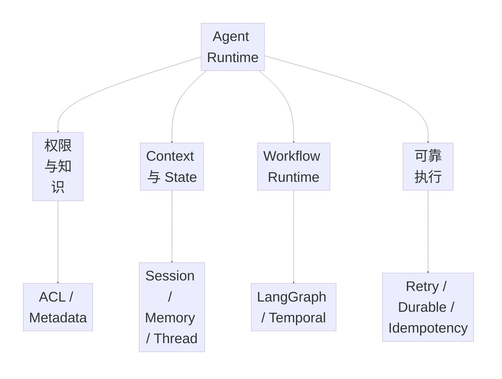

---

# 二、ACL 为什么要在 Ingest 阶段下沉

原笔记第一句话非常重要：

> **权限信息不要等用户来检索时才临时判断。**

更合理的是：

```text
Document 进入知识库
↓
解析
↓
Chunking
↓
把 ACL / tenant / role / security metadata
一起写入每个 Chunk
↓
建立索引
```

RAG 真正被召回、Rerank、放入 Context、绑定 Citation 的往往是 Chunk，而不是整份文档。

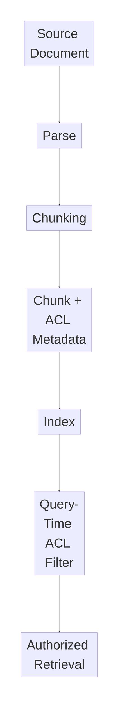

### 一句话记忆

> **ACL 要跟着 Chunk 一起下沉，而不是等检索时再“想起来加权限”。**

---

# 三、Context Window、Session、Conversation、Thread、Memory、State

| 概念 | 核心含义 | 更偏向 |
|---|---|---|
| Context Window | 模型当前一次调用真正能看到的输入窗口 | 模型调用 |
| Session | 一组连续交互的状态容器 | SDK / 应用层 |
| Conversation | 平台或服务端持久化对话对象 | 服务端对话实体 |
| Thread | 工作流 / 图执行中的一条持久状态脉络 | Workflow / Graph |
| Memory | 可复用的短期、长期、工作、摘要记忆 | 记忆系统 |
| State | 当前任务的全部工程状态 | Runtime |

## 1. Context Window

> **模型当前这一次生成时能看到的全部输入。**

它不等于全部聊天历史，也不等于全部 Session、长期 Memory 或 Workflow State。

## 2. Session

> 某个连续交互会话的状态容器。

强调多个 Run / Turn 之间如何自动保留历史。

## 3. Conversation

> 偏平台或服务端管理的一段持久化对话对象。

原笔记强调它通常可以组织消息、工具调用、工具结果和其他上下文项。

## 4. Thread

> 工作流或图执行中的一条持续执行脉络。

可能不断积累 State、Checkpoint、中断点和恢复信息。

## 5. Memory

包括：

- Short-term Memory
- Long-term Memory
- Working Memory
- Summary Memory

## 6. State

State 不只是聊天历史，还可能包括：

```text
当前任务阶段
审批状态
Tool Call 历史
Artifact 指针
Retry Count
Idempotency Key
上次中断位置
权限上下文
预算
错误原因
```

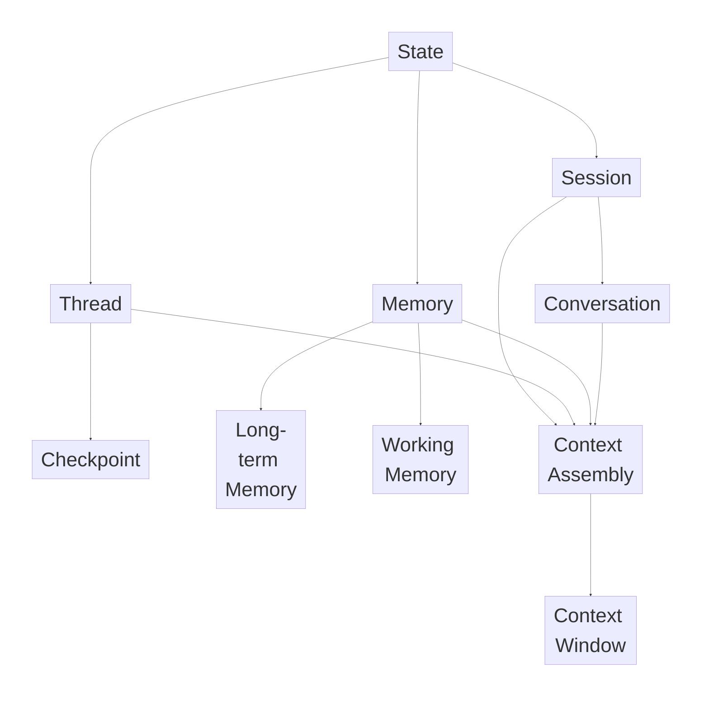

### 一句话区分

```text
Context Window = 这一轮模型能看到什么
Session = 连续多轮交互怎么续起来
Conversation = 平台持久化的对话对象
Thread = Workflow 的一条执行脉络
Memory = 哪些信息值得以后继续复用
State = 当前任务真实的工程状态
```

---

# 四、OpenAI 一侧值得知道的状态管理能力

以下按原笔记口径整理。

## 1. previous_response_id

通过响应链把当前调用接在上一条响应之后，简化多轮续接，不必每轮由应用自己手工拼完整历史。

## 2. Conversation 对象

相比单纯的上一条 Response 指针，更像一个完整可持久化的对话容器，可组织消息、Tool Call、Tool Result 等 Context Item。

## 3. Sessions

原笔记把 Sessions 归到 SDK 侧的历史管理：

```text
Run 前 → 读取 Session History
执行
Run 后 → 新 Item 写回 Session
```

并提醒 SDK Session 和 Server-managed Continuation 通常不要无脑叠加。

## 4. Compaction

不是简单一句摘要，而是对长上下文进行结构化压缩，尽量保留后续推理仍需的状态和关键上下文。

## 5. Prompt Caching

不是 Session State，但和 Context 生命周期紧密相关。稳定前缀、工具定义和大段系统提示的变化频率会影响缓存复用价值。

---

# 五、Context 生命周期

原笔记分成五个阶段：

```text
Generate → Classify → Inject → Compact → Archive
```

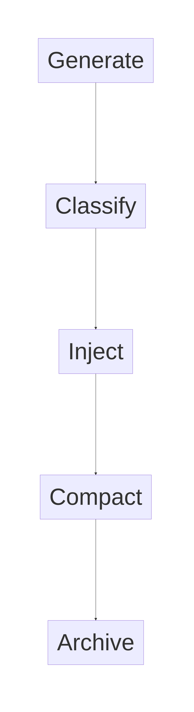

## Generate

信息可能来自：

- 用户输入
- 模型输出
- 工具结果
- 审批动作
- 子任务 Artifact
- Memory Recall
- 系统摘要

## Classify

系统要判断一条信息：

- 进入当前 Context
- 只持久化
- 脱敏后持久化
- 仅审计，不给模型
- 总结后再进 Context
- 写入长期 Memory

核心：

> **不是所有产生的信息都应该进入下一轮模型 Context。**

## Inject

真正进入 Context 的内容按角色和优先级组织，例如：

```text
System / Developer Instructions
Current User Message
Necessary History Summary
Necessary Tool Result
Necessary Artifact Summary
Retrieved Evidence
Security / Permission Hints
```

## Compact

会话变长后，判断哪些历史：

- 只留摘要
- 必须保留原文
- 只保存在外部 State Store
- 后续不再进入 Context

## Archive

信息不再参与实时推理，但仍用于：

- Audit
- Replay
- 用户下载
- 结果复盘
- Training Sample
- Failure Analysis

---

# 六、Context Assembly：上下文如何组装

原笔记分成五层：

1. 固定前缀层
2. 当前任务层
3. 历史摘要层
4. 外部召回层
5. 工具反馈层

## 固定前缀层

系统指令、产品策略、安全规则、稳定 Tool / Namespace 信息。

## 当前任务层

当前用户请求、Workflow State、目标、审批结果、关键变量。

## 历史摘要层

不是完整历史，而是：

```text
已经确认的事实
已完成步骤
用户偏好
未决问题
```

## 外部召回层

RAG、Long-term Memory、Artifact Summary、外部资源。

## 工具反馈层

只保留对当前决策有价值的 Tool Result，不把所有长日志和大文本无脑塞回去。

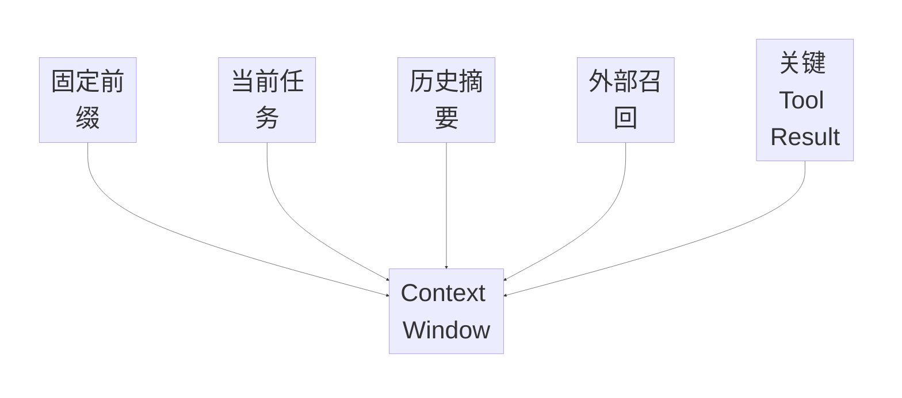

核心：

> **Context Engineering 不是尽量多塞信息，而是只让模型看到当前决策真正需要的信息。**

---

# 七、LangGraph 的核心抽象

原笔记概括为：

```text
State + Node + Edge
```

## State

多个 Node 共享的任务状态。

## Node

具体执行步骤，例如 Planner、Retriever、Reviewer、Critic。

## Edge

Node 之间的状态转移关系，可以是固定、条件或循环。

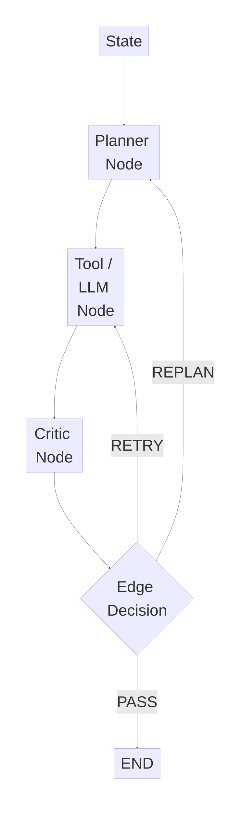

原笔记定位：

> 适合把 Agent 拆成显式节点，保留一定自治能力，快速构建可中断、可恢复、可调试的图式流程。

---

# 八、Temporal 的核心抽象

原笔记更强调 Temporal：

> **Durable Workflow Execution。**

## Workflow

主执行单元，可以持续很久，有本地状态，可以接收 Signal，Worker 崩溃后通过事件历史恢复。

## Activity

真正执行外部副作用或 IO 的工作，例如：

```text
调用 API
发送邮件
写数据库
上传文件
付款
```

原笔记特别强调 Activity 幂等。

## Signals / Queries / Updates

让 Workflow 更像一个长期存活、可交互的业务流程实体。

---

# 九、LangGraph 与 Temporal 怎么选

| 维度 | LangGraph | Temporal |
|---|---|---|
| 核心关注 | Agent 图、LLM、Tool、State 转移 | Durable Workflow |
| 主要抽象 | State / Node / Edge | Workflow / Activity |
| 常见任务 | Agent 推理、Tool Use、Replan | 长业务流程、可靠执行 |
| 恢复 | Checkpoint / Graph State | Event History / Durable Execution |
| 外部副作用 | Tool / Node 中执行 | Activity |
| 长时间运行 | 可以支持 | 更强调 |
| 定时器 / 补偿 / Event | 原笔记非重点 | 更适合 |

更偏 Temporal 的情况：

- 强业务流程可靠性诉求
- 任务持续很久
- 需要强恢复语义
- Retry / Timeout / Timer
- 补偿
- Event-driven
- Workflow 是生产级业务实体

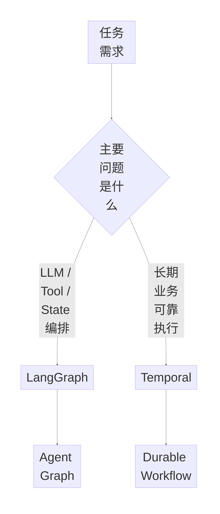

---

# 十、Retry 与 Durable Execution 的区别

> **Retry 解决一个动作失败怎么办，Durable Execution 解决整个过程断了怎么办。**

## Retry

处理单个 Action Failure，例如 API Timeout 后重试。

## Durable Execution

处理整个流程中断，例如 Workflow 已执行到第 8 步，Worker 崩溃后不能从第 1 步全部重来，而应恢复之前状态和执行位置。

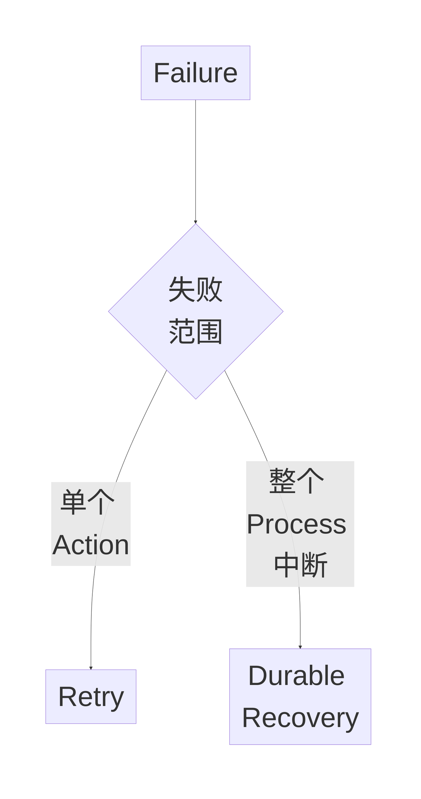

---

# 十一、什么是 Agent Loop

Agent Loop：

> **Agent 的循环执行过程。**

```text
思考 / 决策
↓
调用工具
↓
观察结果
↓
再决定下一步
↓
重复
```

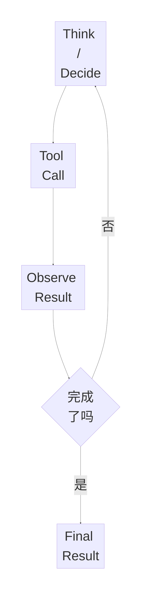

普通一次 LLM 调用：

```text
输入 → 输出
```

Agent Loop：

```text
输入 → 决策 → Action → Observation → 再决策
```

---

# 十二、为什么“可能已经成功”时不能盲目重试

例如发送邮件 API 超时，本地看到 Timeout，但真实情况可能是邮件已经成功发送，只是 Response 丢了。

直接 Retry 可能导致：

> 重复副作用。

同类场景：

- 工单已经创建
- 支付已经发生
- 文件已经上传
- 订单已经生成
- 审批已经提交

所以原笔记提出：

> **先查询外部真实状态，再决定是否重试。**

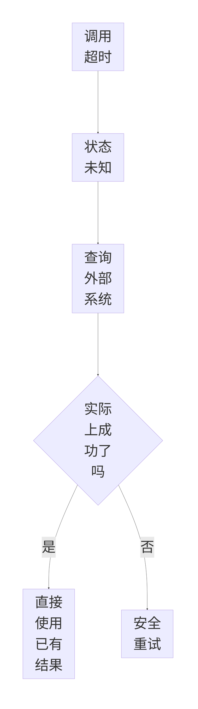

---

# 十三、五类幂等与防重复机制

## 1. Idempotency Key

为同一业务动作生成唯一键。执行前先查是否已处理，处理过直接返回历史结果。

## 2. 去重表 / 幂等表

记录：

```text
idempotency_key
status
result_summary
external_receipt
retry_count
updated_at
```

状态可包括 PROCESSING / SUCCESS / FAILED。

## 3. 资源唯一约束

例如一个订单只能创建一个退款单，用数据库唯一约束或业务唯一键阻止重复创建。

## 4. 状态机防重入

只有允许的状态才能进入下一状态，已 COMPLETED 的任务不能再次执行完成逻辑。

## 5. 外部系统查询确认

当本地不知道副作用是否已成功时，先查询邮件、工单、订单、支付、文件等真实状态。

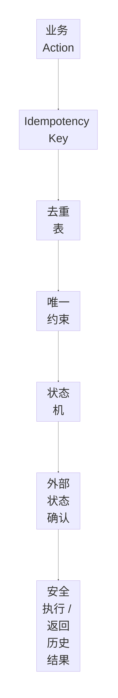

---

# 十四、把这些概念串成一个生产级 Agent Runtime

```text
1. 解析身份和 ACL
2. Load Session / Thread / State
3. 组装 Context
4. Agent Loop 决定 Action
5. 执行 Tool / Activity
6. 保存 Observation
7. 更新 State / Checkpoint
8. 如果失败：
   - Action Failure → Retry
   - Process Failure → Durable Recovery
9. 如果副作用状态未知：
   - 外部确认
   - 再决定是否重试
10. 长 Context：
   - Classify
   - Compact
   - Archive
```

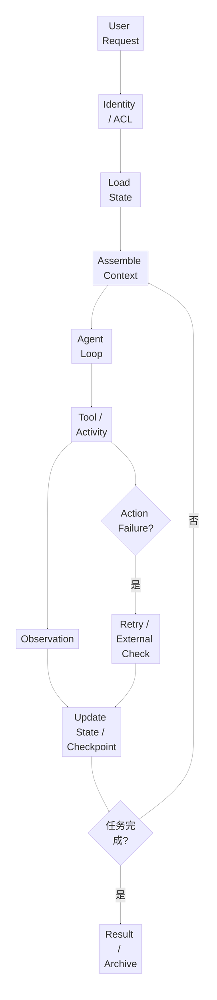

---

# 十五、面试高频速答

## 1. Context Window 和 Session 有什么区别？

> Context Window 是模型当前这一轮真正能看到的输入；Session 是应用或 SDK 层用于跨多轮保存和恢复会话历史的状态容器。

## 2. Session 和 Conversation 有什么区别？

> 按当前笔记口径，Session 更偏 SDK / 应用层的会话历史管理，Conversation 更偏平台或服务端的持久化对话实体。

## 3. Thread 是什么？

> Thread 更偏工作流或图执行中的一条持久状态脉络，会积累 State 和 Checkpoint，用来支持多次执行、中断和恢复。

## 4. Memory 和 State 有什么区别？

> Memory 更关注哪些信息值得以后继续复用；State 更关注当前任务真实的工程状态，包括任务阶段、Retry、Approval、Tool Result、幂等键和 Checkpoint 等。

## 5. Context 生命周期有哪些阶段？

> Generate → Classify → Inject → Compact → Archive。

## 6. Context Assembly 怎么分层？

> 固定前缀、当前任务、历史摘要、外部召回、关键 Tool Result。

## 7. LangGraph 的核心抽象是什么？

> State、Node、Edge。State 保存共享状态，Node 执行具体能力，Edge 决定节点之间如何转移。

## 8. Temporal 更适合什么任务？

> 当前笔记里更偏长时间运行、强恢复语义、Retry / Timeout / Timer、补偿和事件驱动的生产级 Workflow。

## 9. Retry 和 Durable Execution 有什么区别？

> Retry 解决一个动作失败以后怎么再试；Durable Execution 解决整个长流程中断以后如何从之前状态继续执行。

## 10. 什么是 Agent Loop？

> Agent 在 Decide → Tool Call → Observe → 再 Decide 之间循环，直到任务完成或安全终止。

## 11. 为什么 API Timeout 不能直接 Retry？

> 因为外部 Action 可能已经成功，只是本地没收到响应。直接重试可能产生重复副作用，所以应先查询外部真实状态。

## 12. 幂等怎么做？

> 可以组合 Idempotency Key、去重表、数据库唯一约束、状态机防重入和外部状态查询确认。

## 13. 为什么 ACL 要跟 Chunk 一起下沉？

> 因为 RAG 实际检索和引用的是 Chunk。如果权限只留在 Document 层，Chunk 建索引后可能丢失权限边界，所以 Ingest / Chunking 时就应写入 ACL Metadata。

---

# 十六、一页速记

```text
ACL
= Ingest 时下沉到 Chunk Metadata

Context Window
= 本轮模型看到什么

Session
= 连续 Turn 的会话状态容器

Conversation
= 持久化对话实体

Thread
= Workflow 的执行脉络

Memory
= 可复用信息

State
= 当前任务全部工程状态

OpenAI 状态能力（原笔记口径）
= previous_response_id
+ Conversation
+ Sessions
+ Compaction
+ Prompt Caching

Context Lifecycle
= Generate
→ Classify
→ Inject
→ Compact
→ Archive

Context Assembly
= 固定前缀
+ 当前任务
+ 历史摘要
+ 外部召回
+ 关键 Tool Result

LangGraph
= State + Node + Edge

Temporal
= Workflow + Activity

Retry
= 一个 Action 失败怎么办

Durable Execution
= 整个 Process 中断怎么办

Agent Loop
= Decide → Tool → Observe → Decide

“可能已经成功”
= 不要盲目 Retry
= 先查外部真实状态

Idempotency
= Idempotency Key
+ Dedup Table
+ Unique Constraint
+ State Machine
+ External Confirmation
```

---

# 最终核心结论

这一天的知识可以统一理解成：

> **Agent Runtime 的本质，是持续管理“权限、状态、上下文、执行位置和副作用”。**

一个真正可靠的生产 Agent 不能只做到：

```text
LLM → Tool → Answer
```

而应该做到：

```text
ACL
+
State
+
Context Lifecycle
+
Agent Loop
+
Checkpoint
+
Retry
+
Durable Recovery
+
Idempotency
+
Audit
```

最后形成：

> **能持续执行、能中断恢复、不会重复副作用、上下文可控、状态可追踪的 Agent Runtime。**
