> 本文根据原始学习笔记整理，重点把零散概念重构为一条可复习、可面试、可落地的工程主线。
>
> **超大 Mermaid 规范：**本文流程图默认使用 **32px 字号、110px 节点间距、140px 层级间距、50px 图内边距**。复杂架构主动拆图，避免“节点很多但字很小”。

---

## 目录

- [一、先建立统一系统视角](#一先建立统一系统视角)
- [二、Query Rewrite：改写必须有边界](#二query-rewrite改写必须有边界)
- [三、Step-back Prompting：先抽象，再回到具体问题](#三step-back-prompting先抽象再回到具体问题)
- [四、多租户 RAG：Collection、Namespace 与 tenant_id](#四多租户-ragcollectionnamespace-与-tenant_id)
- [五、ACL 到底应该挂在哪里](#五acl-到底应该挂在哪里)
- [六、权限不仅是 Retrieval Security](#六权限不仅是-retrieval-security)
- [七、Can Use 与 Can View 必须分开](#七can-use-与-can-view-必须分开)
- [八、企业知识 Agent 权限系统设计](#八企业知识-agent-权限系统设计)
- [九、租户删除与 Offboarding](#九租户删除与-offboarding)
- [十、Document-Level Retrieval Mismatch](#十document-level-retrieval-mismatch)
- [十一、Agentic RAG 与 GraphRAG 的边界](#十一agentic-rag-与-graphrag-的边界)
- [十二、CRUD-RAG、Artifact 与 A2A](#十二crud-ragartifact-与-a2a)
- [十三、Polling、Streaming 与 Webhook](#十三pollingstreaming-与-webhook)
- [十四、同步与异步](#十四同步与异步)
- [十五、Session、Conversation 与 Thread](#十五sessionconversation-与-thread)
- [十六、5xx、长尾与 Runtime 基础概念](#十六5xx长尾与-runtime-基础概念)
- [十七、Task Decomposition、Planning 与 Workflow](#十七task-decompositionplanning-与-workflow)
- [十八、Memory、RAG、State 与 Context](#十八memoryragstate-与-context)
- [十九、面试高频速答](#十九面试高频速答)
- [二十、一页速记](#二十一页速记)

---

# 一、先建立统一系统视角

这份笔记其实围绕一个中心问题：

> **企业知识 Agent 如何在“检索正确、权限正确、输出正确、状态可控”的前提下运行？**

可以拆成四层：

```text
Knowledge Access
→ RAG / GraphRAG / Query Rewrite

Security Boundary
→ Tenant / Namespace / ACL / Metadata

Runtime
→ Workflow / Planning / A2A / Async

State & Personalization
→ Session State / Memory / Context
```

## 全局架构图

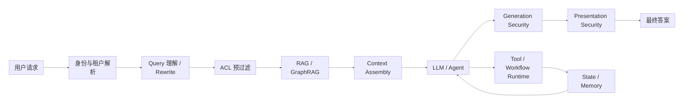

这张图可以作为整篇笔记的总纲。

---

# 二、Query Rewrite：改写必须有边界

Query Rewrite 的目标不是：

> “把用户问题写得更专业。”

而是：

> **在尽量保留原始意图的前提下，把 Query 转换成更适合检索的形式。**

---

## 1. Rewrite 的四条边界

原笔记可以归纳成四条：

### 第一：保留原 Query 的关键信号

特别是：

- 实体；
- 产品名；
- 错误码；
- 时间；
- 地区；
- 版本；
- 业务对象；
- 用户明确限制。

不要为了“语义更自然”随意替换这些词。

---

### 第二：高风险实体可采用双路 Query

不是：

```text
Original Query
→ Rewrite
→ 只检索 Rewrite
```

而可以：

```text
Original Query
+
Rewrite Query
→ 并行检索
→ 融合候选
```

这样可以降低 Rewrite 把关键实体改丢以后造成的 Recall 损失。

## 超大流程图：安全 Rewrite

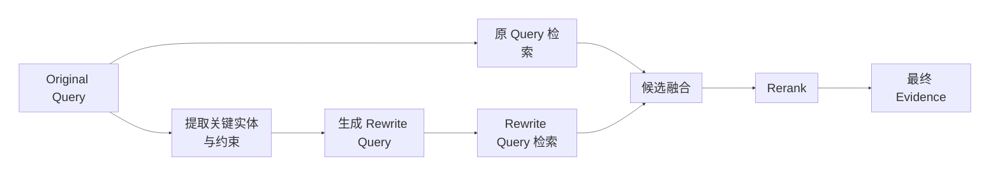

---

### 第三：Rewrite 本身也要单独评测

不能只看：

```text
最终答案准确率
```

还应该观察：

```text
Rewrite 前 Recall
Rewrite 后 Recall
新增召回了什么
丢失了什么
错误类型是什么
```

例如：

| Case | Original Recall@5 | Rewrite Recall@5 | 结论 |
|---|---:|---:|---|
| A | 1 | 1 | 无变化 |
| B | 0 | 1 | Rewrite 有帮助 |
| C | 1 | 0 | 出现 Query Drift |
| D | 0 | 0 | Rewrite 无法解决 |

---

### 第四：保留 Rewrite Rationale

**Rewrite Rationale**：

> Query Rewrite 的改写依据。

它用于解释为什么进行：

- 扩展；
- 消歧；
- 拆分；
- 补充关键词；
- 实体标准化。

例如可以让 Rewrite 模块输出：

```json
{
  "original_query": "支付接口昨天为什么一直504？",
  "rewritten_query": "检索昨天支付接口 HTTP 504、上游超时、网关超时与依赖服务延迟相关日志",
  "preserved_entities": [
    "支付接口",
    "昨天",
    "504"
  ],
  "rewrite_reason": "补充 504 的网关/上游超时语义，但保留时间和错误码约束"
}
```

这样 Rewrite 就从：

> 黑盒字符串改写

变成：

> **可观察的检索决策。**

---

# 三、Step-back Prompting：先抽象，再回到具体问题

Step-back 与普通 Rewrite 不完全一样。

普通 Rewrite：

> 更适合检索地重述当前问题。

Step-back：

> **把问题提升到更抽象的知识层级，先检索通用原理，再回到具体问题。**

---

## 示例

具体问题：

> 为什么长文档检索不到相关段落？

Step-back：

> 影响 RAG 检索召回率的因素有哪些？

获得：

```text
Chunk
Embedding
Hybrid Retrieval
Rerank
Top-K
```

然后回到具体系统逐项检查。

## 超大 Step-back 图

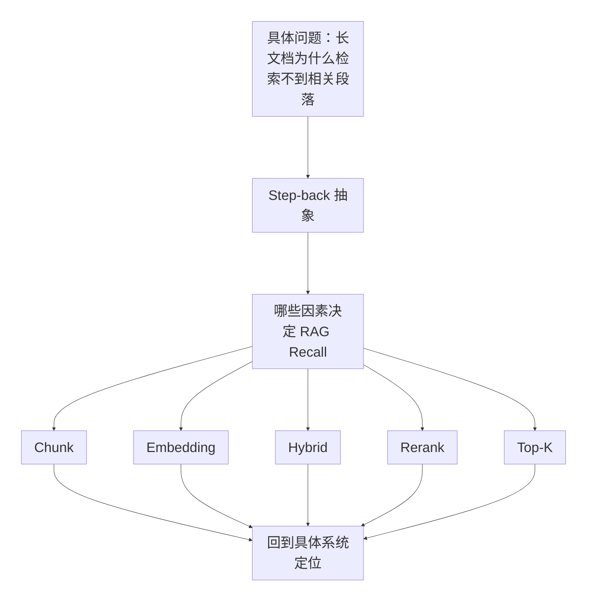

### 一句话区分

```text
Rewrite
= 保留原意，优化检索表达

Expansion
= 扩展同义词、别名和相关词

Step-back
= 先提高抽象层级，再回到具体问题
```

---

# 四、多租户 RAG：Collection、Namespace 与 tenant_id

企业 RAG 经常不是：

```text
一个用户
+
一个知识库
```

而是：

```text
很多公司
很多项目
很多部门
很多角色
共享一套 RAG 服务
```

因此必须处理：

> **Multi-tenancy。**

---

## 1. 单 Collection + tenant_id

一种实现方式：

```text
所有租户数据
→ 同一个 Collection
→ 每条 Chunk 带 tenant_id
→ 查询时强制 tenant_id Filter
```

例如：

```json
{
  "chunk_id": "xxx",
  "tenant_id": "jd",
  "text": "该评论涉及虚假宣传风险……",
  "risk_type": "advertising",
  "embedding": []
}
```

查询：

```text
query = "哪些评论涉及虚假宣传？"

filter:
tenant_id = "jd"
```

真实搜索范围：

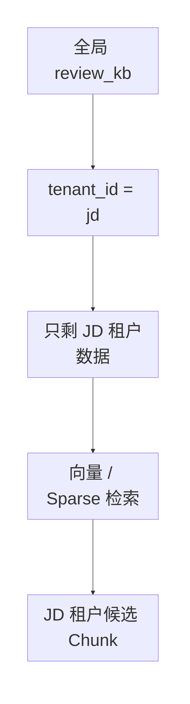

关键点：

> `tenant_id` Filter 不能只是 Prompt 中写一句“只能查当前租户”。

它必须成为：

> **Runtime 强制执行的检索条件。**

---

# 五、ACL 到底应该挂在哪里

ACL：

> **Access Control List，访问控制列表。**

核心问题：

> 权限应该绑在 Document，还是 Chunk？

答案不是二选一。

---

## 1. 文档级 ACL

适合：

- 整份合同只有法务可见；
- 整个项目目录只有项目组可见；
- 整份 HR 文件只有 HR 可见。

例如：

```text
document_id = contract_001
allowed_roles = [legal]
```

---

## 2. Chunk 为什么也需要 ACL / Metadata

RAG 实际召回和引用的往往不是整份 Document，而是：

> Chunk。

所以 Chunk 至少需要继承：

- source_document_id；
- tenant_id；
- project；
- department；
- role；
- security_level；
- source ACL；
- 可引用信息。

否则可能发生：

```text
Document 有权限
↓
切 Chunk
↓
Chunk 索引丢了 ACL
↓
Retriever 直接召回
↓
权限绕过
```

---

## 3. 如果同一文档内部权限不同

例如：

```text
一份公司报告

第 1～5 页：
所有员工可见

第 6～10 页：
管理层可见

第 11 页：
HR Only
```

这时 Document-Level ACL 不够。

必须进一步支持：

> **Chunk / Fragment-Level ACL。**

---

## 超大 ACL 下沉图

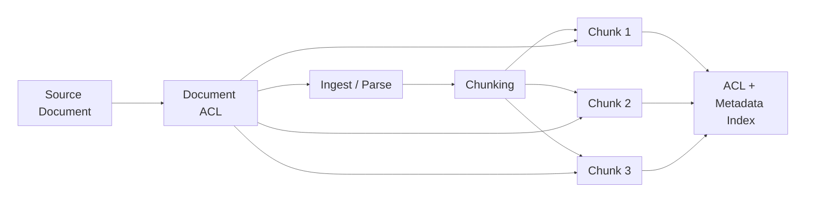

### 核心结论

> **ACL 不是 ingest 完成以后再补，而应该在 ingest / chunking 阶段一起下沉。**

---

# 六、权限不仅是 Retrieval Security

很多系统做到：

```text
Retriever 有 ACL
```

就认为权限问题已经解决。

其实不够。

企业知识 Agent 至少存在三层安全边界：

```text
Retrieval Security
Generation Security
Presentation Security
```

---

## 超大三层权限图

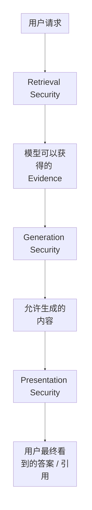

---

## 1. Retrieval Security

问题：

> **我能不能搜到这份信息？**

例如：

- 当前租户是否允许？
- 当前用户角色是否允许？
- 当前部门是否允许？
- 文档安全级别是否允许？

---

## 2. Generation Security

问题：

> **即使模型拿到了这份 Evidence，它能不能这样说？**

原笔记的薪酬例子非常典型。

用户问：

> 为什么张三最近工资变化这么大？

模型可能不直接复制工资字段，而回答：

> 张三属于本轮涨薪幅度较高的员工，调整幅度大约在两成左右。

虽然没有原文复制：

```text
“涨薪幅度较高”
+
“大约两成”
```

仍然已经泄露了敏感信息。

这说明：

> **不泄露原 Chunk ≠ 不泄露信息。**

---

## 3. Presentation Security

问题：

> **最终用户可以看到哪些答案、标题、路径、URL 和 Citation？**

例如答案本身比较克制：

> 张三近期确实存在薪酬调整。

但 Citation 暴露：

```text
人力资源部/
2026薪酬调整/
核心管理层涨薪名单.xlsx
```

即使用户打不开文件，也已经暴露：

- 文件存在；
- 文件名称；
- 文件目录；
- 文件主题；
- 潜在敏感内容。

这属于：

> **Metadata Leakage。**

---

# 七、Can Use 与 Can View 必须分开

这是企业知识 Agent 很重要的一组权限概念。

```text
Can Use
= 模型是否可以使用某信息做推理

Can View
= 用户是否可以直接看到原文 / Citation / Metadata
```

两者不必完全相同。

---

## 例子：报销审批

用户问：

> 我的报销申请为什么没通过？

系统内部可能合法使用：

```text
财务风控内部规则
+
审批人员内部备注
+
用户自己的报销单
```

但普通员工没有权限直接查看：

- 内部完整风控规则；
- 审批人内部备注。

最终可以只返回：

> 该申请未通过主要是因为报销材料与当前费用政策存在不一致，请补充对应凭证后重新提交。

---

## 超大 Can Use / Can View 图

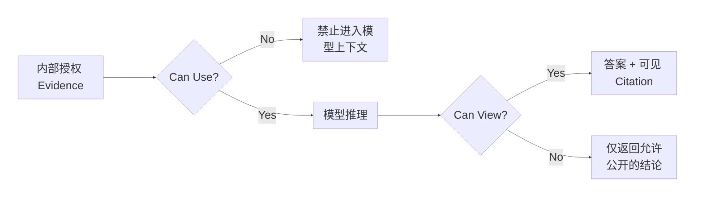

---

## 更严格的情况：答案本身也需要审批

例如：

> 这个客户是不是涉嫌洗钱？

模型生成：

> 该客户存在较高洗钱风险，建议立即冻结账户。

这里即使 Retrieval 和生成都合理，最终输出也可能需要：

> **Human Approval。**

因此安全链路可能继续扩展：

```text
Retrieval
→ Generation
→ Policy Check
→ Human Approval
→ Presentation
```

---

# 八、企业知识 Agent 权限系统设计

原笔记给出的默认方案可以整理成六层。

---

## 第 1 层：Identity Resolution

解析：

- user_id；
- tenant_id；
- organization；
- department；
- role；
- project；
- clearance / security level。

---

## 第 2 层：Tenant Isolation

使用：

- namespace；
- shard；
- database；
- collection；
- partition；
- tenant_id filter；

实现租户隔离。

---

## 第 3 层：Document / Chunk ACL

Ingest 时将权限一起写入：

```text
Document ACL
→ Chunk ACL / Metadata
```

字段例如：

```json
{
  "tenant_id": "company_A",
  "project": "ecommerce",
  "department": "risk",
  "allowed_roles": [
    "risk_manager"
  ],
  "security_level": "internal"
}
```

---

## 第 4 层：Query-Time Pre-filter

推荐：

```text
先 Tenant Filter
→ 再 ACL Filter
→ 再 Retrieval
```

而不是：

```text
全局召回
→ 召回完再删掉不允许看的结果
```

---

## 第 5 层：Output Control

控制：

- 字段级脱敏；
- Citation 是否展示；
- URL 是否展示；
- Document Title 是否展示；
- 是否只返回结论；
- 是否需要审批。

---

## 第 6 层：Audit & Governance

记录：

```text
谁
在什么时间
以什么身份
查询了什么
召回了哪些 Chunk
模型用了哪些 Evidence
最终输出了什么
```

---

## 超大企业权限架构图

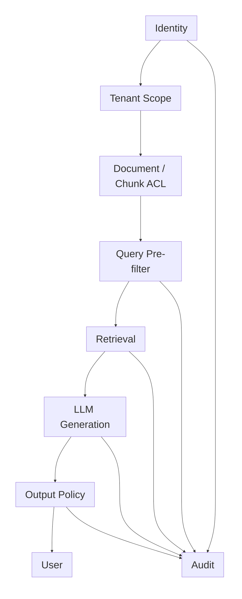

---

# 九、租户删除与 Offboarding

租户退出系统时，真正的问题不是：

> 删除一条 tenant 记录。

而是：

> **所有与这个 tenant 有关的原始数据、索引和派生数据是否真的不可恢复、不可召回。**

---

## 1. 删除对象

应该考虑：

```text
Tenant Business Record
Raw Documents
Chunks
Embeddings
Vector Index
Cache
Derived Data
Evaluation / Trace 副本
```

---

## 2. 共享 Collection 下的风险

如果：

```text
多个 tenant 共用 Collection
```

删除必须强制：

```text
tenant_id = target_tenant
```

不能允许客户端随意构造无租户 Filter 的 Delete。

否则容易：

> 跨租户误删。

---

## 3. Backup 问题

即使线上数据删掉：

```text
旧备份
↓
未来 Restore
↓
被删除租户数据重新出现
```

因此原笔记提出：

```text
Retention Policy
+
Deletion Tombstone
```

来处理备份恢复后的删除状态。

---

## 4. 删除后必须验证

不要只相信：

```text
DELETE 返回 200
```

还应做：

```text
存储验证
+
Retrieval 验证
```

确保 tenant 数据：

> **已经不可召回。**

---

## 超大租户删除图

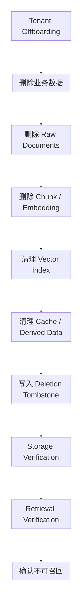

---

# 十、Document-Level Retrieval Mismatch

定义：

> **Chunk 表面上和 Query 很相关，但它来自错误的源文档。**

---

## 示例

用户问：

> 公司 2026 年差旅报销上限是多少？

Retriever 返回：

> 住宿费用上限为 800 元/晚。

Chunk 本身：

```text
语义高度相关
```

但是来自：

```text
《2024 年旧版差旅制度》
```

真正应该使用：

```text
《2026 年最新版差旅管理办法》
```

所以错误不在 Chunk 字面相关性，而在：

> **Document-Level Provenance。**

---

## 为什么只做 Chunk Retrieval 不够

需要同时考虑 Metadata：

```text
document_version
effective_date
is_latest
source_document_id
policy_status
```

---

## 超大 Mismatch 图

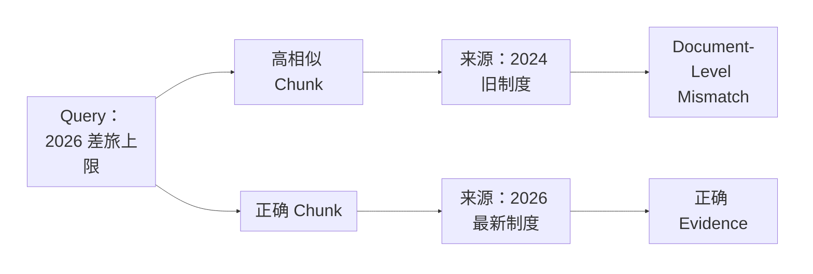

---

# 十一、Agentic RAG 与 GraphRAG 的边界

这两者可以同时存在，但增强的层次不同。

原笔记一句话非常适合记：

> **Agentic RAG 更像 Runtime / Workflow 层增强；GraphRAG 更像 Knowledge Representation 层增强。**

---

## Agentic RAG

强调：

```text
Plan
→ Retrieve
→ Observe
→ Decide
→ 再检索
```

关注的是：

> 检索过程如何动态迭代。

---

## GraphRAG

强调：

```text
Entity
Relationship
Community
Graph Structure
```

关注的是：

> 知识如何组织与检索。

GraphRAG 也完全可以被 Agent 调用。

---

## 超大关系图

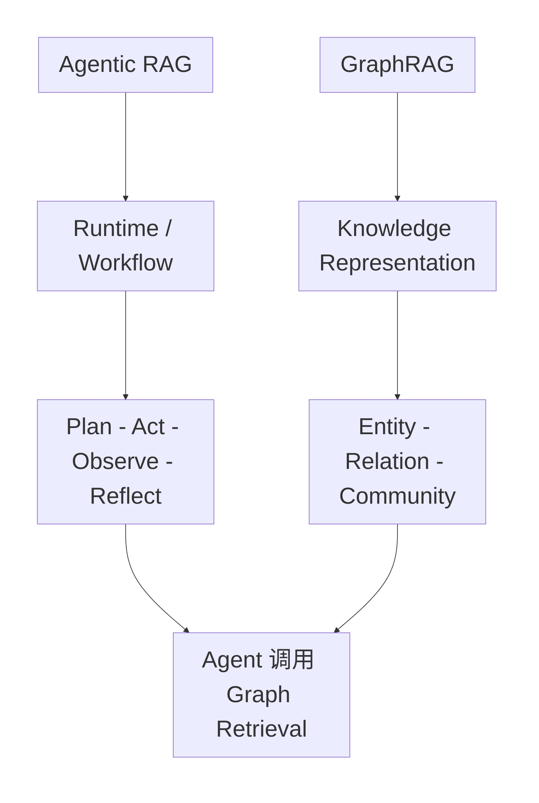

---

# 十二、CRUD-RAG、Artifact 与 A2A

## 1. CRUD-RAG 中的 CRUD

原笔记中的定义：

| 类型 | 含义 | 示例 |
|---|---|---|
| Create | 基于检索知识生成新的内容 | 根据资料写新闻稿 |
| Read | 根据外部知识回答问题 | 查询某公司营收 |
| Update | 用新检索知识修改已有文本 | 更新 CEO 信息 |
| Delete | 删除长文本冗余，做压缩摘要 | 10 页报告压成 500 字 |

特别注意：

> **这里的 Delete 不是删除向量数据库数据。**

它表示：

> 对内容进行删除 / 压缩式生成。

---

## 2. Artifact

Artifact 强调：

> **Agent 执行后产生的、可以保存、查看、传递和继续使用的成果物。**

例如：

```text
report.md
analysis.json
result.csv
presentation.pptx
code.patch
```

和普通聊天回复相比：

> Artifact 更强调“可消费的执行产物”。

---

# 十三、Polling、Streaming 与 Webhook

A2A / 长任务通信需要解决：

> 调用方如何知道远端任务做到哪一步？

原笔记整理成三类。

---

## 1. Polling

Client 主动问：

```text
完成了吗？
完成了吗？
现在完成了吗？
```

特点：

- 不需要长期连接；
- 简单；
- 实时性相对较低；
- 产生额外查询。

---

## 2. Streaming

Server 边执行边推送：

```text
Artifact Chunk 1
Artifact Chunk 2
Artifact Chunk 3
```

特点：

- 实时性高；
- 通常保持持续连接；
- 适合进度和增量结果。

---

## 3. Webhook

Client 提交任务后不等待：

```text
task_id = 123
```

Server 完成以后：

```text
HTTP POST callback
```

主动通知调用方。

适合：

> 超长异步任务。

---

## 超大三模式图

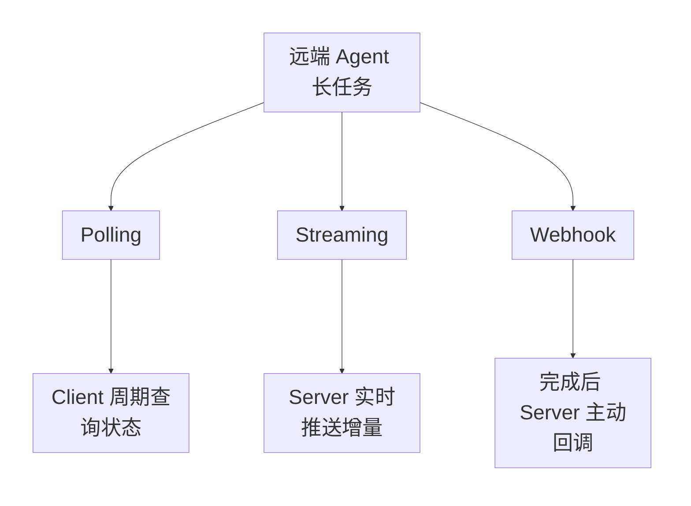

---

## 对比表

| 方式 | 谁主动 | 实时性 | 是否长期连接 | 适合 |
|---|---|---|---|---|
| Polling | Client | 较低 | 否 | 简单状态查询 |
| Streaming | Server 持续推 | 高 | 通常是 | 实时进度、增量输出 |
| Webhook | Server 在事件后推 | 较高 | 否 | 超长异步任务 |

---

# 十四、同步与异步

最通俗定义：

### 同步

> 我发请求以后，等你处理完，我再继续。

```text
Request
→ Wait
→ Response
→ Continue
```

### 异步

> 我发请求以后先做别的，你完成后再通知我或让我查询结果。

```text
Request
→ task_id
→ Do Other Work
→ Completion Signal
```

---

# 十五、Session、Conversation 与 Thread

原笔记可以整理成：

| 概念 | 更偏什么 |
|---|---|
| Session | 应用 / SDK 层会话容器 |
| Conversation | 平台层持久化对话实体 |
| Thread | Workflow / Graph 执行中的一条状态脉络 |

不要把这三个词当成所有框架都完全统一的标准定义。

更适合作为：

> **理解不同层次状态对象的概念模型。**

---

# 十六、5xx、长尾与 Runtime 基础概念

## 1. 5xx

核心：

> 请求已经到了服务端，但服务端处理失败。

常见：

| 状态码 | 含义 |
|---|---|
| 500 | Internal Server Error |
| 502 | Bad Gateway |
| 503 | Service Unavailable |
| 504 | Gateway Timeout |

---

## 2. 长尾

长尾 Case：

> 大多数请求很常见，但存在少量低频、特殊、难处理的情况。

Agent 设计里真正容易体现价值的通常就是：

```text
Happy Path
+
Long-tail Cases
```

固定规则经常容易覆盖 Happy Path。

Planner / Replan / Tool Use / Human Escalation 往往用于：

> 长尾。

---

# 十七、Task Decomposition、Planning 与 Workflow

这三个词非常容易混。

---

## Task Decomposition

> **认知层面的结构化。**

回答：

> 这个目标可以拆成哪些子问题？

例如：

```text
调研一个行业
→ 市场规模
→ 玩家
→ 技术趋势
→ 风险
```

---

## Planning

> **把目标和子任务翻译成当前可运行的执行结构。**

Planning 会结合：

- 当前状态；
- 可用工具；
- 预算；
- Evidence；
- 已失败动作。

---

## Workflow

> **执行层面的确定性编排。**

它负责：

- 节点；
- 顺序；
- 状态转移；
- Retry；
- Timeout；
- Checkpoint；
- Error Handling。

---

## 超大区别图

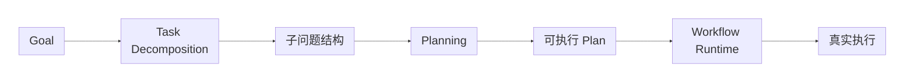

一句话：

```text
Decomposition
= 拆什么

Planning
= 现在怎么做

Workflow
= 系统如何稳定执行
```

---

# 十八、Memory、RAG、State 与 Context

这四个词必须彻底分清。

---

## 1. RAG

> 查外部资料。

例如：

```text
公司的报销制度是什么？
```

去知识库找：

> 公司制度。

---

## 2. Memory

> Agent / 用户以前经历过或长期稳定的信息。

### Episodic Memory

经历过的具体事件：

```text
上次支付服务故障，
最终通过调整连接池解决。
```

Planning 前可以检索类似成功 / 失败 Episode：

> 以前碰到类似情况怎么处理？

### Semantic Memory

长期抽象后的稳定知识：

```text
这个团队默认先执行金丝雀变更。
```

### Procedural Memory

流程性经验：

```text
故障排查：
告警 → 日志 → 指标 → 假设 → Verification
```

---

## 3. State

> 当前任务走到哪里。

例如：

```text
这次审批已经完成 Evidence Retrieval，
当前等待人工 Approve。
```

这是：

> Session State / Working State。

---

## 4. Context

原笔记的定义非常重要：

> **模型当前这一次生成时，实际能看到的所有输入信息。**

Context 可能由：

```text
System Prompt
User Query
Session State
Memory
RAG Evidence
Tool Results
Plan
Failure Summary
```

共同组成。

---

## 超大四者关系图

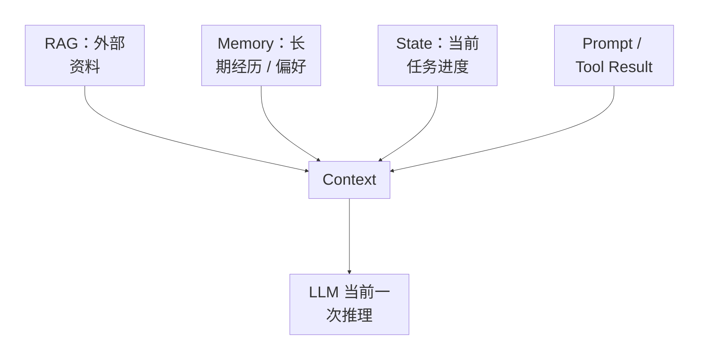

### 一句话背诵

```text
RAG
= 查资料

Memory
= 记经历

State
= 记当前任务走到哪

Context
= 这一次模型最终看到什么
```

---

# 十九、面试高频速答

## 1. Query Rewrite 最大风险是什么？

> Query Drift。改写过程中可能丢失实体、时间、错误码等关键信号，所以高风险查询可以让 Original Query 和 Rewrite Query 并行检索，并单独评估 Rewrite 对 Recall 的影响。

---

## 2. Rewrite Rationale 是什么？

> Rewrite 的改写依据，用于解释为什么补充关键词、做消歧、扩展或拆分，可以提高可观察性和 Debug 能力。

---

## 3. Step-back 和 Rewrite 有什么区别？

> Rewrite 保留原问题层级，主要优化检索表达；Step-back 会先抽象到上位原理，检索通用知识，再回到具体 Case 做判断。

---

## 4. 单 Collection 怎么做多租户？

> 每个 Chunk 强制绑定 tenant_id，查询执行时把 tenant filter 作为 Runtime 条件，而不是依赖 Prompt 让模型自己遵守租户边界。

---

## 5. ACL 应该挂 Document 还是 Chunk？

> 两层都要考虑。Document 保存源权限边界，Chunk 在切分时继承足够的 ACL 和 Metadata，因为真正被检索和引用的是 Chunk。如果同一文档内部权限不同，还需要 Chunk / Fragment-Level ACL。

---

## 6. 为什么 Retriever 做了 ACL 还不够？

> 因为还存在 Generation Security 和 Presentation Security。模型即使合法使用 Evidence，也可能通过总结泄露敏感信息；答案没泄露，Citation 标题、目录和 URL 也可能造成元数据泄露。

---

## 7. Can Use 和 Can View 有什么区别？

> Can Use 决定模型能不能用这份 Evidence 推理；Can View 决定最终用户能不能看到原文、标题或 Citation。某些内部信息可以用于生成允许公开的结论，但不能直接展示原 Evidence。

---

## 8. 企业知识 Agent 权限怎么设计？

> Identity → Tenant Isolation → Document/Chunk ACL → Query Pre-filter → Generation/Presentation Control → Audit。权限要贯穿 ingest、index、retrieval、generation 和 output，而不是只在最后加一层文本过滤。

---

## 9. Tenant Offboarding 最关注什么？

> 删除完整性、隔离性和可验证性。除了业务记录，还要处理原始文档、Chunk、Embedding、向量索引、缓存、派生数据和备份恢复问题，最后做 Storage 和 Retrieval Verification。

---

## 10. Document-Level Retrieval Mismatch 是什么？

> Chunk 表面相关，但来自错误源文档。例如用户问 2026 制度，却召回 2024 旧版制度里的高度相关段落。

---

## 11. Agentic RAG 和 GraphRAG 有什么区别？

> Agentic RAG 更偏 Runtime / Workflow，强调检索过程的 Plan–Act–Observe–Reflect；GraphRAG 更偏 Knowledge Representation，用实体、关系、社区等结构组织知识。GraphRAG 可以作为 Agentic RAG 的一个检索工具。

---

## 12. Artifact 为什么叫 Artifact？

> 因为强调的是 Agent 执行后留下的可保存、可传递、可继续消费的成果物，而不仅是一段对话文本。

---

## 13. Polling、Streaming、Webhook 怎么选？

> Polling 是 Client 周期查询；Streaming 是 Server 实时推增量；Webhook 是长任务完成后 Server 主动回调。实时进度更适合 Streaming，超长异步任务更适合 Webhook。

---

## 14. 同步和异步区别？

> 同步请求要等结果再继续；异步请求提交后可以先做其他事情，结果通过查询、推送或回调获取。

---

## 15. Task Decomposition、Planning、Workflow 怎么区分？

> Decomposition 是认知层拆子问题；Planning 把目标转成当前可执行结构；Workflow 是 Runtime 按节点和状态稳定执行。

---

## 16. RAG、Memory、State、Context 怎么区分？

> RAG 查外部知识，Memory 保存长期经历和偏好，State 保存当前任务状态，Context 是模型当前一次推理最终看到的全部信息。

---

# 二十、一页速记

```text
Query Rewrite
= 保留原意的检索重述
风险 = Query Drift

Rewrite Rationale
= 为什么这么改

Step-back
= 先抽象，再回到具体问题

Multi-tenant
= Tenant Isolation + ACL

单 Collection
= tenant_id 强制 Filter

ACL
= Document Level
+ Chunk / Fragment Level

权限三层
= Retrieval Security
+ Generation Security
+ Presentation Security

Can Use
≠
Can View

企业知识 Agent 权限
= Identity
→ Tenant
→ ACL
→ Pre-filter
→ Generation
→ Presentation
→ Audit

Tenant Offboarding
= Raw Data
+ Chunk
+ Embedding
+ Index
+ Cache
+ Backup
+ Verification

Document-Level Retrieval Mismatch
= Chunk 对
但 Source Document 错

Agentic RAG
= Runtime / Workflow 增强

GraphRAG
= Knowledge Representation 增强

Artifact
= 可保存、传递、继续使用的 Agent 成果物

Polling
= Client 主动问

Streaming
= Server 边做边推

Webhook
= Server 完成后主动通知

Decomposition
= 拆什么

Planning
= 怎么做

Workflow
= 稳定执行

RAG
= 查资料

Memory
= 记经历

State
= 当前走到哪

Context
= 模型这一轮实际看到的一切
```

---

# 最终核心结论

企业知识 Agent 的权限设计不能只停留在：

> “向量数据库加个 tenant_id Filter。”

真正完整的系统应该同时控制：

```text
谁能进入哪个租户
↓
哪些 Document / Chunk 可以召回
↓
模型可以使用哪些 Evidence
↓
模型允许生成什么
↓
用户最终可以看到什么
↓
整个过程是否可审计和可删除
```

也就是：

> **Retrieval Correctness + Permission Correctness + Generation Control + Runtime Governance。**

而 RAG、Memory、Planning、Workflow、A2A 等能力，最终都应该服务于这个目标：

> **让 Agent 不仅能完成任务，而且知道自己能访问什么、能说什么、当前做到哪一步，以及失败后如何继续。**
