> 适用场景：AI Agent 应用开发岗位 / DeepResearch 项目专项面试复盘  
> 来源：根据《试官问：“你在白海主要做什么？”.md》整理。  
>
> Day01 的目标不是一口气讲完所有技术细节，而是先把两条线彻底分开：
>
> **线 1：白海实习职责——回答“我在公司里实际负责什么”。**  
> **线 2：DeepResearch 项目技术——回答“这个系统技术上怎么实现”。**
>
> 本文固定采用：
>
> **① 专有名词 / 系统级方法解释 → ② 记忆路线 → ③ 完整标准答案 → ④ 面试追问 / 边界**

---

# 目录

- [一、Day01 最重要的边界](#一day01-最重要的边界)
- [Q1：你在白海主要做什么](#q1你在白海主要做什么)
- [Q2：这个 DeepResearch 项目是做什么的](#q2这个-deepresearch-项目是做什么的)
- [Q3：DeepResearch 整体怎么实现](#q3deepresearch-整体怎么实现)
- [Q4：6-Agent 是怎么协作的](#q46-agent-是怎么协作的)
- [Q5：ResearchState 是什么](#q5researchstate-是什么)
- [Q6：Critic 为什么要区分 Re-researching 和 Revising](#q6critic-为什么要区分-re-researching-和-revising)
- [Q7：为什么长任务需要 SSE](#q7为什么长任务需要-sse)
- [Q8：Checkpoint 到底解决什么问题](#q8checkpoint-到底解决什么问题)
- [Q9：Evidence / Claim / Citation 怎么治理](#q9evidence--claim--citation-怎么治理)
- [Q10：这些东西都是你在白海做的吗](#q10这些东西都是你在白海做的吗)
- [二、90 秒 DeepResearch 技术稿](#二90-秒-deepresearch-技术稿)
- [三、30 秒白海实习职责稿](#三30-秒白海实习职责稿)
- [四、一页速记](#四一页速记)
- [五、Day01 闭卷验收](#五day01-闭卷验收)

---

# 一、Day01 最重要的边界

先闭卷记住：

```text
白海实习
= 我在公司里实际参与了什么

DeepResearch 项目
= 这个系统技术上怎么实现

个人复现
= 实习结束后为了吃透技术，
  基于公开框架和自构数据重新实现
```

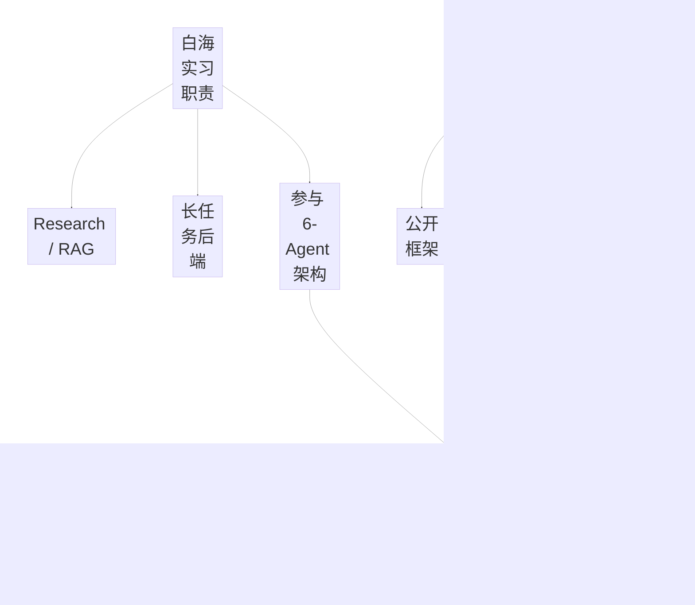

Day01 最重要的不是“讲得多”，而是：

> **贡献边界必须可信。**

---

# Q1：你在白海主要做什么

## ① 专有名词 / 系统级方法解释

### Responsibility Boundary

Responsibility Boundary：

> **明确公司项目里自己真正参与、负责和主导的范围。**

技术面试里，“参与设计”“负责实现”“独立主导”不是同一个强度。

### ToB 行业研究场景

ToB：

> 面向企业客户的业务场景。

当前材料里的场景是：

> **银行 ToB 行业研究。**

不是普通消费者问答，而是较长时间的研究任务。

### Long-running Task

Long-running Task：

> 不是一次几秒钟 HTTP 请求结束，而是可能持续分钟级甚至更久的任务。

因此系统会额外涉及：

- Progress；
- SSE；
- Checkpoint；
- Timeout；
- Cancel；
- Recovery。

---

## ② 记忆路线

> **银行行研 → 两块职责 → RAG → 长任务后端 → 6-Agent 参与设计。**

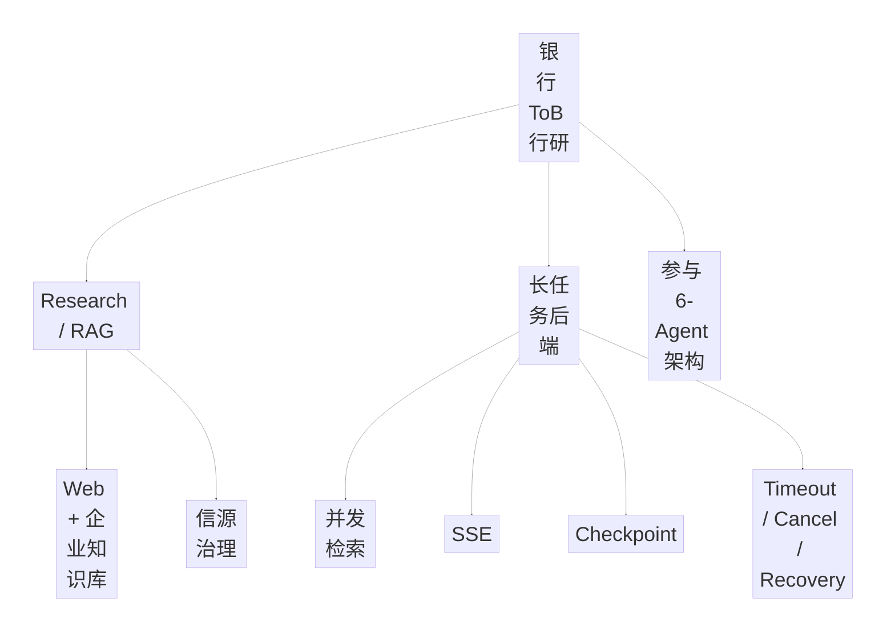

口诀：

```text
场景
→ Research/RAG
→ Long Task Backend
→ 参与 6-Agent
→ 边界收口
```

---

## ③ 完整标准答案

> 我在北京白海科技实习时，主要参与的是一个面向银行 ToB 行业研究场景的 DeepResearch Agent 项目。
>
> 这个场景和普通问答不太一样，一次研究任务会持续比较长时间，需要经过问题拆解、外部搜索、企业知识库检索、分析和报告生成，所以既有 Agent 侧的问题，也有比较重的后端工程问题。
>
> 我个人的职责主要分成两块。
>
> 第一块是 Research 和 RAG 链路。我参与 Research Agent、企业知识库 RAG 和信源治理，主要关注怎么把开放网页和企业内部知识结合起来，以及检索结果怎么去重、筛选并最终进入报告。
>
> 第二块是长任务后端能力，这部分我参与得比较深，包括并发检索、步骤级 SSE、PostgreSQL JSONB Checkpoint、任务超时和取消，以及失败后的恢复机制。因为研究任务不是一次 HTTP 请求几秒就结束，所以我们要解决进度怎么给前端看、任务断了以后从哪里继续，以及哪些阶段可以安全重试这些问题。
>
> 6-Agent 整体架构和状态机我是参与设计和开发，不是我一个人从零主导。我的核心贡献更偏 Research/RAG 和长任务工程链路。

---

## ④ 面试追问：你最核心的个人贡献是什么

> 如果只选两块，我会说 Research/RAG 和长任务工程链路。前者解决开放网页和企业知识的证据获取与治理，后者解决分钟级研究任务的进度、持久化、超时取消和恢复。

---

# Q2：这个 DeepResearch 项目是做什么的

## ① 专有名词 / 系统级方法解释

### DeepResearch

在当前项目材料里，DeepResearch 不是简单的：

> 搜索 + 总结。

它是一个：

> **面向长程研究任务的多 Agent Workflow。**

### Long-horizon Research

Long-horizon Research：

> 一个任务需要经过多个阶段、多个信息源和多次判断，才能形成最终报告。

当前材料里的三个核心问题：

```text
任务怎么拆
证据怎么找
长任务怎么稳定跑完
```

---

## ② 记忆路线

> **拆任务 → 找证据 → 稳定跑完。**

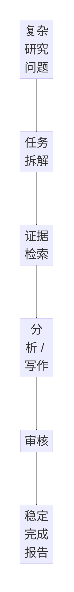

---

## ③ 完整标准答案

> 这套 DeepResearch 主要解决复杂研究任务里的三个问题：任务怎么拆、证据怎么找，以及一个分钟级甚至更长的任务怎么稳定跑完。
>
> 整体上它不是单次搜索问答，而是把研究流程拆成多个专业阶段，通过共享状态和状态机协同，再结合 SSE、Checkpoint 和 Evidence/Citation 治理，最后形成可追踪的研究报告。

---

# Q3：DeepResearch 整体怎么实现

## ① 专有名词 / 系统级方法解释

### Multi-Agent Workflow

Multi-Agent Workflow：

> 多个职责不同的 Agent / Node 在统一状态和执行流程中协作。

### Stage State Machine

阶段状态机：

> 系统显式知道当前处于哪个研究阶段，并控制下一步允许进入哪里。

当前材料中的阶段：

```text
Planning
Researching
Analyzing
Writing
Reviewing
```

### Shared State

Shared State：

> 多个 Agent 之间不靠随意聊天传递任务，而通过统一结构化状态交换信息。

---

## ② 记忆路线

> **六 Agent + ResearchState + 阶段状态机 + Critic 路由 + SSE/Checkpoint + Evidence。**

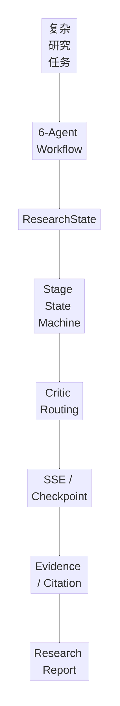

---

## ③ 完整标准答案

> 如果从项目技术本身来看，这套系统本质上是一个面向长程研究任务的多 Agent Workflow，我通常从 Agent 编排、ResearchState 和长任务可靠性三个部分展开。
>
> 整体上我们把研究流程拆成规划、检索、分析、代码与可视化、写作和审核六类 Agent。Agent 之间不是随意互相聊天，而是通过共享 ResearchState 传递 facts、evidences、claims、citations 和 critic feedback，再通过阶段状态机控制 Planning、Researching、Analyzing、Writing、Reviewing 等阶段。
>
> Review 后也不是简单整篇重新生成。Critic 会根据失败原因决定是回到 Re-researching 补证据，还是进入 Revising 只修改表达和结构。
>
> 同时因为任务持续时间比较长，Runtime 还会把阶段事件和 usage 持久化，用 PostgreSQL Checkpoint 保存已完成阶段，并通过 SSE 给前端推送步骤级进度。
>
> 最后 Evidence 会绑定 Claim 和 Citation，本地知识库引用还会做字段校验，保证最终报告里的结论可以追踪到对应证据。

---

# Q4：6-Agent 是怎么协作的

## ① 专有名词 / 系统级方法解释

### Role Specialization

Role Specialization：

> 把研究任务拆成职责不同的专业能力角色。

当前材料中的六类：

```text
Planning
Search / Research
Analysis
Code & Visualization
Writing
Review
```

### Orchestration

Orchestration：

> 通过统一 Workflow 和 State 控制这些角色什么时候执行、拿什么输入、输出到哪里。

---

## ② 记忆路线

> **规划 → 搜索 → 分析 → 代码/可视化 → 写作 → 审核。**

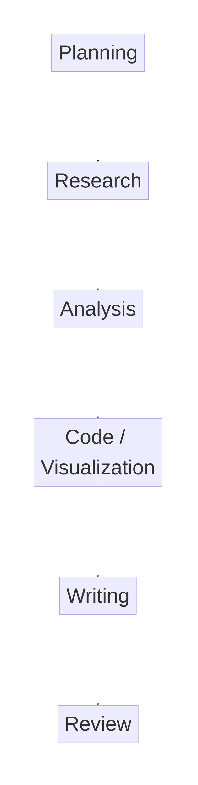

---

## ③ 完整标准答案

> 我们把长程研究任务拆成规划、检索、分析、代码与可视化、写作和审核六类专业角色。它们不是互相自由聊天，而是通过共享 ResearchState 传递 facts、evidences、claims、citations 和 critic feedback，并由阶段状态机决定当前处在哪个研究阶段以及下一步进入哪个节点。
>
> 我在这里是参与整体 6-Agent 架构和状态机设计开发，不能说整套六 Agent 都是我一个人从零主导。

---

## ④ 证据边界

当前材料支持：

> 6-Agent 分类和“参与设计开发”的口径。

不要升级成：

> “我独立设计并从零实现整套 6-Agent 架构。”

---

# Q5：ResearchState 是什么

## ① 专有名词 / 系统级方法解释

### Shared Research State

ResearchState：

> **多个研究节点之间共享的结构化任务状态。**

当前材料里明确提到传递：

```text
facts
evidences
claims
citations
critic feedback
```

### State-driven Workflow

State-driven Workflow：

> Node 的执行和路由由当前 State 决定，而不是只看上一句自然语言。

---

## ② 记忆路线

> **事实、证据、结论、引用、反馈，全都进 State。**

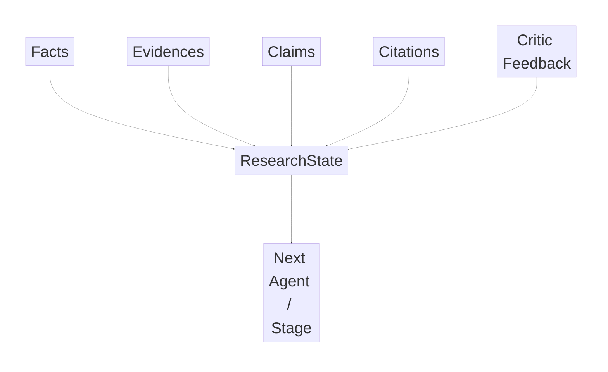

---

## ③ 完整标准答案

> ResearchState 可以理解成整条 DeepResearch 任务的共享状态容器。不同 Agent 不需要通过自由文本彼此解释自己刚刚做了什么，而是把 facts、evidences、claims、citations 和 critic feedback 等结构化结果写进共享 State。
>
> 后续 Node 再基于当前 State 做分析、写作或路由。这样系统才能知道当前已经有什么证据、形成了哪些 Claim、哪些引用已经绑定，以及 Critic 上一轮具体反馈了什么。

---

# Q6：Critic 为什么要区分 Re-researching 和 Revising

## ① 专有名词 / 系统级方法解释

### Failure-aware Routing

Failure-aware Routing：

> 不是所有失败都走同一个 Retry，而是根据失败原因进入不同恢复路径。

### Re-researching

Re-researching：

> 当问题本质是证据不足时，重新进行 Research / Retrieval。

### Revising

Revising：

> 当 Evidence 足够，但表达、结构或写作有问题时，只重写对应内容。

---

## ② 记忆路线

> **缺证据 → 回去搜；表达差 → 只改写。**

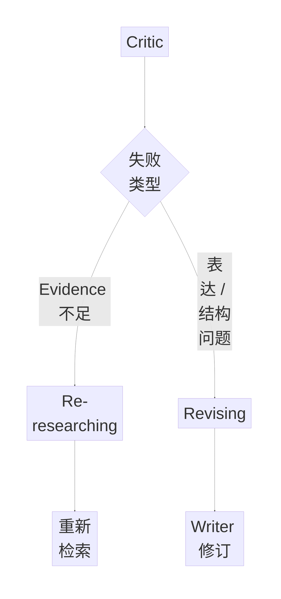

---

## ③ 完整标准答案

> 一个关键设计是 Review 以后不是简单整篇重新生成。Critic 会先区分失败类型。
>
> 如果判断是 Evidence 不足，就路由到 Re-researching，再做检索和证据补充；如果 Evidence 已经够了，只是表达或者结构有问题，就进入 Revising，只让 Writer 修改。
>
> 这样可以避免把所有错误都当成同一种错误处理，也避免因为一个写作问题重新跑完整 Research 链路。

---

# Q7：为什么长任务需要 SSE

## ① 专有名词 / 系统级方法解释

### SSE

SSE：

> **Server-Sent Events。**

在当前项目里，它用于：

> 服务端持续把步骤级任务进度推送给前端。

### Progressive Feedback

Progressive Feedback：

> 长任务执行过程中，前端持续获得阶段事件，而不是一直等待最终结果。

---

## ② 记忆路线

> **任务很长 → 不能一直白屏 → SSE 推进度。**

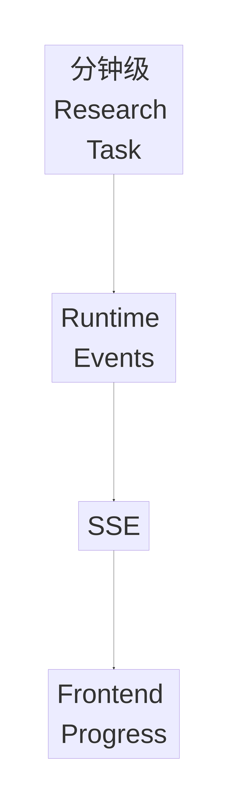

---

## ③ 完整标准答案

> DeepResearch 是分钟级甚至更长的任务，如果前端只发一个 HTTP 请求然后一直等最终报告，用户体验和故障感知都会比较差。
>
> 所以我们做步骤级 SSE，把任务当前进入哪个阶段、发生了哪些事件以及相关 usage 持续推给前端。这样用户可以知道任务还在运行、执行到哪里了，后端也可以把 Runtime 事件和任务状态对应起来。

---

# Q8：Checkpoint 到底解决什么问题

## ① 专有名词 / 系统级方法解释

### Checkpoint

Checkpoint：

> **把长任务已经完成的执行状态持久化。**

### Recovery Point

Recovery Point：

> 任务异常或取消以后，重新启动时应该从哪里继续。

### PostgreSQL JSONB Checkpoint

当前材料明确：

> 使用 PostgreSQL JSONB 保存 Checkpoint。

---

## ② 记忆路线

> **任务跑很久 → 状态落盘 → 中断后从 completed stages 恢复。**

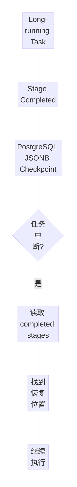

---

## ③ 完整标准答案

> DeepResearch 任务可能持续比较长时间，所以如果进程异常或者用户取消以后只能从 Planning 全部重来，成本和体验都会很差。
>
> 我参与的这部分会把阶段状态和已完成阶段持久化到 PostgreSQL JSONB Checkpoint。任务恢复时根据 completed stages 找到正确的恢复位置，而不是默认重新从 Planning 开始。
>
> 所以 Checkpoint 解决的核心问题是：**长任务中断以后，从哪里继续。**

---

## ④ 面试追问：Checkpoint 就等于不会重复执行吗

当前 Day01 先回答：

> 不等于。Checkpoint 解决恢复位置；哪些外部副作用可以安全重试，还需要单独的 Retry / Idempotency 设计。

这部分可以在后续 DeepResearch Runtime 专项继续深挖。

---

# Q9：Evidence / Claim / Citation 怎么治理

## ① 专有名词 / 系统级方法解释

### Claim

Claim：

> 最终研究报告中的一个具体结论。

### Evidence

Evidence：

> 支持 Claim 的研究证据。

### Citation

Citation：

> Evidence 的来源定位。

### Citation Contract

Citation Contract：

> 对引用需要满足的来源字段和可追踪性要求进行约束。

当前材料明确本地知识库 Citation 会校验：

```text
kb_id
document_id
chunk_id
content_hash
```

---

## ② 记忆路线

> **结论必须有证据，证据必须有地址，地址必须可校验。**

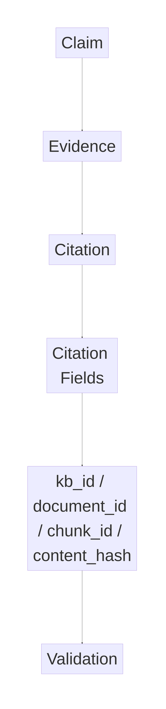

---

## ③ 完整标准答案

> 第三个比较关键的问题是 Evidence 治理。Web Search 和 Local RAG 得到的 Evidence 最终会绑定到 Claim 和 Citation，保证报告里的结论不是一段没有来源的模型生成文本。
>
> 本地知识库引用还会校验 `kb_id、document_id、chunk_id、content_hash` 等字段。如果引用链路校验失败，就不能简单把任务标成成功。
>
> 所以这里真正做的是把“研究结论—证据—引用来源”形成可追踪链路。

---

# Q10：这些东西都是你在白海做的吗

## ① 专有名词 / 系统级方法解释

### Company Contribution vs Personal Reimplementation

必须区分：

```text
公司期间真实贡献
```

和：

```text
实习结束后的个人独立复现
```

### Clean-room Reimplementation

当前材料的关键边界是：

> 不是拿公司代码或公司数据出来复现，而是基于公开框架和自己构造的数据重新独立实现工程思路。

---

## ② 记忆路线

> **公司：RAG + 长任务工程 + 参与架构；个人：公开框架 + 自构数据重新实现。**

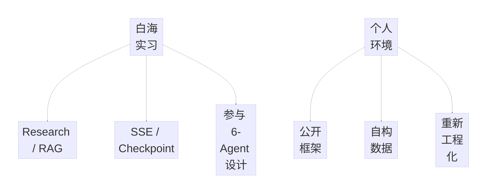

---

## ③ 完整标准答案

> 不是，我会把两部分区分开。
>
> 实习期间我实际参与得比较深的是 Research/RAG、信源治理，以及 SSE、Checkpoint 这些长任务能力；6-Agent 整体架构我是参与设计和开发。
>
> 实习结束之后，为了系统吃透这套技术，我在个人环境里基于公开框架和自己构造的数据重新搭了一套类似的 DeepResearch 工作流，包括 Local RAG、Citation Contract、预算、浏览器 E2E 和后续评测框架。
>
> 这不是把公司的代码或者数据拿出来复现，而是把我在实习中接触到的多 Agent 协作、Checkpoint、Citation 和评测这些工程思路重新独立实现。
>
> 所以我不会把后续个人复现的全部内容算成公司里的个人贡献。

---

# 二、90 秒 DeepResearch 技术稿

> 这套 DeepResearch 主要解决的是复杂研究任务里三个问题：任务怎么拆、证据怎么找，以及长任务怎么稳定跑完。
>
> 整体上我们把研究流程拆成规划、检索、分析、代码与可视化、写作和审核六类 Agent。Agent 之间不是相互随意聊天，而是通过共享的 ResearchState 传递 facts、evidences、claims、citations 和 critic feedback，再通过阶段状态机控制 Planning、Researching、Analyzing、Writing、Reviewing 这些阶段。
>
> 一个比较关键的设计是 Review 后不是简单重新生成。Critic 如果判断是证据不足，就路由到 Re-researching 再检索；如果只是表达或者结构问题，就进入 Revising，只让 Writer 修改，这样避免所有错误都重新跑整条链路。
>
> 第二个难点是这是分钟级甚至更长的任务，所以工程上我比较关注 SSE 和 Checkpoint。Runtime 会把阶段事件和 usage 持久化，PostgreSQL Checkpoint 保存已完成阶段；任务取消或者异常之后，会根据 completed stages 找到正确恢复位置，而不是默认重新从 Planning 开始。
>
> 第三个是证据治理。Web Search 和 Local RAG 得到的 Evidence 最后会绑定到 Claim 和 Citation，本地知识库引用还会校验 `kb_id、document_id、chunk_id、content_hash` 等字段，校验失败就不允许把任务标成成功。
>
> 所以我理解 DeepResearch 真正难的并不是“多放几个 Agent”，而是让**规划、证据、状态恢复和质量审核形成一个可控闭环**。

---

# 三、30 秒白海实习职责稿

> 我在白海主要参与银行 ToB 行业研究场景的 DeepResearch Agent。我的核心职责分成两块：一块是 Research/RAG 和信源治理，包括开放网页和企业知识库双路检索、结果筛选和 Evidence 进入报告的链路；另一块是分钟级研究任务的后端工程，包括并发检索、步骤级 SSE、PostgreSQL JSONB Checkpoint、超时取消和恢复。6-Agent 整体架构和状态机我是参与设计开发，不是我独立从零主导。

---

# 四、一页速记

```text
白海实习职责
≠
DeepResearch 全部技术

白海：
银行 ToB 行研
→ Research / RAG
→ 信源治理
→ 并发检索
→ SSE
→ PostgreSQL JSONB Checkpoint
→ Timeout / Cancel / Recovery
→ 参与 6-Agent 架构


DeepResearch 三个核心问题
= 任务怎么拆
+ 证据怎么找
+ 长任务怎么稳定跑完


6-Agent
= Planning
→ Research
→ Analysis
→ Code / Visualization
→ Writing
→ Review


ResearchState
= facts
+ evidences
+ claims
+ citations
+ critic feedback


Critic Routing
Evidence 不足
→ Re-researching

表达 / 结构问题
→ Revising


SSE
= 长任务实时进度


Checkpoint
= 已完成阶段持久化
= 中断后找恢复位置


Evidence Governance
Claim
→ Evidence
→ Citation
→ kb_id / document_id / chunk_id / content_hash


个人复现
= 实习结束后
+ 公开框架
+ 自构数据
+ 独立工程化

不能说：
把公司代码 / 数据拿出来复现
```

---

# 五、Day01 闭卷验收

## Gate 1：职责边界

30 秒回答：

> 你在白海主要做什么？

必须出现：

```text
银行 ToB 行研
Research/RAG
长任务后端
参与 6-Agent
不是独立主导全部架构
```

---

## Gate 2：项目一句话

> DeepResearch 是一个面向长程研究任务的多 Agent Workflow，核心解决任务拆解、证据获取和长任务可靠执行。

---

## Gate 3：六个角色

闭卷：

```text
Planning
Research
Analysis
Code / Visualization
Writing
Review
```

---

## Gate 4：ResearchState

至少答：

```text
facts
evidences
claims
citations
critic feedback
```

---

## Gate 5：Critic 路由

秒答：

```text
Evidence 不足
→ Re-researching

表达 / 结构问题
→ Revising
```

---

## Gate 6：SSE / Checkpoint

```text
SSE
= 给前端看任务执行到哪

Checkpoint
= 保存长任务执行到哪
```

---

## Gate 7：Evidence 链

```text
Claim
→ Evidence
→ Citation
→ Citation Validation
```

---

## Gate 8：公司 vs 个人复现

必须说清：

> 实习期间我参与 Research/RAG、信源治理、SSE、Checkpoint，并参与 6-Agent 架构设计；后续个人复现是基于公开框架和自构数据重新独立实现技术思路，不是拿公司代码或数据出来复现。

---

# Day01 最终收口

> **白海实习职责回答“我做了什么”，DeepResearch 技术回答“系统怎么做”，个人复现回答“我后来怎么把技术真正吃透”。**
>
> 三条线一定分开。
