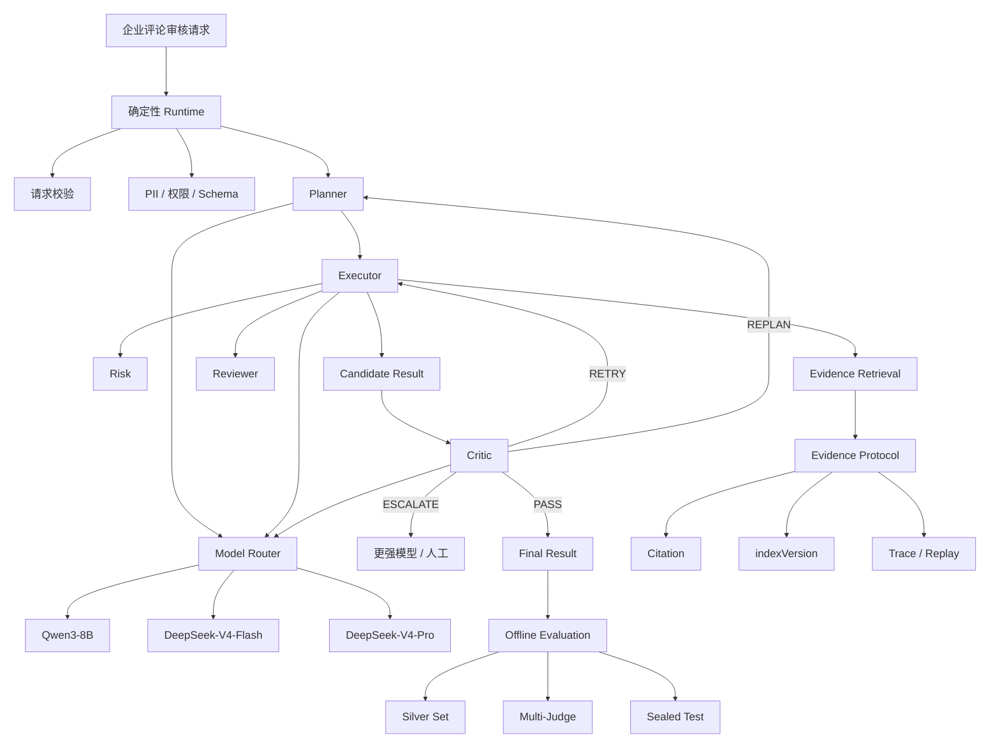

> 适用场景：AI Agent 应用开发岗位项目复盘 / 技术面试 / 简历深挖  
> 原始材料：`E-Review Agent｜企业评论智能治理 Agent 平台.md`
>
> 本文目标不是把项目“说得更夸张”，而是把项目讲得 **真实、边界清楚、经得住连续追问**。
>
> **核心原则：事实、设计解释、量化 Claim 三者必须分开。**  
> 文档中出现的教学示例、推导样例，不等于真实实验数据。

---

# 目录

- [一、Day 1 最终目标](#一day-1-最终目标)
- [二、一句话项目定位](#二一句话项目定位)
- [三、项目故事主线](#三项目故事主线)
- [四、项目总体架构](#四项目总体架构)
- [五、去重后的六大攻击面](#五去重后的六大攻击面)
- [六、18 个核心面试问题与答法](#六18-个核心面试问题与答法)
- [七、90–120 秒项目介绍](#七90120-秒项目介绍)
- [八、30 秒项目介绍](#八30-秒项目介绍)
- [九、量化 Claim 证据审计](#九量化-claim-证据审计)
- [十、绝对不要混淆的事实边界](#十绝对不要混淆的事实边界)
- [十一、Day 1 四个 Gate](#十一day-1-四个-gate)
- [十二、一页面试速记](#十二一页面试速记)

---

# 一、Day 1 最终目标

Day 1 不追求把 Planner、Critic、Router 每个公式都讲透。

Day 1 只解决四件事：

1. **项目到底是什么；**
2. **为什么必须做成 Hybrid Agentic Workflow；**
3. **哪些部分是自己做的，哪些来自 litemall；**
4. **知道哪些简历 Claim 后续必须补证据。**

最终要达到：

```text
Gate 1：一句话定位
Gate 2：90–120 秒项目介绍
Gate 3：30 秒说清个人贡献边界
Gate 4：说出至少三个高风险追问点
```

---

# 二、一句话项目定位

推荐固定成：

> **E-Review Agent 是一个面向企业评论风险治理场景的 Hybrid Agentic Review 系统，核心解决复杂审核任务的动态决策、结果可靠性和模型调用成本问题。**

不要说：

> 我做了一个电商评论 RAG。

也不要说：

> 我做了一个多 Agent 系统，里面有很多 Agent。

因为前者把项目降级为普通 RAG，后者只是在堆技术名词。

---

# 三、项目故事主线

整个项目不要按照技术栈背，而要按照“问题 → 设计”讲。

```text
固定 Workflow 对复杂 Case 不够灵活
                ↓
             Planner

LLM 输出存在错误且难治理
                ↓
             Critic

所有任务直接调用强模型成本高
                ↓
           Model Router

风险结论缺乏可验证依据
                ↓
        Evidence-aware RAG

系统改完以后到底有没有变好
                ↓
    Silver Set + Offline Evaluation
```

最重要的一句话：

> **Planner、Critic、Router、Evidence、Eval 不是五个独立卖点，而是五类工程问题的答案。**

---

# 四、项目总体架构



这不是“完全自由 Agent”。

更准确的定义是：

> **确定性 Workflow + 有边界的 Agent 自主决策 + 运行时治理。**

也就是：

> **Hybrid Agentic Workflow / bounded autonomy**

---

# 五、去重后的六大攻击面

## A. 项目真实性

面试官真正想问：

- 个人项目为什么写“项目负责人”？
- 哪些代码是你做的？
- litemall 哪些属于原项目？
- Spring Boot / Vue 是不是你从零实现的？

核心防守原则：

> **从 0 到 1 做的是 Agent 审核治理能力，不是从 0 到 1 重写整个商城。**

---

## B. Agent 真实性

攻击点：

- 为什么不是固定 Workflow？
- Planner 实际做了什么？
- 是不是把函数换个名字叫 Agent？
- 为什么不全部做 Agent？

核心防守原则：

> **Agent 的价值不是消灭 if/else，而是在预定义边界内处理难以用固定规则覆盖的语义决策。**

---

## C. 指标真实性

攻击点：

- 78% → 92% 的分母是什么？
- 65% 错误拦截率怎么算？
- ≤5% 误拒率怎么算？
- 55% 成本下降怎么计算？
- 这些是不是你为了简历编的？

核心防守原则：

> **数字必须绑定 Dataset + Baseline + Metric Definition + Trace / Script / Report。**

---

## D. 数据真实性

攻击点：

- 500 条从哪里来？
- 为什么叫 Silver？
- 为什么不是 Gold？
- GPT-5.5 参与生成又参与 Judge，会不会产生同源偏差？

核心防守原则：

> **明确它是 AI-assisted Silver Set，不冒充真实生产数据或 Human Gold。**

---

## E. 系统工程

攻击点：

- Java 和 FastAPI 怎么通信？
- Trace 怎么跨 Java / Python 传播？
- Python 或模型挂了怎么办？
- 重试会不会重复执行？

核心防守原则：

> **REST 只是通信层，还需要 Schema、幂等、Retry、Circuit Breaker、Trace 和 Verification。**

---

## F. 设计取舍

攻击点：

- 为什么 Qwen3-8B？
- 为什么三级 Router？
- 为什么 Critic 不直接全部用规则？
- 为什么不用一个强模型直接完成？

核心防守原则：

> **不是追求“最 Agent”，而是追求质量、成本、延迟、可控性之间的工程平衡。**

---

# 六、18 个核心面试问题与答法

---

## 1. 这个项目为什么做？一句话怎么定位？

### 面试回答

> E-Review Agent 是我做的一个企业评论风险治理 Agent 项目。最开始它其实更接近固定审核 Pipeline，包括安全校验、RAG、模型分析和规则回退。后面我发现固定流程有几个问题：简单评论和高风险复杂评论使用相同执行路径，复杂 Case 缺少动态调整能力；LLM 给出结论以后，Evidence 和结果治理不足；另外所有任务都直接调用强模型的话，成本也比较高。所以我后面把系统演进成 Hybrid Agentic Workflow，用 Planner 做有限动态规划、Router 控制模型成本、Critic 做结果治理，再用 Evidence 和离线评测保证结果可追踪和可回归。

### 一句话版

> **E-Review 是面向企业评论风险治理的 Hybrid Agent 系统，重点解决动态决策、结果可靠性和模型成本。**

---

## 2. 这是个人项目，为什么写“项目负责人”？哪些是你做的？哪些是 litemall 原来的？

### 面试回答

> 这是我主导的个人项目，所以“项目负责人”表达的是我负责整体技术方向和核心 Agent 能力建设，并不是说我管理了一个商业团队。底层商城业务并不是我从零写的，基础框架来自开源 litemall。我的核心工作是在它上面做 Agent 审核治理能力的二次开发，包括 Python FastAPI 侧的 Agent/RAG Runtime、Planner-Executor-Critic Workflow、模型路由、Evidence 和评测治理，以及 Java 侧和 Agent 服务的接入、审核任务、安全治理和 Trace 相关改造。商城原有 CRUD 和基础业务能力我不会算成自己的核心贡献。

### 推荐收口

> **我从 0 到 1 做的是 Agent 审核治理能力，不是从 0 到 1 重写整个电商平台。**

### 绝对不要说

> 整个商城都是我独立从零写的。

---

## 3. 为什么不是固定 Workflow？为什么需要 Agent？

### 面试回答

> 我一开始其实就是固定 Workflow，普通低风险评论用固定流程很稳定，所以我并没有把它推翻。真正的问题出现在复杂 Case，比如高风险、Evidence 不充分、模型判断冲突或者第一次审核失败，这些任务需要动态决定下一步是补检索、重新审核、升级模型还是进入人工。如果全部提前写成固定路径，分支会越来越复杂。
>
> 所以我的方案是 Hybrid Workflow：安全、PII、权限、Schema 等确定性部分仍然固定，只有任务拆解、Evidence 补充、失败恢复和模型升级这类带不确定性的节点才引入 Agent 决策。

### 核心句

> **不是 Workflow 和 Agent 二选一，而是 Workflow + bounded autonomy。**

---

## 4. 为什么不全部做成 Agent？

### 面试回答

> 因为很多事情本身就不应该交给 LLM。请求参数是否合法、PII 是否需要脱敏、ACL 权限是否满足、Schema 是否通过、最大重试次数是多少，这些都有明确规则。让模型来判断不仅增加成本，还会引入非确定性。
>
> 所以我的原则是：能用确定性代码保证的就用代码，只有需要语义理解、动态决策和复杂推理的部分才交给 Agent。

### 加分句

> **企业 Agent 不是 Agent 越多越好，而是把自主性放在真正需要自主性的地方。**

---

## 5. Planner 到底做了什么？是不是把函数改名叫 Agent？

### 面试回答

> Planner 不是简单生成 Todo List。它根据当前 Case 的风险等级、Evidence 状态、上下文和前一次失败原因，决定当前 Case 需要哪些步骤以及后续走向。比如低风险 Case 可以走简化路径；Evidence 不充分时增加检索；Evidence 冲突时增加验证；Critic 反馈表明原计划有问题时再触发 Replan。
>
> Planner 不是完全自由的，只能在预定义能力、状态和动作空间内做结构化决策。所以我更愿意把它叫 constrained planning，而不是 unrestricted planning。

### 如果追问：“这不还是 if/else 吗？”

> 外围一定会存在 if/else，因为 Runtime 最终要执行确定性状态转移。Agent 的价值不是消灭 if/else，而是一些难以靠几个固定阈值稳定定义的语义状态，比如 Evidence 是否充分、风险是否存在冲突、是否需要额外验证，可以由模型输出结构化判断，再由确定性 Workflow 执行。

---

## 6. 为什么不用一个大模型全部做完？为什么要三级 Router？

### 面试回答

> 所有请求都用最强模型当然最简单，但大量普通 Case 不需要最高推理能力，这会造成明显的能力浪费。我的思路是把模型能力当作质量—成本资源：低风险、结构化程度高的任务优先本地模型；复杂度上升或 Evidence 不充分时升级到中间档；高风险、Evidence 冲突或 Critic 多次拒绝后才升级到最强模型。
>
> 所以 Router 真正解决的问题是：**什么 Case 值得付更高的推理成本。**

### 为什么三级而不是两级？

> 两级只有本地和强模型两个状态，升级比较激进；三级增加一个中间层，可以把中等复杂 Case 留在 Flash 层，使质量和成本之间有更细的缓冲。

---

## 7. 为什么选 Qwen3-8B？

### 安全回答

> 我的定位不是让 Qwen3-8B 覆盖所有复杂审核，而是把它放在本地低成本层，主要处理低风险、结构化程度较高的任务。选择 8B 量级主要考虑本地部署成本、延迟以及基础指令遵循能力之间的平衡。复杂 Case 仍允许 Router 升级到更强模型。
>
> 我不会说 Qwen3-8B 是经过完整模型 Benchmark 后得到的绝对最优解，因为当前材料里没有完整保存模型选型实验。系统设计的重点是 Router 允许底层模型替换，而不是把某个模型写死在架构里。

### 如果追问量化

> 量化可能造成一定能力损失，所以本地模型只承担低风险层；如果 Evidence 冲突、风险高或者结果不稳定，就升级更强模型。这里本质上是质量、显存、延迟和成本的 trade-off。

---

## 8. 为什么 Critic 不全部用规则实现？

### 面试回答

> Critic 里应该同时有规则检查和语义检查。Schema 是否完整、Citation 是否为空、字段类型是否合法，这类问题适合确定性规则；但 Evidence 是否真正支持风险结论、结论是否超出证据、多个 Evidence 是否互相冲突，这类属于语义一致性问题，很难靠固定规则覆盖。
>
> 所以我的设计是规则先检查硬约束，Critic 负责高层的语义和证据关系验证。

### 一句话

> **Rule Guardrail 检查硬约束，Critic 检查语义与 Evidence 关系。**

---

## 9. 78% → 92% 怎么测？

### 当前正确态度

源材料中存在：

> 多步骤审核任务成功率 78% → 92%。

但当前文档 **没有提供足够的底层实验材料来证明精确分母、逐 Case 结果和最终 Task Success 定义**。

因此，不应把教学示例：

```text
100 个 Case
78 个成功 → 92 个成功
```

直接当成真实实验事实。

### 面试前应补齐的标准定义

Task Success 应明确要求一个 Case 同时满足哪些条件，例如：

```text
Workflow 合法终止
+ 输出 Schema 合法
+ 得到正确审核决策
+ 必需 Evidence / Citation 条件满足
+ 无 Guardrail 违规
```

然后：

```text
Task Success Rate
= 成功 Case 数 / 冻结测试 Case 总数
```

Baseline 与 Candidate 需要在同一冻结 Case 上进行对比。

### 当前安全答法

> 简历里的 78%→92% 是当前离线实验 Claim。它应该建立在同一冻结 Case、统一 Task Success 定义和成对评测上。这个数字真正进入面试强口径之前，我会以最终评测 Manifest、逐 Case 输出和聚合报告为准；如果底层证据不完整，我会降级成“Planner 支持复杂任务动态拆解和失败重规划”，而不会现场补一个分母。

---

## 10. Critic 的 65% 错误拦截率和 ≤5% 误拒率怎么理解？

### 定义

把 Candidate 是否真实错误视为 Ground Truth。

| | 实际错误 | 实际正确 |
|---|---:|---:|
| Critic Reject | TP | FP |
| Critic Pass | FN | TN |

错误拦截率：

```text
TP / (TP + FN)
```

表示：

> 所有真实错误 Candidate 中，有多少被 Critic 成功拦住。

正常结果误拒率：

```text
FP / (FP + TN)
```

表示：

> 所有正确 Candidate 中，有多少被 Critic 错误拒绝。

### 为什么不能只看 65%？

> 如果 Critic 把所有结果全部 Reject，它的错误拦截率可以达到 100%，但正确结果误拒率也会接近 100%，系统完全不可用。所以必须同时看错误拦截能力和正常结果误拒。

### 重要证据边界

原始材料里出现过类似：

```text
80 个错误 Candidate
Critic 拦住 52 个
52 / 80 = 65%
```

以及：

```text
120 个正确 Candidate
误拒 6 个
6 / 120 = 5%
```

这种数据目前只能视为 **解释指标的自洽示例**，除非后续能找到真实 Challenge Set、逐 Case 输出和混淆矩阵，否则不能直接当成真实实验数据。

---

## 11. 55% 成本下降怎么算？

### 正确概念

应该明确：

> **55% 如果成立，指的是相对 All-Pro Baseline 的模型推理层平均成本下降，而不是整个系统 TCO 下降。**

Case Cost 应累计整个任务内所有实际模型调用：

```text
Case Cost
= Σ 每次 API Token Cost
+ 本地模型 Compute Cost
```

其中：

- Retry 要算；
- Replan 引发的新调用要算；
- 模型升级调用要算；
- 本地模型不能默认“零成本”，严格口径可以按 GPU 推理时间折算。

相对下降：

```text
Reduction
= (Cost_baseline - Cost_router) / Cost_baseline
```

### 原稿中的 `$0.020 → $0.009`

这是一组 **用于解释 55% 的自洽成本示例**。

在没有实际 Cost Log、价格快照和 Trace 聚合结果前，不应把：

```text
All-Pro = $0.020 / Case
Router = $0.009 / Case
```

直接说成真实项目测量结果。

### 面试前真正需要的绿色证据

```text
case_id
model
input_tokens
output_tokens
retry_count
latency
api_cost
local_compute_cost
final_case_cost
```

最后统一聚合。

---

## 12. 500 条数据从哪里来？

### 面试回答

> 这 500 条不是我声称从真实线上电商平台拿到的生产数据，而是 AI-assisted evaluation set。数据围绕项目定义的风险本体和系统攻击面构建，包括 Evidence 充分性、Prompt Injection、PII 以及业务边界场景等，再通过 AI 辅助生成和扩充，并划分 Dev、Validation 和 Sealed Test。
>
> 我刻意把它叫 Silver Set，就是为了明确数据来源，不冒充真实生产数据。

源材料中的划分：

```text
Dev / Validation / Sealed Test = 300 / 100 / 100
```

---

## 13. 为什么叫 Silver，不叫 Gold？

### 面试回答

> 因为标签流程里 AI 参与度比较高。即使使用多个 Judge Prompt，并由项目负责人复核分歧和高风险样本，也不能等价成专业标注团队的多人独立标注和专家仲裁。
>
> 所以我把它定义为 AI-assisted Silver Set。它可以用于项目内部的离线比较和回归测试，但我不会把它描述成人类 Gold Standard。

---

## 14. GPT-5.5 参与生成又参与 Judge，会不会同源偏差？

### 面试回答

> 会，这是这套评测设计本身的限制。同一个基础模型即使使用不同 Prompt，也可能存在相关错误，所以我不会把 Multi-Judge 一致直接当成 Ground Truth。
>
> 我的处理思路有几层：不同 Judge 使用独立上下文和差异化 Prompt，分别关注风险本体、Evidence 和反例；分歧、高风险 Case 进入人工复核，同时抽查一部分一致样本检查“共同犯错”；Sealed Test 独立冻结，避免后续调 Workflow 或 Prompt 时反复看到测试数据。
>
> 所以 Multi-Judge 的作用主要是暴露分歧、提高审查覆盖，而不是证明多个 Judge 完全独立。

---

## 15. Java 和 FastAPI 怎么通信？

### 面试回答

> 项目里 Java 和 Python 是两个独立服务。Java/Spring Boot 侧主要承接原有业务系统、审核请求入口、业务状态和异常治理；Python/FastAPI 侧承载 Agent、RAG、模型推理和 Evidence 生成。两边通过 HTTP REST + JSON 通信。
>
> Java 侧构造 Request DTO 后调用 FastAPI 的 Agent-RAG 接口，Python 使用 Pydantic 做请求 Schema 校验，再进入 Agent/RAG Runtime。Python 返回结构化 JSON，Java 再反序列化成 DTO，继续做业务持久化和审核流程。
>
> 这个边界是有意拆开的：Java 保留业务和事务边界，Python 使用更成熟的模型、Embedding、Rerank 和 Agent 生态。

### 一句话架构

```text
Spring Boot
→ Request DTO
→ HTTP POST / JSON
→ FastAPI
→ Agent/RAG Runtime
→ Response JSON
→ Java DTO
→ 业务流程
```

### 工程补充

> HTTP 200 不等于业务成功。服务调用层还要考虑 Schema、超时、有限重试、幂等和 Circuit Breaker，避免瞬时故障或网络重试造成重复审核。

> 注：类名、具体 Endpoint、RestTemplate 等实现细节应以代码为准；只有确认代码中真实存在时才在面试里报具体类名。

---

## 16. Trace 怎么跨 Java 和 Python 传？

### 面试回答

> 核心目标是让同一次审核从 Java 业务入口进入 Python Agent 后仍然属于同一个执行上下文。Java 侧可以通过 ThreadLocal 保存当前请求 Trace Context，进入 Python 异步 Runtime 后使用 ContextVar 保证 asyncio 并发下的上下文隔离。跨服务 Trace Context 需要校验，避免外部直接伪造内部链路。
>
> Agent 执行过程中的节点、Evidence、模型路由和最终决策都可以挂在同一执行链上，后续才能做 Replay 和审计。

### 面试官真正想听的

```text
跨语言传播
+ 并发隔离
+ 防伪造
+ 可回放
```

---

## 17. 模型或 Python 服务挂了怎么办？

### 面试回答

> 我不会把一次模型调用失败直接等同于整个业务失败。模型调用层应该有超时、有限重试和 Fallback；Router 允许在预算和策略范围内切换或升级模型。如果持续失败，就不能无限 Retry，否则会放大延迟和成本。
>
> 达到 retry budget 后，Runtime 应进入明确失败状态或人工处理。Java 调 Python 服务这一层也需要 Circuit Breaker，持续故障时及时熔断，而不是继续把请求打向异常服务。

### 核心句

> **Retry 解决瞬时故障，Fallback 解决能力或服务切换，Circuit Breaker 解决持续故障。**

---

## 18. 如果只记住一个项目亮点，你希望是什么？

### 推荐回答

> 如果只选一个，我希望面试官记住的是治理闭环。这个项目不是单纯把 LLM 或 RAG 接到评论审核上，而是把 Planner 的有限自主决策、Router 的成本控制、Critic 的输出治理、Evidence 的可追溯性和 Offline Eval 串成一个闭环。
>
> 对我来说项目真正想验证的是：Agent 应用不只是“能跑”，还要知道为什么做这个决策、什么时候不应该相信模型，以及怎么通过评测判断一次修改到底有没有变好。

---

# 七、90–120 秒项目介绍

> 我做的 E-Review Agent 是一个面向企业评论风险治理场景的 Agentic Review 系统。最开始这个项目更接近固定审核 Pipeline，但在复杂 Case 上我发现几个问题：简单评论和高风险评论使用相同执行路径，不够灵活；模型给出判断以后，Evidence 和结果治理不足；另外所有请求都使用强模型的话，成本也比较高。
>
> 所以后面我把它设计成 Hybrid Agentic Workflow。安全校验、PII、权限和 Schema 等确定性环节仍然走固定流程，在复杂审核阶段引入 Planner-Executor-Critic。Planner 根据风险等级、Evidence 状态和上下文决定需要哪些审核步骤，Executor 执行 Risk、Evidence、Reviewer 等能力，Critic 再对风险标签、Evidence 一致性和 Citation 做二次治理，不满足要求时进入 Retry、Replan 或模型升级。
>
> 模型层我设计了三级 Router，在 Qwen3-8B、DeepSeek-V4-Flash 和 V4-Pro 之间按风险、任务复杂度、Evidence 状态和预算动态调度。RAG 部分采用 BM25、BGE-M3、RRF 和 CrossEncoder，并通过 Evidence Protocol 将风险结论和 Citation、indexVersion、Trace/Replay 绑定。
>
> 最后我构建了 AI-assisted Silver Set 和离线评测流程，让 Workflow、Prompt 和 Router 的修改都有固定测试基准，而不是只凭主观感觉调系统。

### 为什么这个版本不主动塞很多数字？

Day 1 的目的是：

> **让面试官先记住架构逻辑。**

78→92、65%、55%、12.5pp 等数字留给后续追问，并且只有证据审计通过后才使用强口径。

---

# 八、30 秒项目介绍

> E-Review Agent 是我主导的企业评论风险治理个人项目。我没有把系统设计成完全自由 Agent，而是采用 Hybrid Workflow：普通确定性环节用规则控制，复杂 Case 由 Planner 做有限任务拆解，Router 动态选择不同能力模型，Critic 对风险结论和 Evidence 做二次治理，再结合混合 RAG、Citation、Trace/Replay 和离线评测保证结果可解释、可回归。项目重点解决的是企业 Agent 的动态决策、可靠性和模型成本问题。

---

# 九、量化 Claim 证据审计

这是整个项目后续复盘最重要的一张表。

| Claim | 当前材料状态 | 面试风险 | 需要补的绿色证据 |
|---|---|---|---|
| 78% → 92% Task Success | 有简历 Claim，但当前文档缺完整实验底账 | 🚨 高 | Task Success 定义、冻结 Case、Baseline、逐 Case 输出、聚合报告 |
| Critic 拦截率 65% | 有 Claim + 教学混淆矩阵示例 | 🚨 高 | Challenge Set、真实错误标签、TP/FN、报告 |
| 正常结果误拒 ≤5% | 有 Claim + 教学示例 | 🚨 高 | FP/TN、真实混淆矩阵 |
| 成本下降 55% | 有 Claim + 自洽成本计算示例 | 🚨 高 | Trace Cost Log、Token、价格快照、本地 Compute、Retry 成本 |
| V4-Pro 请求 ≤15% | 有 Claim | ⚠️ 中高 | Route Trace / 聚合脚本 |
| 外部 API 请求 ≤40% | 有 Claim | ⚠️ 中高 | Route Trace / 聚合脚本 |
| Recall@5 +12.5pp | 有 Claim | ⚠️ 中高 | Dense-only Baseline、Hybrid Test、Query 集、评测脚本 |
| 500 条 Silver Set | 文档明确描述 | 🟡 中 | Dataset Manifest、生成记录、哈希 |
| 300/100/100 | 文档明确描述 | 🟡 中 | Split Manifest |
| 约 35% 人工复核 | 有 Claim | ⚠️ 中高 | 复核样本清单与计算脚本 |
| ≤3% 随机抽检错误率 | 原文多次出现“目标控制”口径 | 🚨 高 | 抽样数量、错误数、置信区间/报告 |
| litemall 二次开发 | 文档明确描述 | 🟡 中 | Repo 目录与改造清单 |
| Java ↔ FastAPI | 文档描述明确 | 🟡 中 | 代码接口、DTO、Endpoint |
| Trace / Replay | 文档描述明确 | 🟡 中 | Trace Schema、并发测试、回放记录 |

### 颜色含义

```text
🟢 绿色：证据完整，可强口径
🟡 黄色：设计与材料支持，但面试前最好能打开代码/文件
⚠️ 中高：有 Claim，但缺完整验证材料
🚨 红色：数字很容易被问穿，必须补证据或降级
```

---

# 十、绝对不要混淆的事实边界

## 1. Silver Set ≠ Human Gold

可以说：

> AI-assisted Silver Set

不要说：

> 专业人工 Gold Set。

---

## 2. 离线成对评测 ≠ 线上 A/B

如果实际没有线上用户分流，就不要说：

> 做了线上 A/B Test。

---

## 3. 第三方模型集成 ≠ 自己训练模型

可以说：

> 部署 / 调用 / Router / Eval。

不要说：

> 我训练了 Qwen3 / DeepSeek。

---

## 4. litemall 二次开发 ≠ 整个平台从零写

核心贡献：

```text
Agent Runtime
RAG
Router
Critic
Evidence
Eval
Java-Agent 接入
审核治理
```

基础商城：

```text
来自 litemall
```

---

## 5. 教学示例 ≠ 实验事实

以下形式如果没有真实底账，只能用于理解：

```text
100 个 Case：78 → 92
80 个错误：52 个被拦截
120 个正确：6 个误拒
$0.020 → $0.009
```

面试中只能使用真实日志、评测集和报告支持的数字。

---

# 十一、Day 1 四个 Gate

## Gate 1｜一句话定位

闭卷说：

> **企业评论风险治理 Hybrid Agent：解决复杂任务动态决策、结果可靠性和模型成本。**

---

## Gate 2｜90–120 秒项目介绍

要求：

- 不按技术栈背；
- 不主动堆八个数字；
- 能说清 Problem → Design → Governance → Eval；
- 卡顿不超过两次。

---

## Gate 3｜30 秒真实性边界

闭卷回答：

> 哪些是你写的，哪些不是？

标准骨架：

```text
个人项目
→ 我负责 Agent 核心架构
→ litemall 是基础商城
→ Agent/RAG/Router/Eval/接入是主要改造
→ 不把商城 CRUD 算成自己核心贡献
```

---

## Gate 4｜至少三个项目风险点

必须能说出：

```text
Agent 必要性
指标证据
数据真实性
```

更完整则是：

```text
项目真实性
Agent 真实性
指标真实性
数据真实性
系统工程
设计取舍
```

---

# 十二、一页面试速记

```text
项目：
E-Review Agent
= 企业评论风险治理 Hybrid Agentic Review System

为什么做：
固定 Workflow 对复杂 Case 不够灵活
+ 结果缺乏 Evidence 治理
+ 强模型成本高

设计：
确定性 Runtime
+
Planner
+
Executor
+
Critic
+
Model Router
+
Evidence-aware RAG
+
Offline Eval

Planner：
决定做什么
不是自由规划
而是 constrained planning

Executor：
执行 Risk / Evidence / Reviewer 等能力

Critic：
决定 Candidate 能不能交付
Rule Guardrail 检查硬约束
Critic 检查语义与 Evidence

Router：
决定当前能力调用哪个模型
Qwen3-8B → Flash → Pro
核心是质量 / 成本 trade-off

RAG：
BM25 + BGE-M3 + RRF + CrossEncoder

Evidence：
Claim
↔ Evidence
↔ Citation
↔ indexVersion
↔ Trace / Replay

Data：
500 条 AI-assisted Silver Set
不是生产数据
不是 Human Gold

Java / Python：
Spring Boot
→ REST + JSON
→ FastAPI Agent/RAG Runtime

可靠性：
Schema
+ Idempotency
+ Timeout
+ Retry
+ Circuit Breaker
+ Trace

一个亮点：
Planner + Router + Critic + Evidence + Offline Eval
形成 Agent 治理闭环

真实性原则：
不会就是不会
第三方就是第三方
开源基础就是开源基础
没有证据的数字就降级
```

---

# 最终核心结论

这个项目最有竞争力的讲法不是：

> 我用了 Planner、Critic、Qwen、DeepSeek、BGE-M3。

而是：

> **我把一个固定的评论审核 Pipeline 演进成了一个有边界的 Hybrid Agentic Workflow：确定性规则负责安全和硬约束，Planner 处理复杂任务动态决策，Router 控制模型成本，Critic 和 Evidence 负责结果治理，再通过 Offline Evaluation 验证系统修改是否真正有效。**

真正让面试回答显得可信的不是“无懈可击的话术”，而是：

> **每个设计都有问题来源，每个数字都有证据，每个第三方能力都有清楚边界。**
