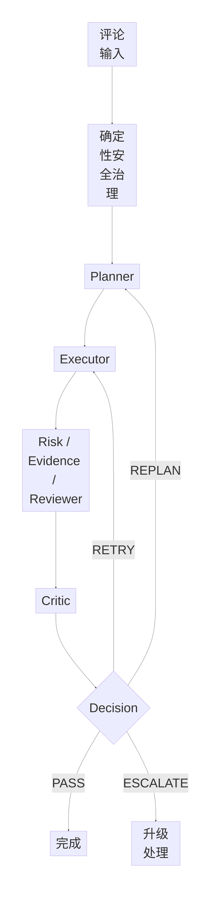
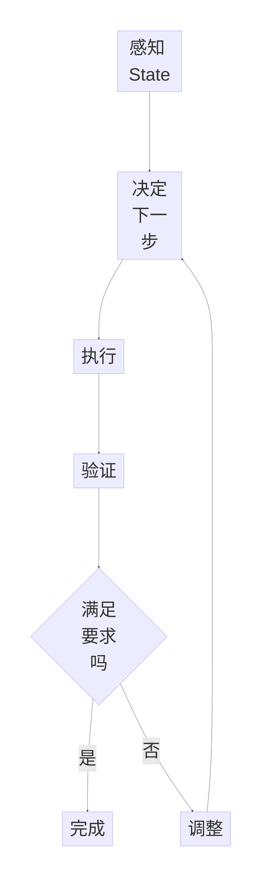
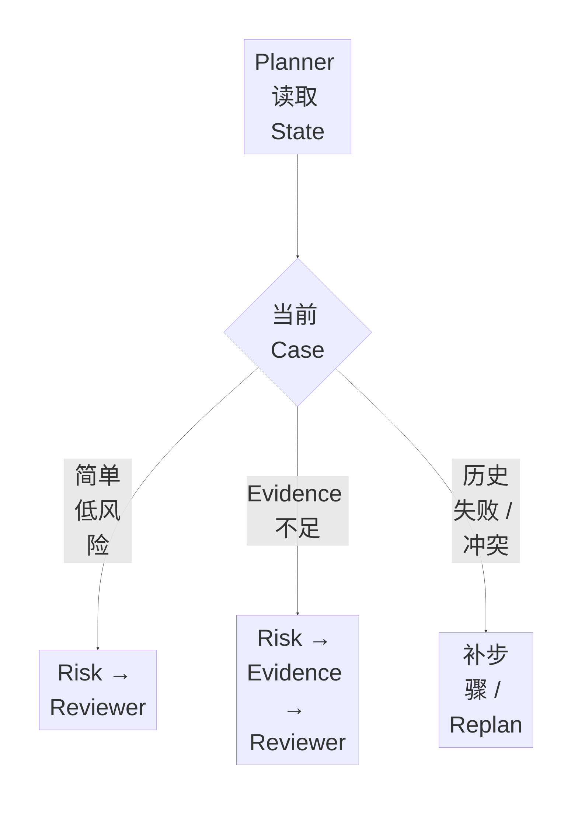
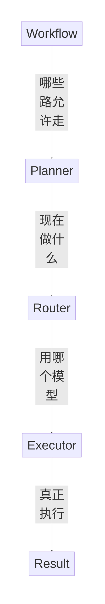
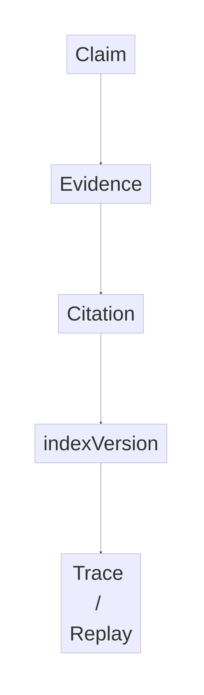
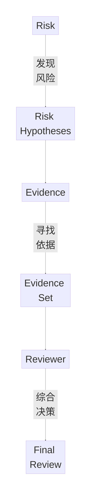
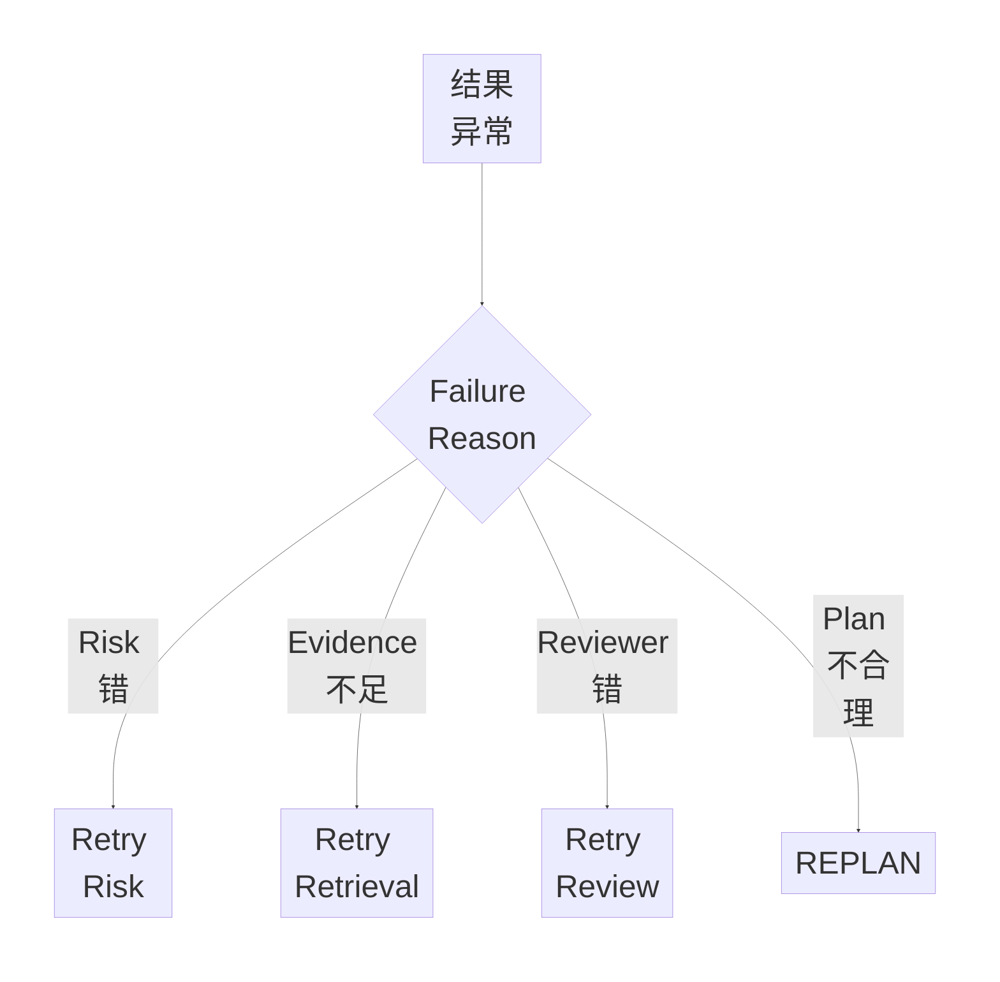
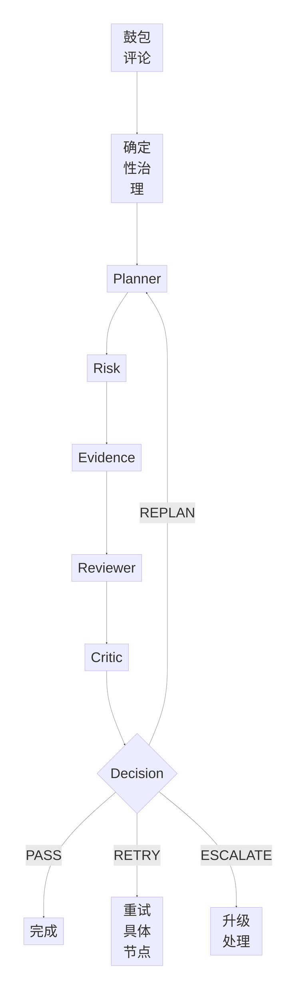

> Day02 固定范围：
>
> **Q1 Agentic Review 是什么、为什么需要它**  
> **Q2 Planner 到底做什么**  
> **Q3 Planner 与固定 Workflow / Router 的边界**  
> **Q4 Evidence 是什么、为什么必须单独治理**  
> **Q5 为什么拆成 Risk / Evidence / Reviewer 三类角色**
>
> 本文以当前 E-Review Day02 复盘材料为依据整理。代码均为帮助理解与面试表达的最小示意，不等同于仓库真实实现；真实类名、LangGraph Node、State 字段与调用链后续需要回代码核验。

---

## 目录

- [一、Day02 总图](#一day02-总图)
- [二、Q1：什么是 Agentic Review](#二q1什么是-agentic-review)
- [三、Q2：Planner 到底做什么](#三q2planner-到底做什么)
- [四、Q3：Planner / Workflow / Router / Executor 的边界](#四q3planner--workflow--router--executor-的边界)
- [五、Q4：Evidence 是什么](#五q4evidence-是什么)
- [六、为什么 Evidence 必须单独治理](#六为什么-evidence-必须单独治理)
- [七、Q5：为什么拆 Risk / Evidence / Reviewer](#七q5为什么拆-risk--evidence--reviewer)
- [八、完整 Case 串联](#八完整-case-串联)
- [九、Day02 面试高频追问](#九day02-面试高频追问)
- [十、闭卷速记与验收 Gate](#十闭卷速记与验收-gate)

---

# 一、Day02 总图

E-Review 的核心不是“用了几个 Agent”，而是：

> **确定性代码守住边界，复杂审核阶段允许受约束的动态决策。**



一页理解：

```text
Q1 Agentic Review
→ 为什么路径需要动态变化？

Q2 Planner
→ 当前 State 下，下一步做什么？

Q3 Boundary
→ Workflow / Planner / Router / Executor 各管什么？

Q4 Evidence
→ 什么内容真正支持或反驳审核 Claim？

Q5 Roles
→ 为什么 Risk、Evidence、Reviewer 要拆开？
```

---

# 二、Q1：什么是 Agentic Review

## 1. 普通一次 LLM 审核

最简单的评论审核：

```text
用户评论
↓
Prompt
↓
LLM
↓
风险标签
```

例如：

> “这个充电宝用了一个月就鼓包，而且客服一直没人处理。”

模型直接输出：

```text
风险等级：高
风险类型：产品安全
```

它的问题不是“模型一定判断错”，而是系统只有一次生成，没有一个显式的状态驱动闭环。

它没有解决：

- 要不要补 Evidence？
- Evidence 到底够不够？
- 是否存在多个风险？
- 第一次失败以后怎么办？
- 当前模型能力是否足够？
- 是否需要升级或人工介入？
- 当前结果能不能直接交付？

---

## 2. Agentic Review 的核心

当前 E-Review 复盘材料把 Agentic Review 理解为：

> **感知当前状态 → 决定下一步 → 执行 → 验证 → 必要时调整。**



最重要的词：

> **bounded autonomy：受约束的自主性。**

不是：

> 模型完全自由行动。

而是：

> 模型只能在预定义的能力、状态和 Workflow 边界里做有限动态决策。

---

## 3. 为什么还保留确定性 Workflow

像这些环节：

```text
安全校验
PII 脱敏
权限检查
Schema 校验
最大重试次数
状态转移边界
```

本身规则明确、要求稳定、需要审计，因此继续用确定性代码。

所以当前设计更准确的描述：

> **Hybrid Agentic Workflow**

---

## 4. Q1 标准面试答案

> E-Review 里的 Agentic Review 不是简单把一次 LLM 调用改名叫 Agent，而是把审核建模成一个状态驱动的决策过程。确定性的安全、PII、权限和 Schema 仍然使用固定代码；进入复杂审核以后，由 Planner 根据风险等级、Evidence 状态和上下文决定需要执行哪些步骤，Executor 调用 Risk、Evidence、Reviewer 等能力，最后 Critic 决定结果是通过、重试、重新规划还是升级。因此它本质上是一个 Hybrid Agentic Workflow。

必背：

> **Agentic 不体现在用了几个 LLM，而体现在审核路径可以根据当前 State 动态变化。**

---

## 5. Q1 最小代码

```python
def review(state):
    plan = planner(state)
    result = executor(plan, state)
    decision = critic(result, state)
    return decision
```

### 第 1 行

```python
def review(state):
```

`def` 表示定义函数。

`review` 是函数名。

`state` 表示当前审核任务的状态，可以理解成一个大盒子，里面可能有：

```text
评论文本
Risk 信息
Evidence
历史结果
失败原因
重试次数
预算
```

### 第 2 行

```python
plan = planner(state)
```

把当前 State 给 Planner。

Planner 输出：

```text
接下来应该做什么。
```

### 第 3 行

```python
result = executor(plan, state)
```

Executor 根据 Plan 真正执行任务。

### 第 4 行

```python
decision = critic(result, state)
```

Critic 判断当前结果是否可靠，可能输出：

```text
PASS
RETRY
REPLAN
ESCALATE
```

### 第 5 行

```python
return decision
```

把最终运行时决策返回。

---

# 三、Q2：Planner 到底做什么

## 1. Planner 不是 Todo List

Planner 的核心不是：

> 帮我列几个步骤。

而是：

> **根据当前状态决定接下来执行什么。**

一句话：

> **Planner = WHAT TO DO NEXT**

---

## 2. 具体 Case

评论：

> “这个充电宝已经鼓包了，我用了两个月，而且客服不处理。”

当前 State 可能包含：

```text
产品安全风险：较高
Evidence：不足
存在售后投诉
当前模型：低成本模型
```

Planner 可能决定：

```text
Risk
→ Evidence
→ Reviewer
→ Critic
```

而评论：

> “物流有点慢。”

可能只需要：

```text
Risk
→ Reviewer
```

因此 Planner 的价值来自：

> **不同 State 对应不同执行路径。**



---

## 3. Planner 的输入

不要只说：

> 输入是评论。

更完整：

```text
Content
Risk
Evidence
History
Budget
```

展开：

- 评论内容；
- 风险信号；
- Evidence 状态；
- 历史上下文；
- 前一次失败原因；
- 预算；
- 重试次数。

---

## 4. Planner 的输出

应该尽量是：

> **Structured Plan**

例如：

```json
{
  "risk_level": "HIGH",
  "steps": [
    "risk_analysis",
    "evidence_retrieval",
    "review"
  ],
  "need_critic": true
}
```

结构化的价值：

- Executor 可以稳定消费；
- 可以做 Schema 校验；
- 可以做 Trace；
- 可以做 Replay；
- 可以知道执行到哪一步；
- 可以针对单个节点 Retry。

---

## 5. Planner 教学代码

```python
def planner(state):
    steps = ["risk_analysis"]

    if state["evidence_sufficient"] is False:
        steps.append("evidence_retrieval")

    steps.append("review")

    return {
        "steps": steps,
        "need_critic": True
    }
```

### 第 1 行

```python
def planner(state):
```

定义 Planner 函数。

输入是当前 State。

### 第 2 行

```python
steps = ["risk_analysis"]
```

创建一个 List。

`[]` 表示列表。

先加入：

```text
risk_analysis
```

即先做风险分析。

### 第 3 行

空行，只用于可读性。

### 第 4 行

```python
if state["evidence_sufficient"] is False:
```

`if` = 如果。

从 State 里读取：

```text
Evidence 是否充分。
```

如果是 `False`：

> 说明 Evidence 不够。

### 第 5 行

```python
steps.append("evidence_retrieval")
```

`append()` = 在列表末尾新增一个元素。

于是：

```python
["risk_analysis"]
```

变成：

```python
[
    "risk_analysis",
    "evidence_retrieval"
]
```

### 第 6 行

空行。

### 第 7 行

```python
steps.append("review")
```

最后加入 Reviewer 综合审核。

### 第 8 行

空行。

### 第 9～12 行

```python
return {
    "steps": steps,
    "need_critic": True
}
```

返回一个 Python Dictionary。

`{}` 表示字典。

`"steps": steps`：

> 返回刚才规划出来的步骤。

`"need_critic": True`：

> 当前 Plan 最后需要 Critic。

---

## 6. 面试官攻击：这不就是 if/else 吗？

应该承认：

> 上面的代码就是最小教学示意。

如果真实 Planner 只是：

```python
if A:
    B
if C:
    D
```

那么确实没必要为了“Agent”而使用 LLM。

真正需要 Agent Planner 的地方，是一些难以完全写成稳定规则的语义状态，例如：

- Evidence 是否真正充分；
- 评论是否同时存在多种风险；
- 多个 Evidence 是否互相矛盾；
- 当前失败以后应该补检索还是重新规划；
- 是否需要升级处理。

当前复盘材料的核心立场：

> **能用确定性代码的继续用代码，只有带语义不确定性的决策才考虑让模型结构化判断。**

---

## 7. Q2 标准面试答案

> Planner 的职责是决定当前 Case 接下来应该做什么，而不是直接输出最终审核结果。输入包括评论内容、风险信号、当前 Evidence 状态、上下文和历史执行结果；如果存在失败重试，也会考虑前一次失败原因和当前预算。输出是 Structured Plan，例如需要 Risk Analysis、Evidence Retrieval 和 Review 哪几个步骤，以及是否需要 Critic。这样 Executor 可以按 Plan 执行，同时也方便 Trace、Replay 和错误定位。

---

# 四、Q3：Planner / Workflow / Router / Executor 的边界

这是 Day02 最应该背熟的一题。

> **Workflow 管哪些路允许走，Planner 管现在走哪条，Router 管这一步用哪个模型，Executor 负责真正执行。**

---

## 1. Workflow

Workflow 定义：

- 有哪些 Node；
- 哪些状态允许跳转；
- 最大 Retry；
- 什么时候停止；
- 什么时候升级；
- Checkpoint 如何恢复。

它是：

> **道路系统 / Runtime 骨架。**

---

## 2. Planner

Planner 决定：

> 当前 Case 实际走哪些步骤。

例如：

```text
Case A
Risk → Reviewer

Case B
Risk → Evidence → Reviewer

Case C
Risk → Evidence → Reviewer → Replan
```

---

## 3. Router

Router 不决定：

> 是否需要 Review。

而是在 Review 已经确定要执行后，决定：

> **用哪个模型执行 Review。**

当前项目材料里的三级模型：

```text
低风险
→ Qwen3-8B

中等复杂
→ DeepSeek-V4-Flash

高风险 / Evidence 冲突
→ DeepSeek-V4-Pro
```

---

## 4. Executor

Executor：

> 真正执行当前 Step。

---

## 5. 边界图



必背：

```text
Workflow = ROAD
Planner = WHAT
Router = WHICH MODEL
Executor = DO
```

---

## 6. 最小代码

```python
plan = planner(state)

for step in plan["steps"]:
    model = router(step, state)
    result = execute(step, model, state)
```

### 第 1 行

```python
plan = planner(state)
```

Planner 根据 State 生成 Plan。

### 第 2 行

空行。

### 第 3 行

```python
for step in plan["steps"]:
```

`for` 表示循环。

把 `plan["steps"]` 里的每一步依次取出来。

例如：

```python
[
    "risk_analysis",
    "evidence_retrieval",
    "review"
]
```

### 第 4 行

```python
model = router(step, state)
```

已经知道当前要执行哪个 Step。

Router 决定：

> 这个 Step 用哪个模型。

### 第 5 行

```python
result = execute(step, model, state)
```

Executor 根据：

```text
Step
+
Model
+
State
```

真正执行。

---

# 五、Q4：Evidence 是什么

## 1. 定义

Evidence：

> **能够支持或者反驳某个审核结论的可追溯依据。**

例如系统的 Claim：

> “该评论涉及产品安全风险。”

对应：

```text
Claim
= 产品存在潜在电池安全风险

Evidence
= 规则库里关于电池鼓包安全风险的具体条款

Citation
= 这段 Evidence 在哪个来源、哪个位置

indexVersion
= 当时使用的是哪一版知识索引
```

---

## 2. Evidence ≠ Citation

```text
Evidence
= 证据本身

Citation
= 证据在哪里
```

例如：

```text
Evidence：
“电池出现鼓包时应停止继续使用……”

Citation：
rule_102 / section_3
```

---

## 3. 为什么需要 indexVersion

知识库会更新：

```text
risk-kb-v12
↓
risk-kb-v13
```

同一 Query 在不同索引版本：

> 可能召回不同 Evidence。

如果没有 `indexVersion`，未来 Replay 时就难以还原：

> **当时模型究竟看到了哪一版知识环境。**

因此当前项目材料中的 Evidence Protocol 是：

```text
Claim
↔ Evidence
↔ Citation
↔ indexVersion
↔ Trace / Replay
```



---

## 4. Evidence 最小数据结构

```python
evidence = {
    "claim": "存在产品安全风险",
    "text": "电池出现鼓包应停止继续使用",
    "source_id": "rule_102",
    "index_version": "risk-kb-v12"
}
```

### `evidence = {`

创建一个 Dictionary，用来保存结构化 Evidence。

### `"claim": ...`

记录：

> 这段 Evidence 支持或反驳哪个 Claim。

### `"text": ...`

真正的证据内容。

### `"source_id": ...`

来源标识，属于 Citation / Provenance 信息。

### `"index_version": ...`

记录检索时使用的索引版本。

---

# 六、为什么 Evidence 必须单独治理

## 1. 找证据和做最终决定是两个目标

Evidence 侧：

> **有什么依据支持 / 反驳当前 Risk Hypothesis？**

Reviewer 侧：

> **综合所有信息后，最终应该怎么处理？**

两者优化目标不同。

---

## 2. Evidence Agent 更关注

```text
Query
Retrieve
Rerank
Evidence
Citation
```

目标更偏：

```text
Recall
Coverage
Relevant Evidence
Traceability
```

---

## 3. Reviewer 更关注

输入：

```text
Comment
+
Risk
+
Evidence
```

输出：

```text
ALLOW
WARN
BLOCK
MANUAL_REVIEW
```

---

## 4. 为什么不能全塞一个 Prompt

如果一个模型同时负责：

```text
发现风险
+ 查资料
+ 判断证据
+ 做最终决定
```

职责高度耦合。

当前材料特别强调一种风险：

> **先形成结论，再去找支持这个结论的证据。**

即：

> confirmation bias / 确认偏误。

拆开后：

```text
Risk
→ 提出风险假设

Evidence
→ 找支持 / 反驳依据

Reviewer
→ 综合判断
```

更容易做独立检查。

---

# 七、Q5：为什么拆 Risk / Evidence / Reviewer

## 1. Risk

回答：

> **这里可能有什么风险？**

例如：

```text
产品安全
售后服务
欺诈
PII
```

---

## 2. Evidence

回答：

> **有什么 Evidence 支持或反驳这些风险？**

当前项目材料里 Evidence 能力涉及：

```text
BM25
BGE-M3
RRF
CrossEncoder
```

输入：

```text
Risk Hypotheses + Comment
```

输出：

```text
Evidence[]
```

---

## 3. Reviewer

回答：

> **综合 Risk + Evidence 后，最终应该怎么处理？**

---

## 4. 角色总图



必背：

```text
Risk
= 发现风险

Evidence
= 寻找依据

Reviewer
= 综合决策
```

---

## 5. 为什么不一个 Agent 全做

一个 Agent 做完整 Demo 当然可以。

问题是：

> 一旦最终结果错了，很难定位错在哪。

可能是：

```text
Risk 错
Retrieval 错
Rerank 错
Evidence 不足
Reviewer 错
```

角色拆开以后，可以分别评测和恢复。

---

## 6. 角色拆分最大的价值

不是：

> “多个 Agent 更智能。”

而是：

> **错误可定位。**

例如：

```text
Evidence 不足
→ 只重跑 Retrieval

Reviewer 错
→ Retry Reviewer

Plan 本身有问题
→ Replan
```



---

## 7. Q5 标准面试答案

> 一个模型一次性完成风险识别、检索、证据判断和最终审核当然更简单，但职责耦合会非常重。一旦结果出错，很难判断到底是风险发现错了、Evidence 没找全，还是最终决策错了。所以我把它拆成 Risk、Evidence、Reviewer 三类能力角色：Risk 负责提出风险假设，Evidence 负责寻找支持或者反驳这些风险的依据，Reviewer 最后综合原始评论、风险假设和 Evidence 做最终决策。拆分最大的价值不是 Agent 数量，而是职责清晰、错误可定位、节点可独立评测，而且 Critic 可以根据 Failure Reason 更精准地触发 Retry 或 Replan。

---

# 八、完整 Case 串联

评论：

> “这个充电宝鼓包了，用了两个月，客服还不处理。”

执行过程：

```text
1. 确定性治理
   请求 / PII / 权限 / Schema

2. Planner
   根据 Content + Risk + Evidence + History 形成 Plan

3. Risk
   产品安全风险 + 售后服务风险

4. Evidence
   检索支持 / 反驳风险的依据

5. Reviewer
   综合 Comment + Risk + Evidence

6. Critic
   PASS / RETRY / REPLAN / ESCALATE
```



---

# 九、Day02 面试高频追问

## 1. Agentic Review 和普通 Workflow 区别？

> 普通 Workflow 的主要路径提前固定；E-Review 在确定性边界内允许 Planner 根据当前 Risk、Evidence 和历史执行状态动态选择审核步骤，并由 Critic 决定 Retry、Replan 或 Escalate。区别不在 Agent 数量，而在有限范围内的动态状态决策。

## 2. 为什么不全部固定？

> Evidence 是否充分、风险是否冲突、失败后应该补检索还是重新判断，这些包含语义不确定性。如果全部写规则，分支会越来越复杂；如果全部交给 Agent，又会失去可控性，所以采用 Hybrid。

## 3. Planner 不就是 if/else？

> 教学代码是 if/else，只用来解释输入和 Structured Plan。真正需要 Agent Planner 的地方，是 Evidence 充分性、风险冲突和失败原因等难以靠稳定规则完全覆盖的语义状态。如果真实逻辑完全能由规则解决，就不应该为了 Agent 而使用 LLM。

## 4. Planner 和 Router 区别？

> Planner 决定业务步骤，例如是否需要 Evidence；Router 在步骤确定以后选择执行模型。

## 5. Evidence 为什么不只是 Retrieval Result？

> 因为系统需要知道某个具体 Claim 是被哪段内容支持或反驳的，并绑定 Citation、indexVersion 和 Trace，才能做可追踪审核。

## 6. Citation 为什么不等于 Evidence？

> Evidence 是证据内容；Citation 是证据的位置。

## 7. indexVersion 为什么重要？

> 知识库会更新，同一 Query 在不同版本可能召回不同内容。没有 indexVersion 就无法准确 Replay 当时的知识环境。

## 8. 多角色会不会更贵？

> 会，因此角色拆分不是越多越好。这里拆 Risk、Evidence、Reviewer，是因为职责目标天然不同，同时需要错误定位、独立评测和精准 Retry。简单 Case 不一定需要完整复杂链路。

## 9. Risk / Evidence / Reviewer 都是完全自主 Agent 吗？

> 更稳妥的描述是：我把系统按职责划分为 Risk、Evidence、Reviewer 三类能力角色，通过 LangGraph Workflow 编排，而不是强调它们都是完全自主的通用 Agent。真正的自主性主要体现在 Planner 对路径的有限动态决策，以及 Critic 反馈后的 Retry / Replan。

---

# 十、闭卷速记与验收 Gate

## 一页速记

```text
Q1 Agentic Review

= 确定性 Workflow
+ bounded autonomy
+ 执行
+ Critic 治理

核心：
路径根据 State 动态变化


Q2 Planner

输入：
Content
Risk
Evidence
History
Budget

输出：
Structured Plan

核心：
WHAT TO DO NEXT


Q3 边界

Workflow = ROAD
Planner = WHAT
Router = WHICH MODEL
Executor = DO


Q4 Evidence

Evidence
= 支持 / 反驳 Claim 的内容

Citation
= Evidence 在哪里

indexVersion
= 当时使用哪一版知识索引

Protocol
= Claim
↔ Evidence
↔ Citation
↔ indexVersion
↔ Trace / Replay


Q5 角色拆分

Risk
= 发现风险

Evidence
= 找依据

Reviewer
= 做决定

拆分价值：
职责清晰
错误可定位
独立评测
精准 Retry / Replan
```

---

## Gate 1：Q1

30 秒闭卷回答 Agentic Review，必须出现：

```text
Hybrid
bounded autonomy
State
Planner
Critic
```

## Gate 2：Q2

闭卷：

```text
Input
= Content + Risk + Evidence + History + Budget

Output
= Structured Plan
```

并知道：

> Planner 不直接给最终审核结论。

## Gate 3：Q3

必须秒答：

```text
Workflow = ROAD
Planner = WHAT
Router = WHICH MODEL
Executor = DO
```

## Gate 4：Q4

必须区分：

```text
Evidence
Citation
indexVersion
```

并解释 Replay。

## Gate 5：Q5

必须秒答：

```text
Risk = 发现风险
Evidence = 找依据
Reviewer = 做决定
```

再补：

> **角色拆分最大的价值不是“更智能”，而是错误可定位、节点可独立评测、Retry / Replan 更精准。**

---

# Day02 最终标准答案

> E-Review 采用的是 Hybrid Agentic Workflow，而不是完全自由 Agent。安全、PII、权限和 Schema 等确定性逻辑由固定 Runtime 保证；复杂审核阶段，Planner 根据评论、Risk、Evidence、历史执行状态和预算生成 Structured Plan，决定当前 Case 接下来应该执行哪些能力。Workflow 定义允许的节点和状态转移，Planner 决定当前走哪条路径，Router 决定具体步骤使用哪个模型，Executor 负责真正执行。
>
> 在执行能力上，我把审核职责拆成 Risk、Evidence、Reviewer：Risk 负责发现风险假设，Evidence 负责检索支持或反驳这些风险的可追溯依据，Reviewer 综合评论、Risk 和 Evidence 做最终判断。Evidence 不等于 Citation，Evidence 是证据内容，Citation 是来源定位，同时记录 indexVersion 是为了保证未来 Trace / Replay 时能够还原当时模型看到的知识环境。
>
> 这种拆分的重点不是增加 Agent 数量，而是让职责、状态和错误边界更清楚。当 Critic 发现结果不可靠时，可以根据 Failure Reason 精确触发某个节点 Retry，或者在 Plan 本身不合理时触发 Replan，从而形成一个受约束、可验证、可恢复的 Agentic Review 闭环。
