> 适用场景：AI Agent 应用开发岗位 / E-Review 项目专项面试复盘  
> 来源：根据 `erday03.md` 原始复盘材料去重、重组与结构化整理。  
>
> 本文固定采用统一答题模板：
>
> **① 专有名词 / 系统级方法解释 → ② 记忆路线 → ③ 完整标准答案 → ④ 面试追问 → ⑤ 证据边界**
>
> 其中原稿带条件的数字，例如 `78%→92%` 是否确实来自同一 `100 条 Sealed Test`，仍保留为**待证据确认项**，不会擅自改成确定事实。

---

# 目录

- [一、先重新理解 ER-B1 Bullet](#一先重新理解-er-b1-bullet)
- [Q1：为什么需要 Planner](#q1为什么需要-planner)
- [Q2：Planner 的输入和输出是什么](#q2planner-的输入和输出是什么)
- [Q3：为什么 Planner 和 Executor 要拆开](#q3为什么-planner-和-executor-要拆开)
- [Q4：为什么拆 Risk / Evidence / Reviewer](#q4为什么拆-risk--evidence--reviewer)
- [Q5：为什么 Reviewer 后面还需要 Critic](#q5为什么-reviewer-后面还需要-critic)
- [Q6：Retry 和 Replan 到底有什么区别](#q6retry-和-replan-到底有什么区别)
- [Q7：Evidence Sufficiency 到底怎么判断](#q7evidence-sufficiency-到底怎么判断)
- [Q8：Planner 和 Model Router 怎么区分](#q8planner-和-model-router-怎么区分)
- [Q9：14pp 能不能归因给 Planner](#q914pp-能不能归因给-planner)
- [Q10：为什么只看 Task Success 不够](#q10为什么只看-task-success-不够)
- [Q11：Checkpoint 到底解决什么](#q11checkpoint-到底解决什么)
- [Q12：有 Checkpoint 就不会重复 API 调用吗](#q12有-checkpoint-就不会重复-api-调用吗)
- [Q13：Replay 和 Resume 有什么区别](#q13replay-和-resume-有什么区别)
- [Q14：为什么用 LangGraph，不自己写状态机](#q14为什么用-langgraph不自己写状态机)
- [Q15：什么叫 Task Success](#q15什么叫-task-success)
- [Q16：78% 的 Baseline 到底是什么](#q1678-的-baseline-到底是什么)
- [Q17：Dev / Validation / Sealed Test 怎么分工](#q17dev--validation--sealed-test-怎么分工)
- [Q18：为什么是 Paired Comparison](#q18为什么是-paired-comparison)
- [Q19：McNemar Test 和 Wilson Interval 分别解决什么](#q19mcnemar-test-和-wilson-interval-分别解决什么)
- [二、Day03 一页总记忆图](#二day03-一页总记忆图)
- [三、闭卷验收](#三闭卷验收)

---

# 一、先重新理解 ER-B1 Bullet

不要记成：

> Planner 很强，所以成功率 +14pp。

更正确的系统主线是：

```text
业务复杂度上升
↓
固定 Workflow 不够灵活
↓
Planner 做有限动态规划
↓
Executor 执行专业能力
↓
Critic 治理 Candidate Result
↓
Checkpoint 保证长任务可恢复
↓
Offline Eval 判断 PEC 版本是否真的改善
```

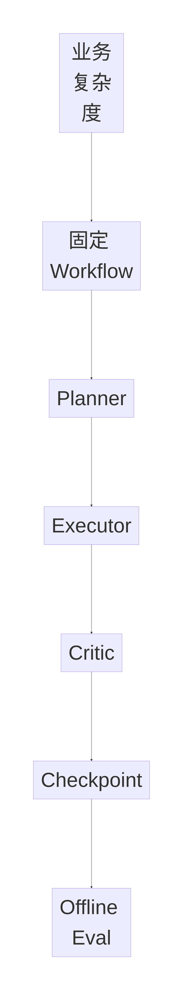

最重要的一句：

> **这是一个系统级 PEC 重构故事，不是 Planner 单点英雄故事。**

---

# Q1：为什么需要 Planner

## ① 专有名词 / 系统级方法解释

### Planner

Planner：

> **根据当前任务状态，决定接下来需要执行哪些能力步骤。**

它不直接完成业务动作，而是生成一个受约束的执行计划。

### Bounded Autonomy

Bounded Autonomy：

> **受约束自主性。**

模型可以动态做语义路由，但：

- 不能发明不存在的 Tool；
- 不能绕过 Workflow；
- 不能修改安全边界；
- 不能无限 Retry；
- 只能在预定义 Action Space 内选择。

### Semantic Routing

Semantic Routing：

> 对难以用固定规则表达的语义状态做路径选择。

例如：

```text
Evidence 是否真的支持 Claim？
是否存在多种风险？
Evidence 冲突意味着补检索还是升级审核？
```

---

## ② 记忆路线

> **能写死的交给代码，写不死的语义选择交给 Planner。**

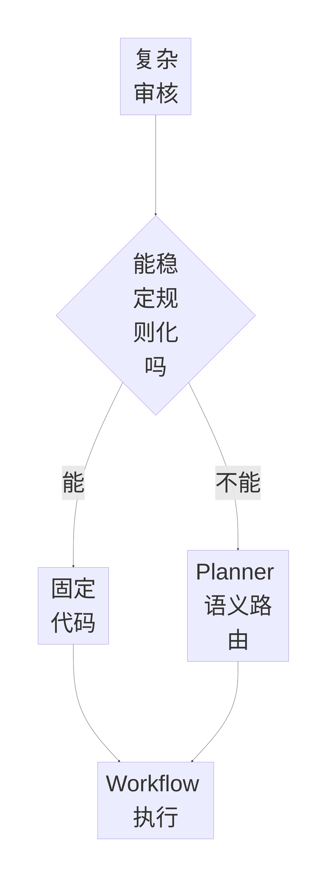

记忆口诀：

```text
规则明确 → Code
语义不确定 → Planner
动作边界 → Workflow
```

---

## ③ 完整标准答案

> 我的第一版其实就是固定 Workflow，所以我不是为了做 Agent 而强行加 Planner。固定 Workflow 对安全校验、PII、权限、Schema 这种确定性步骤非常合适，真正的问题主要出现在复杂审核阶段。
>
> 比如同样是评论审核，有些 Case 只需要风险分类，有些 Case 需要额外检索 Evidence；有些 Evidence 已经充分，有些 Evidence 相互冲突；还有一些 Case 第一次 Reviewer 失败后，需要判断到底是重新执行、补检索，还是重新规划。如果把这些组合状态全部固化成规则，业务分支会越来越复杂。
>
> 因此我的设计不是完全自由 Agent，而是让 Planner 只负责难以完全写死的语义路由决策，并且只能从预定义 Action 和合法状态转移中选择；安全、权限、最大重试次数等仍然由确定性代码控制。
>
> 所以 Planner 的价值不是替代 Workflow，而是**在 Workflow 的边界内动态决定当前 Case 应该走哪条路径。**

---

## ④ 面试追问：这不还是 if-else 吗？

> 最终执行层一定会有 if-else 或条件边，因为生产系统不可能没有确定性状态转移。真正的区别是**判断条件来自哪里**。
>
> 像 `retry_count > 2`、Citation 为空、Schema 不合法，这些我直接用代码判断；但“当前 Evidence 是否真正支持风险 Claim”“是否同时存在多个风险类型”“Evidence 冲突意味着补检索还是升级审核”，这些属于语义判断，我让模型输出结构化决策，再由 Workflow 做 Schema、动作空间和状态转移校验。
>
> 所以我的设计是：**模型负责难以规则化的语义判断，代码负责动作空间和安全边界。**

---

## ⑤ 证据边界

当前材料支持：

- 固定 Workflow → PEC 的设计演进；
- Planner 承担有限语义路由；
- 确定性规则仍由 Runtime 控制。

当前材料**不能单独证明**：

> Planner 本身带来全部 `+14pp`。

模块归因必须看 Ablation。

---

# Q2：Planner 的输入和输出是什么

## ① 专有名词 / 系统级方法解释

### State

State：

> **当前任务所有对后续决策有价值的工程状态。**

不只是评论文本，还包括：

- Risk；
- Evidence；
- History；
- Failure Reason；
- Retry Count；
- Budget。

### Structured Plan

Structured Plan：

> **受 Schema 约束、Runtime 可以直接消费的执行计划。**

它不是自由自然语言 Todo。

---

## ② 记忆路线

> **Planner = State In → Plan Out**

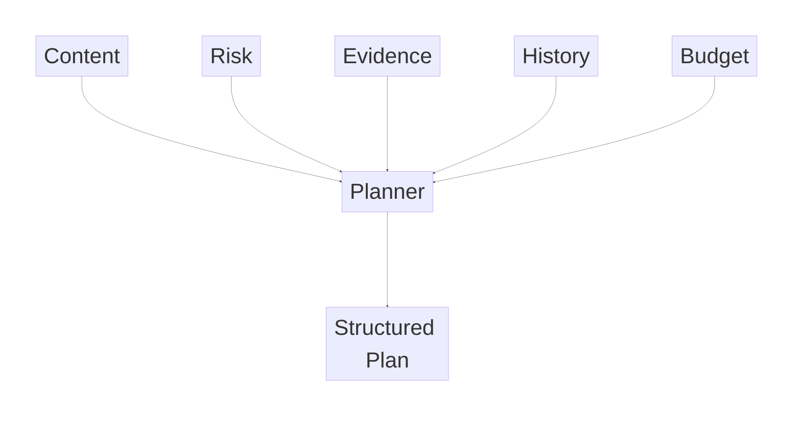

口诀：

> **C-R-E-H-B → PLAN**

```text
Content
Risk
Evidence
History
Budget
```

---

## ③ 完整标准答案

> 我把 Planner 的输入理解成当前任务状态，而不只是原始评论。核心包括五类：原始评论和评论类型、当前风险信号、Evidence 状态、历史执行上下文，以及失败信息和剩余预算。
>
> 第一次规划时主要看 Content、Risk 和 Evidence；如果是 Replan，还需要带上上一轮真实执行轨迹、Failure Reason 和 Retry Count，避免 Planner 再次进入同一个失败路径。
>
> Planner 不输出最终业务答案，而是输出一个受 Schema 约束的 Structured Plan。至少包含需要执行的能力步骤、必要执行约束和后续验证要求。
>
> 例如复杂 Case 可以是：
>
> `Risk → Evidence Retrieval → Reviewer`
>
> 普通低风险 Case 可以是：
>
> `Risk → Reviewer`
>
> Planner 不能自己创造系统不存在的能力，只能从注册好的 Action Space 中选择。
>
> 我刻意避免 Planner 输出大段自然语言再让 Executor 二次理解，因为那样会在 Planner 和 Executor 之间增加新的 LLM 歧义。结构化输出更容易做校验、Trace、Replay 和 Failure Attribution。

---

## ④ 示例 Structured Plan

```json
{
  "steps": [
    "risk_analysis",
    "evidence_retrieval",
    "review"
  ],
  "constraints": {
    "max_retry": 2
  },
  "need_critic": true
}
```

---

## ⑤ 证据边界

当前材料支持 Planner 输入的五类状态抽象。

具体字段名、真实 Pydantic / TypedDict / State Schema：

> 需要后续回仓库代码核验。

---

# Q3：为什么 Planner 和 Executor 要拆开

## ① 专有名词 / 系统级方法解释

### Separation of Concerns

Separation of Concerns：

> **关注点分离。**

Planner 关注：

> 任务结构。

Executor 关注：

> 把步骤真正执行出来。

### Plan-and-Execute

Plan-and-Execute：

> 先形成计划，再逐步执行。

它和边思考边行动的 ReAct 不冲突，只是更强调：

- 可观测；
- 可验证；
- 可回放；
- 可独立评测。

---

## ② 记忆路线

> **Planner 负责 What，Executor 负责 Do。**

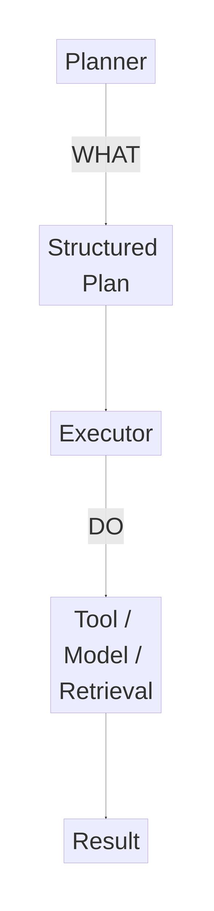

---

## ③ 完整标准答案

> 一些 ReAct Agent 可以边 Reasoning 边 Acting，但我这里更关心可控性和可评测性，所以把 Plan 和 Execution 分开。
>
> 第一，Planner 只关心任务结构，不需要承担每个节点的业务细节；第二，Executor 可以针对不同 Step 使用不同 Tool、Retrieval 或 Model；第三，Plan 本身可以被结构化校验、Trace 和 Replay；第四，最终失败时可以进一步判断到底是 Plan 本身有问题，还是某个执行节点失败。
>
> 如果两者完全耦合，最终 Case 失败时很难区分是模型一开始规划错了，还是工具调用、检索或某个执行节点失败。
>
> 所以在这个项目里：
>
> **Planner = What，Executor = Do。**

---

## ④ 追问：是不是所有 Agent 都应该 Plan / Execute 分离？

> 不是。简单任务或低风险任务直接 ReAct 或单次 Tool Loop 可能更划算。只有当我需要显式 Plan、节点级 Trace、独立评测和局部恢复时，分离才有明显工程收益。

---

# Q4：为什么拆 Risk / Evidence / Reviewer

## ① 专有名词 / 系统级方法解释

### Role Decomposition

Role Decomposition：

> 把一个复杂 Agent 任务拆成职责不同的能力角色。

### Observability

Observability：

> 能够看到系统内部到底发生了什么。

### Evaluability

Evaluability：

> 每个能力可以独立定义指标和测试。

### Recoverability

Recoverability：

> 某个节点失败时，可以只恢复必要部分，而不是全部重跑。

---

## ② 记忆路线

> **Risk 提问题，Evidence 找依据，Reviewer 做决定。**

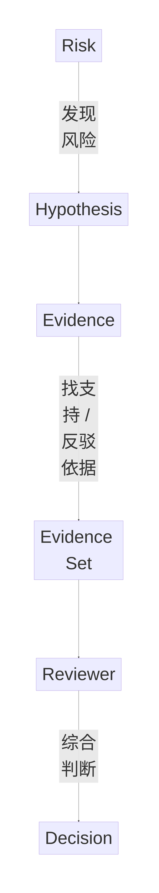

口诀：

```text
Risk = 问题
Evidence = 依据
Reviewer = 决策
```

---

## ③ 完整标准答案

> 技术上当然可以让一个 Agent 全部完成，而且对于简单 Case 单 Agent 可能更划算，所以我不会说 Agent 越多越好。
>
> 我做角色拆分主要有三个目标。
>
> 第一是职责隔离：Risk 提出风险假设，Evidence 负责寻找支持或反驳的依据，Reviewer 最后做综合决策。
>
> 第二是错误定位：如果最终审核错误，我可以进一步判断到底是 Risk 漏检、Retrieval 没找全，还是 Reviewer 决策错误，而不是只能知道“LLM 答错了”。
>
> 第三是局部恢复：Evidence 节点失败时，可以只重跑 Evidence，不需要整个任务从头执行。
>
> 所以角色拆分的价值不是增加 Agent 数量，而是提高：
>
> **observability、evaluability 和 recoverability。**

---

## ④ 必背四点

```text
职责隔离
错误定位
独立评测
局部恢复
```

---

# Q5：为什么 Reviewer 后面还需要 Critic

## ① 专有名词 / 系统级方法解释

### Decision Maker

Reviewer 是：

> **决策生成者。**

### Verifier / Critic

Critic 是：

> **候选结果验证者。**

### External Grounding

Critic 不应该只是：

> “再想一遍。”

而应该尽量利用：

- Evidence；
- Citation；
- Schema；
- Policy；
- Trace；

这些可外部验证信号。

---

## ② 记忆路线

> **Reviewer 生成答案，Critic 判断答案能不能交付。**

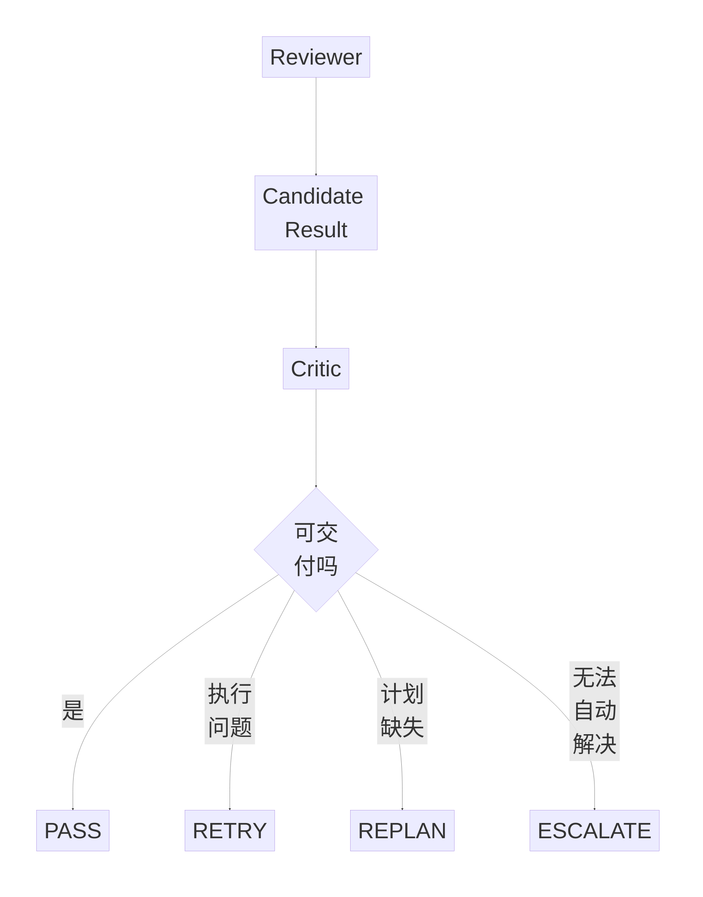

---

## ③ 完整标准答案

> Reviewer 和 Critic 的优化目标不一样。Reviewer 回答的是“这个评论最终应该怎么处理”，它是 Decision Maker；Critic 不重新完整完成同一个任务，而是验证 Candidate Result 是否满足发布条件，比如风险 Claim 是否被 Evidence 支持、Citation 是否有效、Schema 是否完整，以及是否存在明显冲突。
>
> 所以一个负责生成决策，另一个负责验证决策。
>
> 如果 Critic 发现的是暂时执行错误，可以 Retry；如果发现原 Plan 缺少必要步骤，则 Replan；自动流程仍无法解决时再 Escalate。
>
> 我也不会把 Critic 当作绝对正确的 Oracle，它本身也需要独立评测。

---

# Q6：Retry 和 Replan 到底有什么区别

## ① 专有名词 / 系统级方法解释

### Retry

Retry：

> **Plan 没问题，但某次 Execution 出错。**

### Replan

Replan：

> **当前 Plan 本身不完整或方向不对，需要重新生成计划。**

### Escalation

Escalation：

> 自动流程达到失败阈值后，升级到更强模型或人工。

---

## ② 记忆路线

> **Retry = Plan 对，Execution 错。**  
> **Replan = Plan 本身错。**

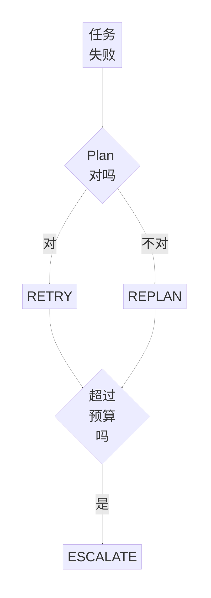

---

## ③ 完整标准答案

> Retry 和 Replan 的核心区别是失败层级不同。
>
> 如果 Planner 已经明确要求 `Evidence Retrieval`，但是 Retriever 临时超时，这属于执行失败，Plan 本身是对的，所以应该 Retry。
>
> 但如果 Planner 原计划是 `Risk → Reviewer`，Reviewer 给出了高风险结论，而 Critic 发现这个高风险结论完全没有 Evidence 支持，那么再跑一次 Reviewer 没有意义。真正的问题是 Plan 少了 `Evidence Retrieval`，所以应该 Replan。
>
> 如果 Retry 和 Replan 都超过预算，就进入 Escalate，避免形成无限 Agent Loop。

---

# Q7：Evidence Sufficiency 到底怎么判断

## ① 专有名词 / 系统级方法解释

### Evidence Sufficiency

Evidence Sufficiency：

> **当前 Evidence 是否足够支撑或反驳目标 Claim。**

### Explicit Validation

显式可验证层：

- 有没有 Evidence；
- Citation 完不完整；
- 来源是否合法；
- 必要风险项是否覆盖。

### Semantic Verification

语义验证层：

- Evidence 是否真的支持 Claim；
- 是否只是部分支持；
- 多个 Evidence 是否冲突。

---

## ② 记忆路线

> **硬条件先代码，语义支持再模型。**

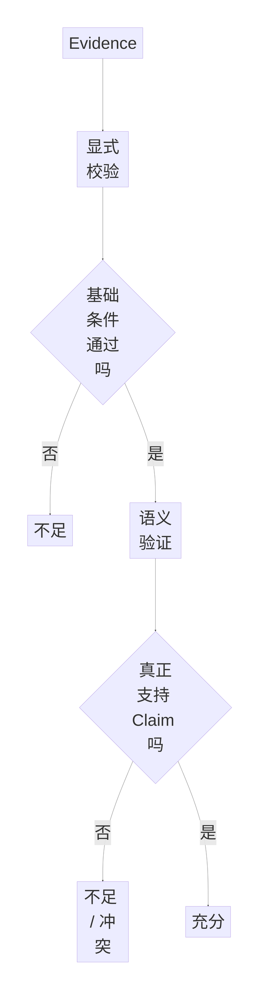

---

## ③ 完整标准答案

> 我不会把 Evidence Sufficiency 简单定义成模型的一次自评分，也不会直接把 Retriever Similarity 当成“证据充分”。
>
> 我更倾向拆成两层。
>
> 第一层是显式可验证特征，例如有没有 Evidence、Citation 是否完整、来源是否合法、是否覆盖必要风险项，这些尽量由代码判断。
>
> 第二层再做语义验证，判断 Evidence 是否真正支持当前 Claim、是否只支持部分 Claim，以及多个 Evidence 之间是否存在冲突。
>
> 最后把 Evidence Sufficiency 作为一个状态输入 Planner 或 Critic，而不是让 Planner 自己既生成证据、又自己宣布证据足够。
>
> 核心原则是：
>
> **不要让生成者完全自证。**

---

# Q8：Planner 和 Model Router 怎么区分

## ① 专有名词 / 系统级方法解释

### Task Routing

Planner 做的是：

> **Task Routing。**

决定：

> 当前 Case 要执行哪些任务。

### Model Routing

Router 做的是：

> **Model Routing。**

决定：

> 某个任务已经确定后，用哪个模型执行。

---

## ② 记忆路线

> **Planner 选路，Router 选车。**

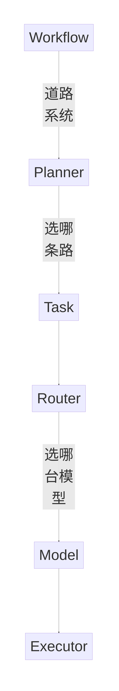

必背：

```text
Workflow = 哪些路能走
Planner  = 现在走哪条
Router   = 开什么车
Executor = 真正开车
```

---

## ③ 完整标准答案

> Planner 做的是 Task Routing，决定当前 Case 需要完成哪些任务；Model Router 做的是 Model Routing，在某个任务已经确定以后决定使用什么模型执行。
>
> 例如 Planner 决定当前 Case 需要 `Risk → Evidence → Reviewer`。执行到 Reviewer 时，Router 再结合风险等级、Evidence 状态、历史 Critic 结果和成本预算，决定这一节点使用本地模型还是更强模型。
>
> 所以 Planner 不应该关心具体模型 API 怎么调，Router 也不应该自己改变整个业务 Workflow。

---

# Q9：14pp 能不能归因给 Planner

## ① 专有名词 / 系统级方法解释

### System-level Before / After

System-level Before / After：

> 对比整个旧系统和整个新系统。

### Module Attribution

Module Attribution：

> 判断某个单模块到底贡献了多少。

### Ablation Study

Ablation Study：

> 固定其他模块，只移除或替换目标模块，再比较结果。

---

## ② 记忆路线

> **整体变好 ≠ Planner 单独带来全部提升。**

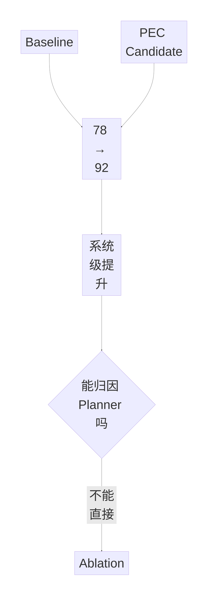

---

## ③ 完整标准答案

> 不一定。如果 Baseline 和 PEC Candidate 之间同时发生了 Planner、Critic、失败恢复、Prompt 等多个变化，那么 `78%→92%` 只能说明整体配置 Before / After 有改善，不能证明 Planner 单独贡献了 14 个百分点。
>
> 如果我要归因 Planner，需要固定其他模块以后做类似：
>
> `Full System vs Full System - Planner`
>
> 的消融，并且最好进一步统计不同 Failure Category 的变化。
>
> 所以面试中我会明确区分：
>
> **系统级结果**和**模块级归因**。

---

# Q10：为什么只看 Task Success 不够

## ① 专有名词 / 系统级方法解释

### Final Outcome Evaluation

只看：

> 最终是否成功。

### Single-step Evaluation

看：

> Planner Route、Tool Choice、单节点决策是否正确。

### Trajectory Evaluation

看：

> 整条 Agent 执行轨迹是否合理。

---

## ② 记忆路线

> **结果、步骤、轨迹、系统成本都要看。**

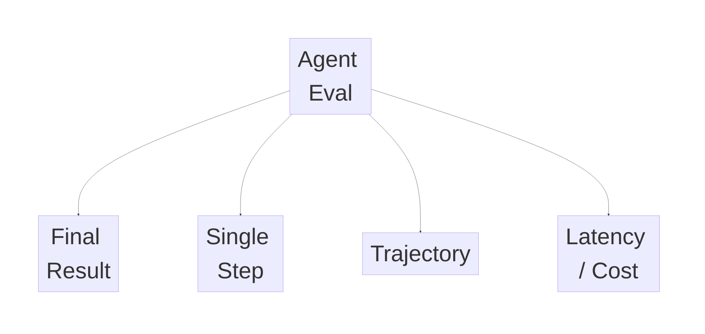

---

## ③ 完整标准答案

> 只看 Task Success 不够，因为 Agent 可能最终成功，但过程非常差，比如调用了很多无用工具、发生多次 Replan、成本和延迟很高；也可能最终失败，但已经完成了大部分正确步骤。
>
> 所以我会把评测拆成至少三层：最终任务是否成功、关键单步决策是否正确、完整 Trajectory 是否合理。系统层面再同时看延迟、模型调用成本和 Failure Taxonomy。
>
> 对这个项目而言，后续比较有价值的指标包括：
>
> - Task Success Rate；
> - Trajectory Correctness；
> - Planner Routing Accuracy；
> - Retry / Replan Rate；
> - Latency；
> - Cost；
> - Failure Taxonomy。

---

# Q11：Checkpoint 到底解决什么

## ① 专有名词 / 系统级方法解释

### Checkpoint

Checkpoint：

> **把当前 Graph State 持久化成可恢复快照。**

### thread_id

`thread_id`：

> 一条持续任务 / 会话执行脉络的标识。

### StateSnapshot

StateSnapshot：

> 某一时刻保存下来的状态快照。

### Pending Writes

原稿中记录的 LangGraph 语义：

> 同一个 super-step 中，部分节点成功、部分节点失败时，成功节点的状态更新可作为 pending writes 保留，恢复时减少不必要的重复工作。

---

## ② 记忆路线

> **Thread 找到任务，Checkpoint 找到位置，Snapshot 找到状态。**

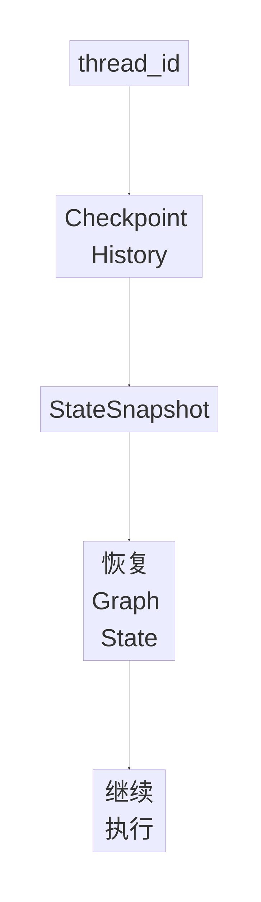

口诀：

```text
Thread = 哪个任务
Checkpoint = 执行到哪
Snapshot = 当时是什么状态
```

---

## ③ 完整标准答案

> Checkpoint 主要解决“任务执行到哪里了”。每个执行线程通过 `thread_id` 对应自己的历史 Checkpoint 和 StateSnapshot，故障以后可以从最后可恢复的 Graph State 继续，而不是把整条 Agent Chain 从最开始重新执行。
>
> 对我来说，可以把它记成三个东西：
>
> **Thread → thread_id → StateSnapshot。**
>
> `thread_id` 相当于一条持续任务链的身份证号，Checkpointer 用它查找和保存该任务对应的状态历史。已经成功完成并持久化的节点状态可以被复用，从而减少故障恢复时的重复执行。

---

## ④ 证据边界

原稿中关于：

- super-step；
- pending writes；
- checkpoint persistence；

属于 LangGraph 实现语义。

若面试中报非常具体的官方行为，建议以后单独回官方文档再核验版本差异。

---

# Q12：有 Checkpoint 就不会重复 API 调用吗

## ① 专有名词 / 系统级方法解释

### Durable State

Checkpoint 更接近：

> **Durable State。**

### Exactly-once

Exactly-once：

> 一个外部副作用动作绝对只执行一次。

Checkpoint 本身不等于 Exactly-once。

### Idempotency

Idempotency：

> 同一个业务动作重复执行多次，最终业务效果仍然等同于执行一次。

---

## ② 记忆路线

> **Checkpoint 保证“能恢复”，幂等保证“重跑也安全”。**

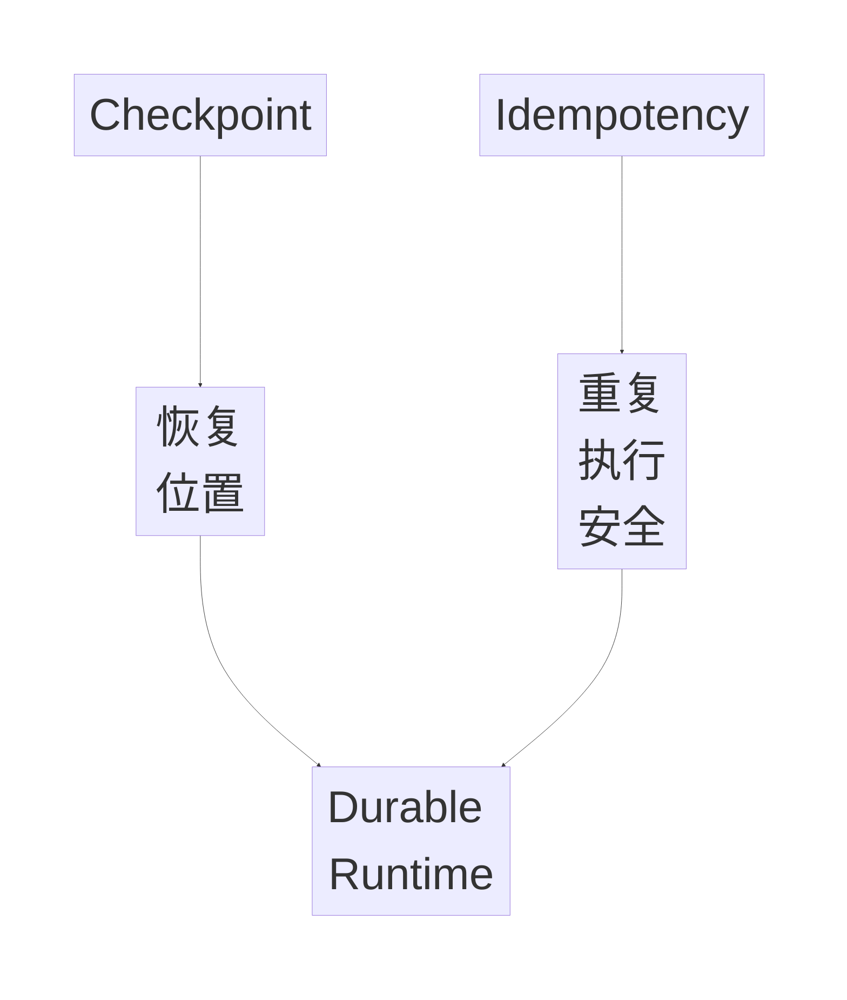

---

## ③ 完整标准答案

> 不一定。Checkpoint 解决的是恢复位置，不天然保证 Exactly-once。
>
> 如果 Replay 或恢复后，某些后续节点需要重新执行，那么里面的 LLM Call、API 请求或外部写操作都可能再次发生。
>
> 所以具有副作用的动作仍然需要幂等设计。比如为一次业务动作绑定 `execution_id` 或 `idempotency_key`，服务端检查同一个 Key 是否已经成功执行过；如果已经成功，就直接返回历史结果，而不是再次产生副作用。
>
> 所以我的理解是：
>
> **Checkpoint 保证 Durable State，Idempotency 保证重复执行安全。**

---

# Q13：Replay 和 Resume 有什么区别

## ① 专有名词 / 系统级方法解释

### Resume

Resume：

> **从中断状态继续当前任务。**

### Replay

Replay：

> **从历史 Checkpoint 重新执行后续路径，用于调试、审计或回归分析。**

---

## ② 记忆路线

> **Resume = 接着跑。Replay = 回到历史节点重新跑。**

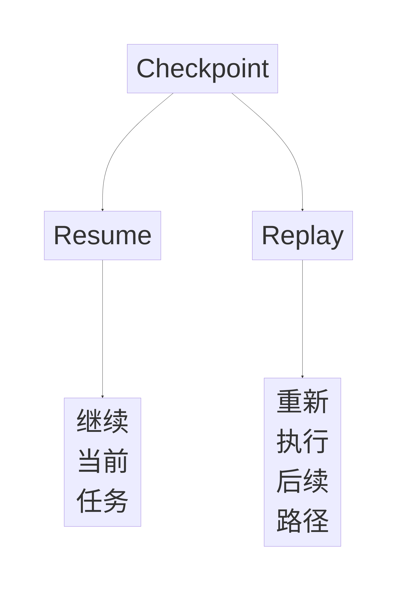

---

## ③ 完整标准答案

> Resume 和 Replay 不是完全一回事。
>
> Resume 更强调从当前中断状态继续完成原任务；Replay 更偏调试和审计，是从某个历史 Checkpoint 重新执行后续路径。
>
> 因为 Replay 后面的模型调用和 API 调用可能重新发生，所以 Replay 的结果并不保证和历史完全一致。这也是为什么 Trace 里还应该保存模型版本、Prompt Version、Evidence / indexVersion 等上下文，这样才能解释为什么同一个历史节点重放以后结果可能变化。

---

# Q14：为什么用 LangGraph，不自己写状态机

## ① 专有名词 / 系统级方法解释

### Explicit Graph State Machine

LangGraph 的价值不只是：

> 画一张图。

而是把：

- Shared State；
- Node；
- Conditional Routing；
- Checkpoint；
- Interrupt；
- Replay；

放进统一执行模型。

### Framework Trade-off

简单 Workflow：

> 自己写状态机完全可以。

复杂长链路 Agent：

> 框架统一状态和恢复机制会更有价值。

---

## ② 记忆路线

> **简单流程手写，长链路状态化 Agent 用图式 Runtime。**

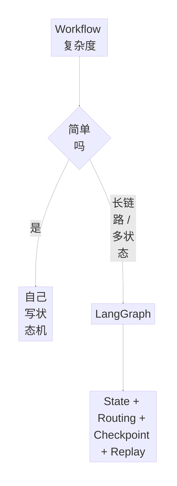

---

## ③ 完整标准答案

> 自己写状态机当然可以，而且简单 Workflow 我也不会为了框架强行上 LangGraph。
>
> 这个项目选择 LangGraph，主要是因为它把 Shared State、Conditional Routing、Checkpoint、Durable Execution 和 Replay 组合在统一执行模型里，比较适合长链路 Agent。
>
> 对我真正有价值的不是“用了 LangGraph”本身，而是它允许我显式定义 Node 和 State Boundary，并在这些边界持久化状态。这对错误定位、故障恢复和回放比较重要。
>
> 所以我的原则还是：
>
> **能用简单状态机解决就不用复杂框架；只有状态、恢复和动态路径复杂到一定程度时，LangGraph 才真正体现工程价值。**

---

# Q15：什么叫 Task Success

## ① 专有名词 / 系统级方法解释

### End-to-end Task Success

Task Success：

> **Case 级端到端成功指标。**

不是某个 Risk Label 的单点 Accuracy。

### Success Predicate

Success Predicate：

> 一个 Case 被判定为成功必须满足的必要条件集合。

可以理解成：

```text
Gate1 AND Gate2 AND Gate3 AND Gate4
```

---

## ② 记忆路线

> **不是“Label 对了就成功”，而是“整个 Case 做完整了才成功”。**

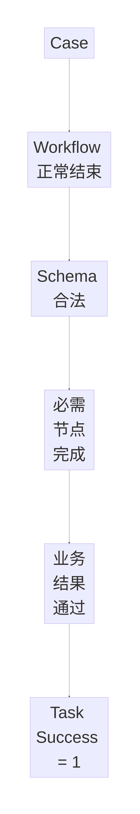

---

## ③ 完整标准答案

> 我这里的 Task Success 是 Case 级端到端指标，不是 Risk Label 的单点 Accuracy。
>
> 一个复杂审核 Case 只有在 Workflow 正常终止、结构化输出通过 Schema 校验、这个 Case 必须执行的关键步骤完成，并且最终审核结果通过冻结评测标准时，我才把它记为成功；否则记为失败。
>
> 对于明确要求 Evidence 的 Case，还需要检查对应 Evidence 和 Citation 是否满足要求。
>
> 我之所以用 Task Success，而不是只看分类 Accuracy，是因为 Agent 是一个多步骤系统。最终 Label 恰好对了，但中间发生错误 Routing、Evidence 缺失或异常 Fallback，不能说明整个 Agent 真正把任务做完整了。

---

## ④ Success Predicate

```text
Task Success =
Workflow Terminated Correctly
AND Schema Valid
AND Required Steps Completed
AND Final Business Result Passed
AND Required Evidence/Citation Passed（适用时）
```

分母始终是：

> **Case 数。**

不是 Node Call 次数。

---

# Q16：78% 的 Baseline 到底是什么

## ① 专有名词 / 系统级方法解释

### Baseline

Baseline：

> **作为比较起点的旧系统或基准配置。**

### Candidate

Candidate：

> 待评估的新系统配置。

### Paired Before / After

同一批 Case：

```text
旧版跑一次
新版跑一次
```

形成配对结果。

---

## ② 记忆路线

> **Baseline = PEC 前固定审核 Workflow。**

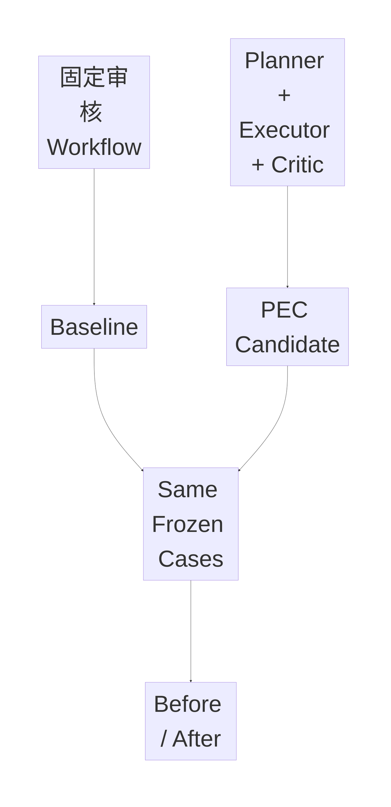

---

## ③ 完整标准答案

> 我的 Baseline 是 PEC 重构前的固定审核 Workflow，不是为了做实验临时造出来的“单 Agent”基线。
>
> 旧版主要是请求治理、混合检索、模型判断和规则回退这类固定路径；Candidate 则是在这套确定性安全边界之上加入 Planner-Executor-Critic，让复杂 Case 可以根据 Risk、Evidence 和执行状态动态决定补检索、审核、Retry 或 Replan。
>
> 所以 `78%→92%` 我会把它定义成旧固定 Workflow 与新版 PEC 系统的系统级 Before / After 对比。
>
> 这里非常重要的一点是：我不会说这 14 个百分点全部来自 Planner，因为新版同时包含 Critic 和失败恢复等变化。Planner 单独贡献需要 Ablation。

---

## ④ 证据边界

原稿写的是：

> **如果确认 78/92 确实来自当前 100 条 Sealed Test**，才可以进一步说：
>
> `78/100 → 92/100`

所以在底层实验台账确认前：

> 不要把“100 条 Sealed Test”现场说成已证实事实。

---

# Q17：Dev / Validation / Sealed Test 怎么分工

## ① 专有名词 / 系统级方法解释

### Dev Set

高频开发：

- Failure Analysis；
- 改 Workflow；
- 改 Prompt。

### Validation Set

方案选择：

- 候选方案比较；
- Threshold Calibration；
- 最终配置选择。

### Sealed Test

配置冻结以后：

> **只做最终独立评测。**

### Test Leakage

Test Leakage：

> 用 Test 的表现反过来调 Prompt、Workflow 或 Threshold，导致最终指标被高估。

---

## ② 记忆路线

> **Dev 改、Val 选、Test 只验。**

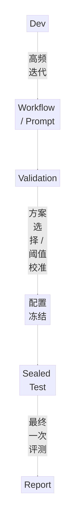

口诀：

```text
Dev = 改
Val = 选
Test = 验
```

---

## ③ 完整标准答案

> 我把数据划分成 Dev、Validation 和 Sealed Test。
>
> Dev 主要用于开发阶段的错误分析，以及 Workflow、Prompt 的高频迭代；Validation 用于候选方案选择和阈值校准；等 Workflow、Prompt、Model Router 和 Threshold 全部确定以后冻结配置，再在 Sealed Test 上做最终评测。
>
> Sealed Test 的结果不能反向用于修改系统，否则就会产生 Test Leakage，使最终指标高估真实泛化能力。

---

## ④ 哪些内容可以被 Dev / Val 调整

```text
Workflow
├─ Planner 拆解方式
├─ Re-retrieval 条件
├─ Critic 是否触发
└─ 模型升级策略

Prompt
├─ Planner Prompt
├─ Critic Prompt
└─ Structured Output Prompt

Threshold
├─ Evidence Sufficiency
├─ Risk Confidence
├─ Router Upgrade
└─ Critic Reject
```

---

# Q18：为什么是 Paired Comparison

## ① 专有名词 / 系统级方法解释

### Paired Comparison

Paired Comparison：

> **同一个 Case 同时在 Baseline 和 Candidate 上运行。**

因此两次结果：

> 相关。

不是两组独立样本。

### Binary Outcome

每个 Case：

```text
0 = Fail
1 = Success
```

---

## ② 记忆路线

> **同一 Case 跑两版，所以是配对，不是独立比例。**

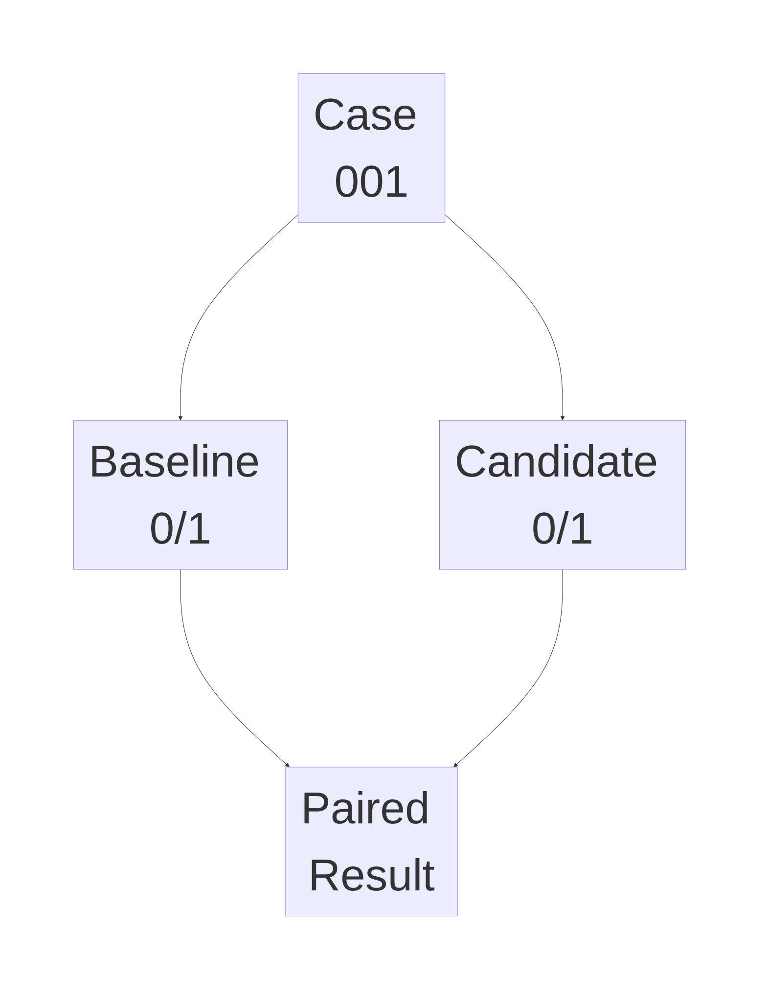

---

## ③ 完整标准答案

> 因为 Baseline 和 Candidate 跑的是同一批 Case，所以每个 Case 都有一对二元结果，例如旧版失败 / 新版成功，或者旧版成功 / 新版失败。
>
> 这两次结果来自同一个 Case，因此不是两组独立比例。
>
> 所以如果进一步做严格统计，应该保留逐 Case 的 0/1 Paired Result，而不是只保存最终的 78% 和 92%。

---

# Q19：McNemar Test 和 Wilson Interval 分别解决什么

## ① 专有名词 / 系统级方法解释

### McNemar Test

McNemar Test：

> **用于同一对象前后两次二元结果的配对比较。**

它特别关注：

```text
旧 Fail → 新 Success
旧 Success → 新 Fail
```

这两类 Discordant Cases。

### Wilson Interval

Wilson Interval：

> **用于估计单个二项比例的不确定性。**

例如：

```text
92 / 100
```

不仅报告：

```text
92%
```

还可以报告该成功率的置信区间。

---

## ② 记忆路线

> **McNemar 比两版；Wilson 看单版稳定性。**

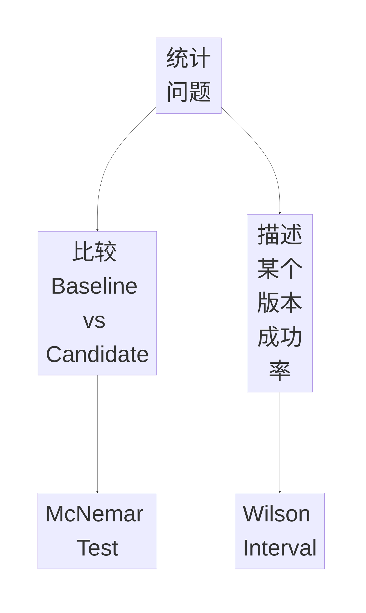

---

## ③ 完整标准答案

> 我不会把 `78%→92%` 包装成论文式统计显著性结论，它首先是一个工程离线回归指标。
>
> 如果进一步做严格统计，因为 Baseline 和 Candidate 是在同一批 Case 上做 Before / After，所以我会保存每个 Case 的 0/1 Paired Result，重点统计“旧版失败、新版成功”和“旧版成功、新版失败”这两类 Discordant Cases，再用 McNemar Test 做配对显著性分析。
>
> Wilson Interval 则不是用来比较两个版本的，它主要用来描述某一个版本成功率本身的不确定性。
>
> 所以：
>
> **McNemar Test → 比较旧版和新版。**  
> **Wilson Interval → 描述单个版本成功率有多稳定。**
>
> 在没有实际完成统计报告的情况下，我不会现场虚构 p-value。

---

# 二、Day03 一页总记忆图

```mermaid
%%{init: {
  "themeVariables": {"fontSize":"76px"},
  "themeCSS": ".nodeLabel { font-size:76px !important; } .edgeLabel { font-size:60px !important; }",
  "flowchart": {"nodeSpacing":250,"rankSpacing":330,"diagramPadding":125,"useMaxWidth":true}
}}%%
flowchart TD
    A[固定 Workflow] --> B[Planner]
    B --> C[Structured Plan]
    C --> D[Executor]

    D --> E[Risk]
    D --> F[Evidence]
    D --> G[Reviewer]

    G --> H[Critic]

    H -->|Execution 错| I[RETRY]
    H -->|Plan 错| J[REPLAN]
    H -->|超预算| K[ESCALATE]

    D --> L[Checkpoint]
    L --> M[Resume / Replay]
    M --> N[Idempotency]

    H --> O[Offline Eval]
    O --> P[Task Success]
    O --> Q[Trajectory]
    O --> R[Cost / Latency]

    P --> S[Baseline vs Candidate]
    S --> T[Paired Comparison]
    T --> U[McNemar]
```

---

# 三、闭卷验收

## Gate 1：Planner 为什么存在

必须答出：

```text
不是替代 Workflow
而是在 Workflow 边界内
做难规则化的语义路由
```

---

## Gate 2：Planner 输入输出

必须闭卷：

```text
Content
Risk
Evidence
History
Budget
↓
Structured Plan
```

---

## Gate 3：Planner / Executor

必须秒答：

```text
Planner = WHAT
Executor = DO
```

---

## Gate 4：三角色

```text
Risk = 提风险假设
Evidence = 找支持 / 反驳依据
Reviewer = 做综合决策
```

价值：

```text
Observability
Evaluability
Recoverability
```

---

## Gate 5：Critic

必须答：

```text
Reviewer = 生成决策
Critic = 验证 Candidate 是否可交付
```

---

## Gate 6：Retry / Replan

```text
Retry = Plan 对，Execution 错
Replan = Plan 本身不对
```

---

## Gate 7：Evidence Sufficiency

```text
显式规则校验
+
语义验证
```

不能：

> 让生成者完全自证。

---

## Gate 8：Planner / Router

```text
Workflow = 路网
Planner = 选路
Router = 选车
Executor = 开车
```

---

## Gate 9：14pp

必须说：

> **系统级 Before / After ≠ Planner 单模块 +14pp。**

模块归因：

> Ablation。

---

## Gate 10：Checkpoint

```text
Checkpoint = Durable State
Idempotency = 重复执行安全
```

---

## Gate 11：Resume / Replay

```text
Resume = 接着跑
Replay = 从历史节点重新跑
```

---

## Gate 12：Task Success

```text
Case-level End-to-end 0/1
≠
Risk Label Accuracy
```

---

## Gate 13：数据集

```text
Dev = 改
Validation = 选
Sealed Test = 验
```

---

## Gate 14：统计

```text
同一 Case 跑两版
= Paired Comparison

McNemar
= 比较两版

Wilson
= 描述单版成功率区间
```

---

# 面试最终收口答案

> E-Review 的 PEC 重构不是为了把固定 Workflow 强行包装成 Agent，而是解决复杂审核 Case 中难以完全规则化的语义路由问题。安全、PII、权限、Schema、Retry 上限等确定性逻辑仍由代码控制，Planner 只在预定义 Action Space 内根据 Content、Risk、Evidence、History 和 Budget 生成 Structured Plan，Executor 再负责真正执行 Risk、Evidence、Reviewer 等能力。
>
> 我把 Risk、Evidence、Reviewer 拆开，不是为了增加 Agent 数量，而是为了职责隔离、错误定位、独立评测和局部恢复。Reviewer 生成 Candidate Decision，Critic 再基于 Evidence、Citation、Schema 等信息验证它是否可交付；Execution 暂时失败用 Retry，Plan 本身缺失则 Replan，超过预算再 Escalate。
>
> Checkpoint 负责保存 Durable State 和恢复位置，但不天然保证 Exactly-once，因此外部副作用仍需要 Idempotency。Resume 是从中断状态继续，Replay 更偏从历史 Checkpoint 重跑后续路径。
>
> 在评测上，`78%→92%` 应理解为旧固定 Workflow 与新版 PEC Candidate 的系统级 Before / After，而不是 Planner 单模块贡献 14pp。Task Success 是 Case 级端到端 0/1 指标；如果 Baseline 和 Candidate 跑的是同一批冻结 Case，则属于 Paired Comparison。只有底层实验材料确认后，才能进一步使用具体 `78/100 → 92/100` 的强口径；如果要做统计显著性分析，可以保留逐 Case Paired Result，再考虑 McNemar Test，而不能现场虚构 p-value。
