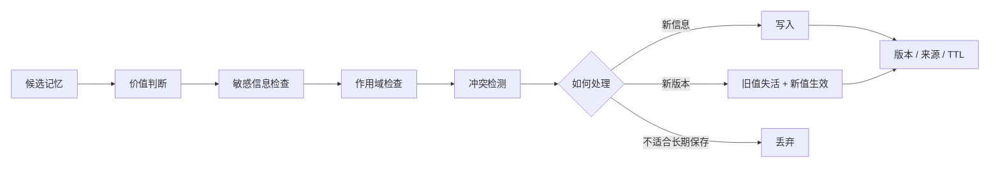
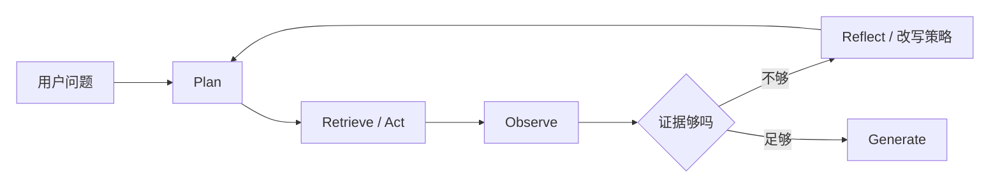
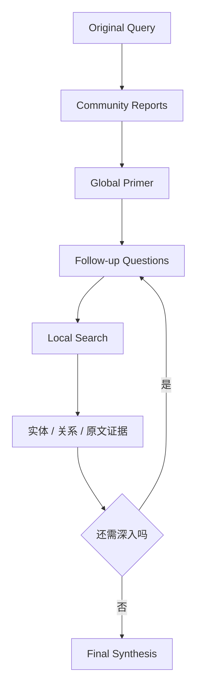
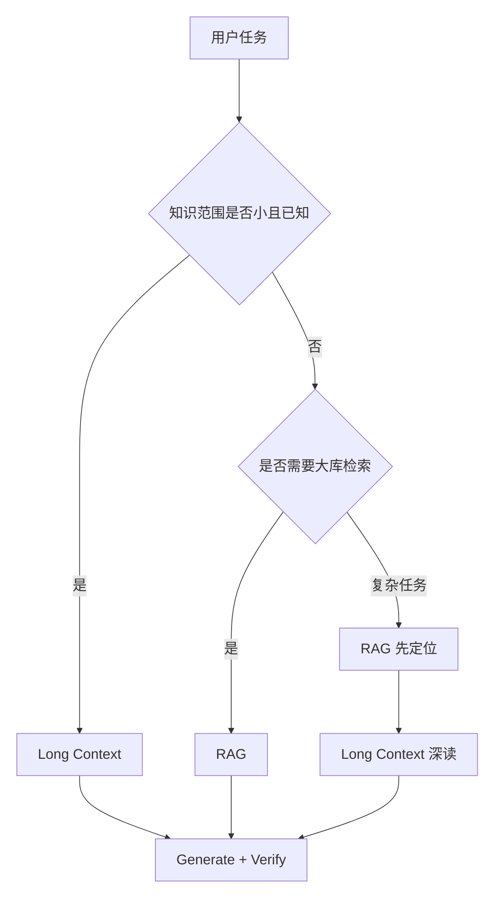
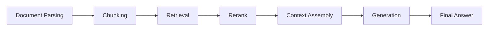
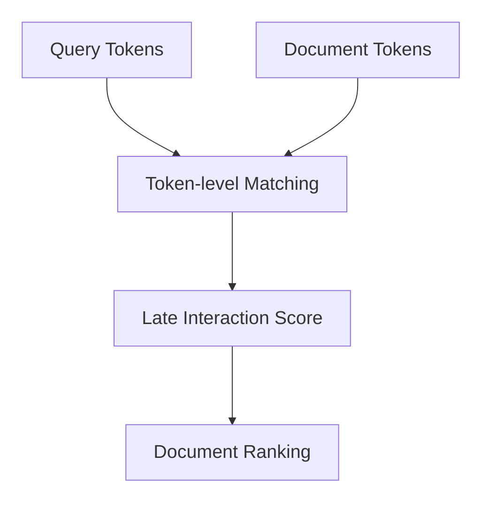
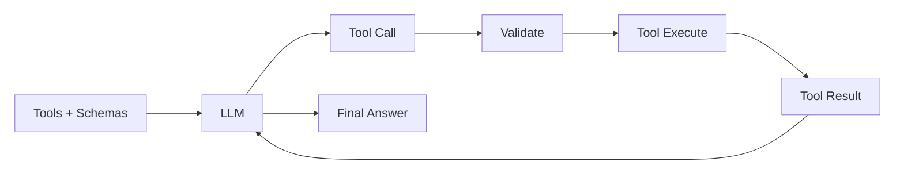
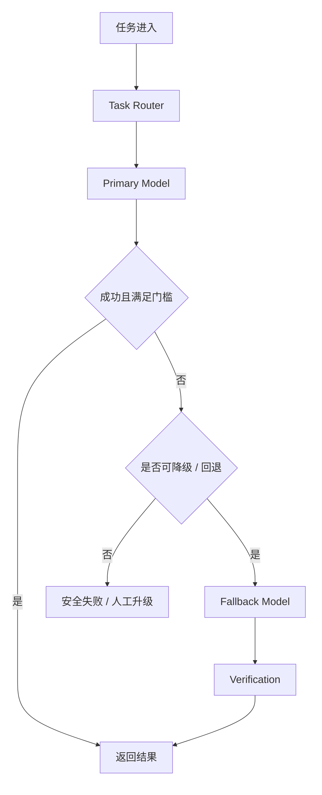
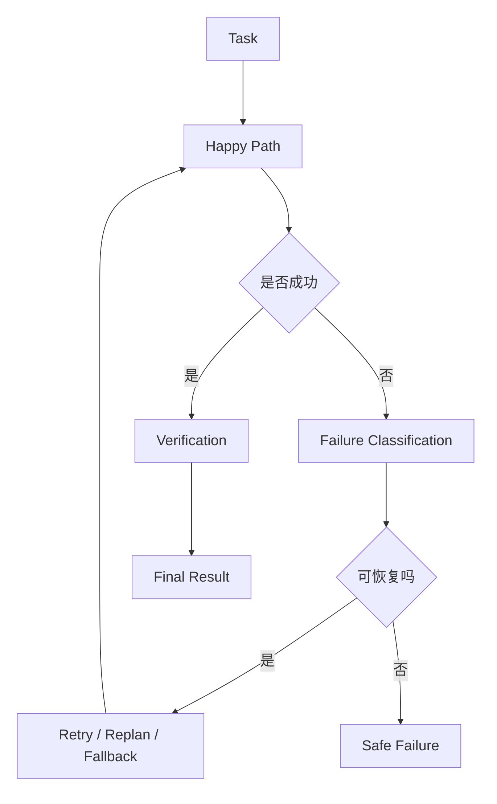

> 来源：根据原始学习笔记《先抓住核心区别》进行结构化整理、错别字修正与工程化重组。  
> 说明：本文重点保留原笔记中的知识边界与判断逻辑，并对 DRIFT Search、ColBERT Late Interaction 两处术语进行了外部核验。

---

## 目录

- [一、先抓住四组核心区别](#一先抓住四组核心区别)
- [二、长期记忆：写入、冲突、生命周期与隐私](#二长期记忆写入冲突生命周期与隐私)
- [三、Agentic RAG、GraphRAG 与长上下文路由](#三agentic-raggraphrag-与长上下文路由)
- [四、RAG 指标体系与失败分层](#四rag-指标体系与失败分层)
- [五、Chunking、Overlap 与 Late Interaction](#五chunkingoverlap-与-late-interaction)
- [六、Prompt Engineering：让任务可验收](#六prompt-engineering让任务可验收)
- [七、Context Engineering：让模型拿到正确材料](#七context-engineering让模型拿到正确材料)
- [八、Structured Output 与 Function Calling](#八structured-output-与-function-calling)
- [九、模型选型、路由、回退与 Eval 驱动降本](#九模型选型路由回退与-eval-驱动降本)
- [十、Happy Path 与生产系统思维](#十happy-path-与生产系统思维)
- [十一、面试高频速答](#十一面试高频速答)
- [十二、复习检查表](#十二复习检查表)

---

# 一、先抓住四组核心区别

很多 Agent / RAG 问题看起来零散，实际上可以先归纳成四组边界：

| 问题 | 核心区别 |
|---|---|
| Memory 写入 | 显式触发 vs 自动提炼 |
| 知识访问 | RAG vs 长上下文 |
| 模型控制 | Prompt Engineering vs Context Engineering |
| 能力与成本 | 强模型直上 vs Eval 驱动模型路由 |

先把边界分清，再讨论具体技术，学习会清晰很多。

---

# 二、长期记忆：写入、冲突、生命周期与隐私

## 1. 显式触发写入 vs 自动提炼写入

| 方式 | 显式触发写入 | 自动提炼写入 |
|---|---|---|
| 触发条件 | 用户明确表达“记住这个” | 系统从对话中判断哪些内容值得长期保存 |
| 准确性 | 较高 | 相对较低，可能误判 |
| 用户控制感 | 强 | 较弱 |
| 使用成本 | 用户需要主动表达 | 用户几乎无感 |
| 信息覆盖率 | 容易遗漏 | 较高 |
| 噪声风险 | 低 | 高 |
| 适合内容 | 强偏好、明确事实、重要约束 | 长期习惯、反复出现的偏好、稳定行为模式 |

### 推荐策略

> **不要二选一。更合理的是 Hybrid：显式写入为主，自动提炼为辅。**

原因很简单：

- 只做显式写入：准确，但容易漏；
- 只做自动提炼：覆盖广，但容易把临时表达误判为长期偏好；
- 两者结合：让“高价值确定信息”优先被显式确认，同时利用自动提炼发现长期模式。

---

## 2. Memory 写入不只是 `insert`

一个成熟的长期记忆系统至少应该思考：

```text
候选记忆产生
→ 是否值得长期保存
→ 是否涉及敏感信息
→ 检查作用域
→ 检查已有记忆
→ 冲突检测
→ 写入 / 更新 / 失活旧值
→ 保存版本与来源
→ 生命周期管理
→ 用户可查看、修改、删除
```

下面这张图使用放大字号，便于复习。



---

## 3. 用户偏好变化不能简单覆盖

假设旧记忆：

```text
2026-05-01
用户偏好：回答尽量简短
```

之后用户明确说：

```text
2026-08-01
以后技术学习内容希望讲得详细一些。
```

不应该直接执行：

```text
memory["answer_style"] = "详细"
```

更合理的处理是：

```text
检测到新旧记忆冲突
→ 判断新信息是否明确
→ 记录新来源
→ 保存时间
→ 旧值失活
→ 新版本生效
→ 必要时向用户确认
```

可以抽象成：

```json
{
  "memory_key": "technical_explanation_style",
  "value": "detailed",
  "status": "active",
  "valid_from": "2026-08-01",
  "source": "explicit_user_instruction",
  "confirmed": true,
  "supersedes": "memory_v1"
}
```

### 为什么需要版本管理？

因为长期记忆不是一个静态 KV 表，而更像：

> **带来源、时间、作用域、有效状态和冲突关系的长期状态系统。**

---

## 4. Memory 冲突处理

常见冲突：

### 时间冲突

旧：

```text
用户目前在准备后端岗位。
```

新：

```text
用户目前重点准备 AI Agent 岗位。
```

应优先考虑更新时间和明确程度。

### 作用域冲突

```text
工作邮件：正式、简洁
```

和：

```text
聊天回复：自然一点
```

两者并不真正冲突，因为作用域不同。

### 来源冲突

- 用户显式确认；
- 系统自动推断；
- 从单次行为推断；
- 从多次行为归纳。

通常不能把低可信自动推断直接覆盖用户明确表达。

---

## 5. 长期记忆如何遗忘

Memory 设计不仅要考虑“怎么记”，还必须考虑“怎么忘”。

原笔记给出的核心机制包括：

- TTL；
- 生命周期分层；
- 冲突覆盖；
- 旧值失活；
- 用户显式删除；
- 敏感字段限制写入；
- 作用域收缩。

### TTL

TTL = Time To Live。

适合：

- 临时项目状态；
- 时效偏好；
- 短期计划；
- 可能快速变化的业务事实。

### 生命周期分层

可以把 Memory 粗分成：

```text
短期
→ 中期
→ 长期稳定
```

不同层使用不同保留策略。

### 旧值失活，而不一定物理删除

例如：

```json
{
  "value": "偏好简短回答",
  "status": "inactive",
  "valid_until": "2026-08-01"
}
```

这样系统仍可进行审计和冲突追踪。

### 用户显式删除

长期记忆必须允许用户：

- 查看；
- 修改；
- 删除；
- 撤销；
- 禁止某类信息长期保存。

### 敏感字段限制写入

不是“模型觉得有用”就能长期保存。

敏感信息应该：

- 默认不写；
- 缩小作用域；
- 设置更短生命周期；
- 经过明确策略；
- 必要时需要用户确认。

---

# 三、Agentic RAG、GraphRAG 与长上下文路由

## 1. 什么是 Agentic RAG

普通 RAG 可以理解为：

```text
Query
→ Retrieval
→ Context
→ LLM
→ Answer
```

Agentic RAG 则让检索本身进入一个迭代闭环：

```text
Plan
→ Act / Retrieve
→ Observe
→ Reflect
→ 决定是否继续检索
```

其中 **Observe** 很重要，因为 Agent 需要根据当前检索结果判断：

- 信息是否够了；
- 查询是否需要改写；
- 是否需要换数据源；
- 是否需要深入某个实体；
- 是否存在证据冲突；
- 是否应该停止。



> Agentic RAG 的重点不是“用了 Agent”这个标签，而是：**检索过程具备状态、观察和迭代能力。**

---

## 2. DRIFT Search

**DRIFT Search = Dynamic Reasoning and Inference with Flexible Traversal。**

它属于 Microsoft GraphRAG 的查询方式之一，结合了 Global Search 与 Local Search 的特点。

更准确的理解不是简单的：

```text
先搜大范围
→ 再缩小范围
```

而是：

```text
利用社区级信息建立较宽的初始认知
→ 生成 follow-up questions
→ 使用 Local Search 深入具体实体、关系和文本
→ 根据中间结果继续产生后续问题
→ 形成逐步深入的检索路径
```



---

## 3. 传统搜索和 RAG 的区别

一个简化理解：

### 传统搜索

典型目标：

> 找出用户可能想看的文档或页面。

常见结果：

```text
Query
→ 排序
→ 文档 / 页面列表
```

### RAG

目标更偏向：

> 找到能支撑当前生成任务的证据，并放入 LLM 上下文。

常见流程：

```text
Query
→ 召回相关 Chunk / 证据
→ Rerank
→ Context Assembly
→ LLM
→ Answer
```

所以 RAG 中“检索”的下游消费者通常是 **LLM**，不只是最终用户。

---

## 4. RAG 不等于向量检索

RAG 更完整的工程视角：

```text
知识接入
→ 解析
→ 清洗
→ Chunking
→ Metadata
→ Index
→ Retrieval
→ Rerank
→ Context Assembly
→ Generation
→ Citation
→ Evaluation
→ Regression
```

因此：

> **RAG 不是一个单纯的检索技巧，而是知识访问、证据约束、成本治理和系统可追溯性共同组成的工程体系。**

---

## 5. RAG vs 长上下文

如果知识库很小，直接把全部相关内容放进长上下文，可能比构建复杂 RAG 更直接。

因此成熟系统不应该形成：

```text
所有任务 → RAG
```

更合理的是：

```text
任务识别
→ 判断知识规模与定位难度
→ Long Context / RAG / 两者组合
```



### 一个容易记忆的判断

| 场景 | 更适合 |
|---|---|
| 已知一份文档，直接分析 | Long Context |
| 数万份文档中找答案 | RAG |
| 大库中定位几份文档后深度分析 | RAG + Long Context |
| 需要严格权限、版本、引用 | RAG 更有优势 |
| 很小且稳定的知识集合 | 可考虑直接上下文 |

---

# 四、RAG 指标体系与失败分层

## 1. NDCG

NDCG：

> **Normalized Discounted Cumulative Gain**

它是搜索、推荐和 RAG 检索中常见的排序指标。

直观关注：

1. 相关结果有没有被排到前面；
2. 相关度越高的结果是不是越靠前；
3. 排名靠后的正确结果价值会被折损。

所以 NDCG 不只是问：

```text
“找没找到？”
```

还关注：

```text
“找到了以后排得好不好？”
```

---

## 2. RAG 指标分层

### 检索阶段

常见：

- Recall@K；
- Hit@K；
- MRR；
- NDCG@K。

### 重排与上下文组装

原笔记关注：

- Top-K；
- 去重率；
- Token 利用率；
- 不同来源覆盖率。

这里可以理解成不仅要“排序正确”，还要问：

```text
最终喂给模型的上下文是否：
少重复
有覆盖
Token 使用有效
来源不过度单一
```

### 生成阶段

关注：

- 答案正确率；
- Faithfulness；
- Citation 质量；
- Hallucination。

### 系统阶段

关注：

- P95；
- P99。

工程中还可以把这些指标与业务成功率一起观察，而不能只看单个检索指标。

---

## 3. Recall、Hit、MRR、NDCG 怎么区分

| 指标 | 主要问题 |
|---|---|
| Recall@K | 所有该找的相关结果，我找回了多少？ |
| Hit@K | Top-K 中有没有至少一个正确结果？ |
| MRR | 第一个正确结果出现得有多早？ |
| NDCG@K | 整体排序质量怎么样，高相关结果是否更靠前？ |

一句话记：

```text
Recall：漏没漏
Hit：中没中
MRR：第一个正确答案靠不靠前
NDCG：整个排序好不好
```

---

## 4. RAG 错误分层

原笔记里一个非常重要的思路：

> 不要只看到“最终回答错了”，要定位 RAG 链路到底哪一层错了。

可以拆成：

```text
解析错
→ 切块错
→ 召回错
→ 重排错
→ 上下文组装错
→ 生成错
```



### 为什么失败分层重要？

比如最终答案错误，可能不是模型推理能力不够：

- Parser 把表格结构解析坏了；
- Chunk 把关键条款拆开了；
- Retriever 根本没找回来；
- Reranker 把正确证据排下去了；
- Context Assembly 塞入太多冲突内容；
- LLM 在正确证据上仍然生成错误。

不同错误，对应完全不同的优化方向。

---

# 五、Chunking、Overlap 与 Late Interaction

## 1. Chunk 太小

风险：

- 上下文不完整；
- 语义被切碎；
- 条款和解释分离；
- 指代信息丢失；
- 流程步骤断裂。

---

## 2. Chunk 太大

风险：

- 无关信息增加；
- 一个 Chunk 混合多个主题；
- Embedding 表示被多种语义“平均化”；
- 检索相关性下降；
- Context Token 浪费。

所以 Chunk Size 本质上是：

> **完整上下文 vs 检索纯度之间的 Trade-off。**

---

## 3. 常见 Chunking 方法

原笔记列出的五类：

1. 固定长度切分；
2. 递归切分；
3. 结构切分；
4. 层级切分；
5. 语义切分。

### 固定长度

按照固定 Token / 字符数切分。

优点：

- 简单；
- 稳定；
- 易实现。

缺点：

- 不理解文档结构。

### 递归切分

按：

```text
章节
→ 段落
→ 句子
→ Token
```

逐级尝试。

### 结构切分

按照：

- 标题；
- Markdown Heading；
- HTML Section；
- 合同条款；
- 代码函数；
- 表格。

进行切分。

### 层级切分

同时保存：

- coarse chunk；
- fine chunk。

适合：

```text
先粗定位
→ 再细取证
```

### 语义切分

根据语义变化判断边界。

适用于主题边界不完全由格式体现的文本。

---

## 4. Overlap 为什么有用

Overlap 的目的：

> 减少 Chunk 边界导致的信息断裂。

例如：

```text
Chunk A：
……系统必须验证用户权限，并在高风险操作前……

Chunk B：
……触发人工审批。
```

完全不重叠时，“高风险操作前触发人工审批”可能被拆开。

加入适量 Overlap 后，可以让边界内容在相邻 Chunk 中保留。

但 Overlap 过大也会：

- 增加存储；
- 增加重复召回；
- 浪费 Token；
- 影响来源多样性。

---

## 5. ColBERT 的 Late Interaction

普通单向量 Dense Retrieval 常见做法：

```text
Document
→ Encoder
→ 一个向量
```

ColBERT 的核心不同点：

> 文档和 Query 保留 token 级的多向量表示，然后在匹配阶段进行细粒度 token-level interaction。

简化理解：

```text
Single-vector:
Query Vector ↔ Document Vector

Late Interaction:
Query Token Vectors
        ↕
Document Token Vectors
```

这让相关性匹配能够利用更细粒度的词项信息，但也带来更高的索引与存储开销。



---

# 六、Prompt Engineering：让任务可验收

## 1. Prompt Engineering 的核心目标

不是单纯“把提示词写长”。

而是：

> **把任务从模糊自然语言，转换成模型可以理解、系统可以验收的任务契约。**

---

## 2. 原笔记的五个核心原则

## 原则一：把目标写成可验收任务

Prompt 中尽量明确：

- 目标对象；
- 成功标准；
- 不允许事项；
- 输出格式。

例如模糊 Prompt：

```text
帮我分析这个系统。
```

更清晰：

```text
分析以下 Agent Runtime 的可靠性问题。

目标：
找出最可能导致循环调用的三个工程原因。

成功标准：
每个原因必须对应具体链路位置和可执行修复方案。

禁止：
不要只给抽象原则。

输出：
JSON，字段为 root_cause、evidence、fix。
```

---

## 原则二：减少隐含假设

很多失败来自：

> 人类脑中默认知道，但 Prompt 没写。

例如：

```text
“正常情况下”
“专业一点”
“按之前方式”
“适当优化”
```

对模型来说都可能存在多种解释。

应该把关键假设显式化。

---

## 原则三：分离规则、数据、示例与输出要求

推荐分层：

```text
[Rules]
系统必须遵守的稳定规则

[Input]
本轮真实数据

[Examples]
少量示例

[Output Schema]
输出格式
```

而不是把所有内容混成一长段自然语言。

---

## 原则四：定义失败处理

Prompt 不仅要告诉模型：

```text
成功时怎么办
```

还应该告诉模型：

```text
不知道怎么办
信息不足怎么办
工具失败怎么办
证据冲突怎么办
无法满足约束怎么办
```

这对 Agent 尤其重要。

---

## 原则五：Prompt 必须测试

Prompt 是系统的一部分，不是写完就结束。

应该通过 Eval 观察：

- 成功率；
- 错误分类；
- 格式合规率；
- 工具选择准确率；
- 参数准确率；
- 回归 Case。

---

# 七、Context Engineering：让模型拿到正确材料

## 1. Prompt Engineering vs Context Engineering

一个容易混淆的边界：

### Prompt Engineering

更关注：

```text
怎么描述任务？
怎么表达规则？
怎么约束输出？
```

### Context Engineering

更关注：

```text
运行时到底把什么信息给模型？
以什么顺序给？
保留多少？
什么时候加载？
什么时候压缩？
哪些内容应该被淘汰？
```

一句话：

> **Prompt Engineering 设计指令，Context Engineering 设计运行时信息环境。**

---

## 2. Context Engineering 的核心动作

原笔记可以归纳成：

```text
选择
→ 分层
→ 排序
→ 压缩
→ 生命周期管理
→ 验证
```

---

## 3. 常见 Context 组织形式

### 1. 稳定前缀 + 动态后缀

稳定部分：

- 系统规则；
- 安全规则；
- 固定任务定义。

动态部分：

- 当前用户输入；
- 当前状态；
- 检索证据；
- 最新工具返回。

### 2. 计划状态 + 执行日志

分开保存：

```text
Current Plan
Current State
Completed Steps
Latest Observations
Failure Summary
```

避免执行日志和计划混成一段。

### 3. 证据区 + 规则区

```text
[Rules]
……

[Evidence]
……

[User Input]
……
```

显式告诉模型信息的角色。

### 4. 按需加载工具描述

不要永远把几十个工具 Schema 全塞入上下文。

可以：

```text
上层 Router
→ 选工具域
→ 只加载当前可能使用的 Tool Definitions
```

这样可以降低 Tool Selection 混淆和 Token 成本。

---

## 4. Context Compression

历史信息不应该无限堆积。

原笔记提出：

> 将历史从“原文堆积”转化成“状态化表示”。

常见压缩结果：

- Summary；
- Task State；
- User Preference Memory；
- Unresolved Issues。

例如：

```json
{
  "task_state": "waiting_for_database_metrics",
  "completed": [
    "checked_application_logs",
    "checked_service_health"
  ],
  "failed_attempts": [
    "restart_all_instances"
  ],
  "unresolved_issues": [
    "database_pool_status"
  ]
}
```

往往比塞入几十轮原始聊天更有效。

---

## 5. 什么是 Context Bug

如果：

- 目标已经写清楚；
- 约束已经明确；
- 输出 Schema 也正确；

但模型仍然在错误材料上推理，那么问题更可能属于：

> **Context Bug，而不一定是 Prompt Bug。**

例如：

```text
用户问 2026 年制度
↓
Retriever 返回 2023 年旧版本
↓
Prompt 完全正确
↓
模型基于旧证据认真推理
↓
最终仍然错误
```

此时继续改 Prompt 的收益有限。

应该检查：

- Retrieval；
- Metadata；
- Version Filter；
- Context Assembly；
- Evidence Priority。

---

# 八、Structured Output 与 Function Calling

## 1. JSON Schema 为什么重要

如果任务需要机器继续消费输出，就不要只依赖自然语言约定。

例如：

```json
{
  "type": "object",
  "properties": {
    "tool": {
      "type": "string"
    },
    "reason": {
      "type": "string"
    }
  },
  "required": ["tool", "reason"],
  "additionalProperties": false
}
```

### `additionalProperties: false`

作用：

> 不允许模型返回 Schema 中没有定义的额外字段。

这样可以收紧结构边界。

---

## 2. Schema 不应该无限扩张

更好的设计思路：

> **一个任务对应一个职责清晰的 Schema。**

不要把所有可能字段都塞进一个“万能 JSON”。

Schema 太宽会导致：

- 模型不清楚哪些字段重要；
- 可选字段过多；
- 校验价值下降；
- 下游逻辑复杂；
- 更容易出现歧义。

---

## 3. Function Calling 的基本闭环

```text
1. 把可用工具和 Tool Schema 提供给模型
2. 模型返回 Tool Call
3. Runtime 校验并执行
4. Tool Result 返回模型
5. 模型决定：
   - 输出最终答案
   - 或提出新的 Tool Call
```



### Runtime 不应盲目执行

Tool Call 之后通常还需要：

- Schema Validation；
- Argument Grounding；
- 权限判断；
- 风险检查；
- 幂等控制；
- 超时；
- 重试；
- Verification。

---

# 九、模型选型、路由、回退与 Eval 驱动降本

## 1. 模型选型不能只看“谁最强”

至少考虑：

1. 任务类型；
2. 正确率要求；
3. 延迟；
4. 成本；
5. 吞吐；
6. 长上下文能力；
7. Context 管理能力。

原笔记中的关键判断：

> **强模型全部传到底，通常既贵又慢，也未必是最稳定的系统设计。**

---

## 2. 静态模型路由

一种简单策略：

```text
任务分类
→ 不同任务类型
→ 不同模型
```

例如原笔记给出的启发式：

| 任务 | 可能的模型级别 |
|---|---|
| 简单分类 | 小模型 |
| 长文分析 | 中等能力模型 |
| 复杂代码 / 高难推理 | Reasoning / Frontier Model |

注意：

> 这只是初始路由假设，不应该脱离 Eval 直接作为最终结论。

---

## 3. 为什么先用强模型做 Baseline

推荐流程：

```text
先定义任务和指标
→ 用强模型建立 Baseline
→ 确定任务理论可达水平
→ 做失败分类
→ 尝试把简单子任务下沉
→ 比较质量 / 成本 / 延迟
```

这样才能回答：

```text
“小模型真的够吗？”
```

而不是凭感觉决定。

---

## 4. Eval 驱动的模型下沉

假设强模型：

```text
Accuracy = Baseline
Cost = High
Latency = High
```

然后测试中模型、小模型：

```text
只要质量下降仍在业务可接受阈值内
→ 就可以下沉
```

所以真正目标不是：

> 用最强模型。

而是：

> **找到满足质量门槛下的最低综合成本方案。**

---

## 5. 回退与降级

当主模型出现：

- 超时；
- 限流；
- 服务故障；
- 成本预算不足；
- 上下文限制；
- 特定能力不可用；

可以降级到兼容模型。



---

## 6. 完整模型选型方法

原笔记最终可以整理成：

### Step 1：定义任务

明确：

- 输入；
- 输出；
- 成功标准；
- 风险级别。

### Step 2：定义指标

例如：

- Accuracy；
- Task Success；
- Schema Compliance；
- P95；
- Cost / Task。

### Step 3：强模型做 Baseline

回答：

> 这个任务在当前系统条件下大概能做到多好？

### Step 4：失败分类

区分：

- 模型能力不足；
- Prompt 问题；
- Context 问题；
- Tool 问题；
- Retrieval 问题；
- Schema 问题。

### Step 5：尝试模型下沉

把容易的任务交给更便宜、更快的模型。

### Step 6：工程优化

继续加入：

- Cache；
- Context Compression；
- Batch；
- Workflow 优化；
- Model Routing；
- Retry / Fallback。

---

# 十、Happy Path 与生产系统思维

## 1. 什么是 Happy Path

Happy Path：

> **理想情况下，一切都按照预期顺利执行的主流程。**

例如：

```text
用户提问
↓
Agent 正确理解
↓
选择正确工具
↓
参数正确
↓
工具执行成功
↓
Agent 正确整合结果
↓
输出答案
```

它默认：

- 输入正常；
- 模型判断正确；
- 工具可用；
- 数据存在；
- 网络正常；
- 权限满足；
- 流程不中断。

---

## 2. 为什么只做 Happy Path 不够

真实系统还需要考虑：

```text
用户意图不完整怎么办？
工具参数缺失怎么办？
工具超时怎么办？
权限不足怎么办？
检索不到怎么办？
证据互相冲突怎么办？
模型重复调用怎么办？
Schema 校验失败怎么办？
主模型不可用怎么办？
```

因此生产系统应该同时设计：

```text
Happy Path
+
Failure Path
+
Recovery Path
+
Fallback Path
```



---

# 十一、面试高频速答

## 1. 显式 Memory 和自动 Memory 怎么取舍？

不建议二选一。显式写入准确、控制感强，但覆盖率低；自动提炼覆盖率高，但存在误判和噪声。生产系统更适合 Hybrid，以显式写入为主、自动提炼为辅，并结合冲突检测、版本、来源和生命周期管理。

---

## 2. 用户偏好改变时 Memory 怎么处理？

不能简单覆盖旧值。应该检测冲突，记录时间、来源和确认状态，让旧值失活、新版本生效，并在信息不明确时向用户确认。

---

## 3. 长期记忆怎么做遗忘？

可以使用 TTL、生命周期分层、旧值失活、冲突覆盖、用户显式删除、敏感信息限制写入和作用域收缩。

---

## 4. 什么是 Agentic RAG？

Agentic RAG 是把检索加入 Plan–Act–Observe–Reflect 的迭代闭环。Agent 不只是执行一次 Retrieval，而是根据 Observation 判断证据是否足够、是否需要改写查询或继续深入。

---

## 5. DRIFT Search 是什么？

DRIFT 是 Microsoft GraphRAG 中结合 Global 与 Local 特点的检索方式。它先通过社区信息建立宽泛认知并生成 follow-up questions，再利用 Local Search 逐步深入实体、关系和原始文本。

---

## 6. 长上下文能替代 RAG 吗？

不能简单替代。小规模、已知文档直接进入长上下文可能更简单；大规模知识库、需要检索定位、权限过滤、引用和版本治理时，RAG 更适合。成熟系统可以通过 Router 在 Long Context、RAG 和二者组合之间选择。

---

## 7. RAG 常见指标有哪些？

检索阶段看 Recall、Hit、MRR、NDCG；上下文阶段可以看 Top-K、去重率、Token 利用率、来源覆盖；生成阶段看正确率、Faithfulness、Citation、Hallucination；系统层看 P95、P99。

---

## 8. NDCG 和 MRR 区别是什么？

MRR 更关注第一个正确结果出现的位置；NDCG 关注整个结果列表的排序质量，并考虑不同相关度以及位置折损。

---

## 9. RAG 回答错了怎么排查？

按链路分层：

```text
解析
→ Chunking
→ Retrieval
→ Rerank
→ Context Assembly
→ Generation
```

先定位哪一层出错，再针对性优化。

---

## 10. Chunk 太大太小分别有什么问题？

Chunk 太小会导致上下文割裂；Chunk 太大则会带入过多无关信息，使语义表示和最终上下文更嘈杂。

---

## 11. Overlap 的作用是什么？

Overlap 用于降低 Chunk 边界效应，让跨边界的信息在相邻 Chunk 中保留。但 Overlap 太大会造成重复索引、重复召回和 Token 浪费。

---

## 12. 什么是 ColBERT Late Interaction？

ColBERT 不把整篇文档压缩成单个向量，而是保留 token 级多向量表示，在查询阶段进行细粒度 token-level 匹配，再得到文档相关性分数。

---

## 13. Prompt Engineering 的核心是什么？

把模糊任务变成可以执行、可以验收的任务契约，明确目标、成功标准、禁止事项、输入、示例、输出结构和失败处理。

---

## 14. Prompt Engineering 和 Context Engineering 区别是什么？

Prompt Engineering 更关注如何表达规则和任务；Context Engineering 更关注运行时给模型哪些信息、如何排序压缩、何时加载和淘汰，以及状态如何组织。

---

## 15. 什么是 Context Bug？

当任务目标和 Prompt 已经清楚，但模型拿到了错误、过期、冲突或低优先级的信息并基于它推理，问题更像 Context Bug，而不是 Prompt Bug。

---

## 16. 为什么 JSON Schema 常加 `additionalProperties: false`？

为了禁止模型生成 Schema 未定义的额外字段，收紧结构化输出边界，让下游程序更容易稳定解析和验证。

---

## 17. Function Calling 的完整流程是什么？

Tool Schema 提供给模型 → 模型产生 Tool Call → Runtime 校验并执行 → Tool Result 返回模型 → 模型继续调用工具或生成最终答案。

---

## 18. 模型选型为什么不能只用最强模型？

最强模型通常成本和延迟更高，而且复杂系统中很多任务并不需要最高推理能力。应该先用强模型建立 Baseline，再通过 Eval 判断哪些任务可以下沉给更便宜、更快的模型。

---

## 19. 模型路由怎么设计？

先按任务类型设计静态路由作为初始方案，再通过 Eval 验证质量、成本和延迟，根据失败类型持续调整路由和门槛。

---

## 20. 什么是 Happy Path？

Happy Path 是理想条件下从输入到成功输出的主流程。生产 Agent 除了 Happy Path，还必须设计失败、恢复、回退和安全终止路径。

---

# 十二、复习检查表

## Memory

- [ ] 能区分显式写入与自动提炼写入；
- [ ] 知道为什么推荐 Hybrid；
- [ ] 能说明 Memory 为什么需要冲突检测；
- [ ] 能解释旧值失活与版本管理；
- [ ] 知道 TTL 的作用；
- [ ] 能说明用户删除与隐私治理；
- [ ] 知道作用域为什么重要。

## RAG

- [ ] 能说明普通 RAG 与 Agentic RAG；
- [ ] 能解释 DRIFT Search；
- [ ] 能区分 RAG 与传统搜索；
- [ ] 知道 RAG 不等于向量数据库；
- [ ] 能解释 Long Context 与 RAG 路由；
- [ ] 能区分 Recall、Hit、MRR、NDCG；
- [ ] 能按链路拆 RAG 错误；
- [ ] 能解释 Chunk Size Trade-off；
- [ ] 能列出五类 Chunking；
- [ ] 能解释 Overlap；
- [ ] 能解释 ColBERT Late Interaction。

## Prompt / Context

- [ ] 能把模糊 Prompt 改成可验收任务；
- [ ] 能解释隐含假设为什么危险；
- [ ] 能分离规则、输入、示例和输出；
- [ ] 能定义失败处理；
- [ ] 知道 Prompt 需要 Eval；
- [ ] 能区分 Prompt Engineering 与 Context Engineering；
- [ ] 能列出常见 Context 组织方式；
- [ ] 能解释 Context Compression；
- [ ] 能判断什么是 Context Bug。

## Structured Output / Tool Use

- [ ] 知道 `additionalProperties: false`；
- [ ] 知道为什么 Schema 要职责单一；
- [ ] 能画出 Function Calling 闭环；
- [ ] 知道 Runtime 不应该盲目执行 Tool Call。

## Model Routing

- [ ] 能列出模型选型维度；
- [ ] 知道为什么强模型不应该全部传到底；
- [ ] 能说明强模型 Baseline 的价值；
- [ ] 能做失败分类；
- [ ] 能解释 Eval 驱动的模型下沉；
- [ ] 能说明 Retry、Fallback 与降级；
- [ ] 能解释质量、成本、延迟之间的 Trade-off。

## Production Thinking

- [ ] 能解释 Happy Path；
- [ ] 能列出常见 Failure Path；
- [ ] 知道为什么恢复路径同样重要；
- [ ] 能从“模型能力问题”进一步拆成 Prompt、Context、Retrieval、Tool、Schema 等系统问题。

---

# 一页速记

```text
Memory
= 写入策略 + 冲突 + 版本 + TTL + 权限 + 用户控制

Agentic RAG
= Retrieval + Plan / Act / Observe / Reflect

DRIFT
= Community-level Primer + Follow-up Questions + Local Search

RAG
= Parse + Chunk + Metadata + Retrieve + Rerank
  + Context + Generate + Citation + Eval

Retrieval Metrics
= Recall / Hit / MRR / NDCG

Chunk
= 太小丢上下文，太大增噪声

Prompt Engineering
= 把任务写清楚、写成可验收契约

Context Engineering
= 决定运行时给模型什么、怎么组织、何时压缩

Structured Output
= 清晰 Schema + 严格校验

Function Calling
= Schema → Tool Call → Execute → Observation → Next Action

Model Routing
= 强模型 Baseline → Eval → 失败分类 → 下沉 → Fallback

Production Agent
= Happy Path + Failure Path + Recovery Path
```

---

# 核心结论

把这一整组知识串起来，可以形成一个统一理解：

> **可靠的 AI Agent 不是“找一个最强模型 + 写一个好 Prompt”就结束，而是 Memory、RAG、Context、Tool Schema、模型路由、Eval、错误恢复共同组成的运行时系统。**

当 Agent 表现不好时，不要第一反应就认为“模型不够强”。

更专业的排查顺序应该是：

```text
Task Definition
→ Prompt
→ Context
→ Retrieval
→ Tool / Schema
→ Model
→ Runtime
→ Verification
→ Eval
```

这样才能从“会调用 LLM”逐渐走向“会设计 Agent 系统”。
